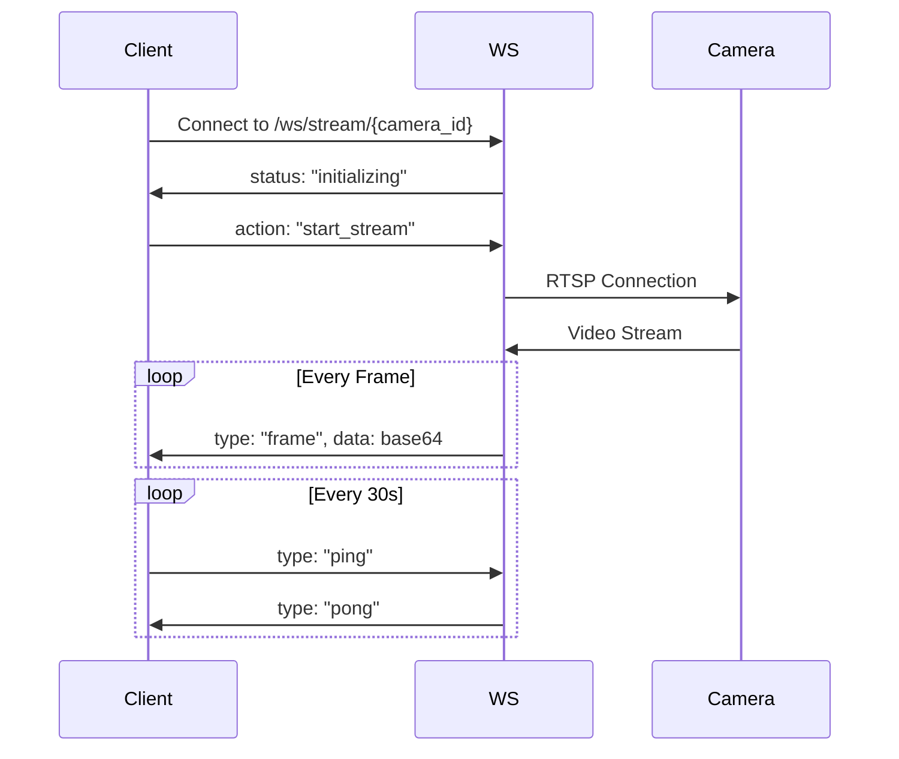

# 📡 API REST y WebSocket

> Documentación de la API v2 con FastAPI y streaming WebSocket

## 🎯 Arquitectura API

### Stack Tecnológico

- **FastAPI** - Framework web moderno con async/await
- **WebSocket** - Streaming de video en tiempo real
- **Pydantic** - Validación y serialización de datos
- **SQLite + SQLAlchemy** - Base de datos con ORM
- **OpenCV** - Procesamiento de video

### Base URLs

```bash
API REST: http://localhost:8000/api/v2
WebSocket: ws://localhost:8000/ws
Docs: http://localhost:8000/docs
```

## 📷 REST API v2

### Endpoints de Cámaras

#### GET /api/v2/cameras

Listar todas las cámaras con filtros opcionales

**Query Parameters:**

- `brand` (string): Filtrar por marca
- `is_active` (boolean): Solo cámaras activas
- `protocol` (string): Filtrar por protocolo

**Response:**

```json
{
  "status": "success",
  "data": [
    {
      "camera_id": "550e8400-e29b-41d4-a716-446655440000",
      "code": "CAM-DAHUA-REAL-172",
      "display_name": "Cámara Principal",
      "ip_address": "192.168.1.172",
      "brand": "Dahua",
      "model": "Hero-K51H",
      "is_active": true,
      "created_at": "2025-07-16T10:00:00Z"
    }
  ],
  "count": 1
}
```

#### GET /api/v2/cameras/{camera_id}

Obtener detalle de una cámara específica

**Response:**

```json
{
  "status": "success",
  "data": {
    "camera_id": "550e8400-e29b-41d4-a716-446655440000",
    "code": "CAM-DAHUA-REAL-172",
    "display_name": "Cámara Principal",
    "ip_address": "192.168.1.172",
    "brand": "Dahua",
    "model": "Hero-K51H",
    "protocols": [
      {
        "protocol_name": "RTSP",
        "port": 554,
        "is_primary": true
      },
      {
        "protocol_name": "ONVIF",
        "port": 80,
        "is_primary": false
      }
    ],
    "credentials": {
      "username": "admin",
      "has_password": true
    },
    "endpoints": [
      {
        "endpoint_type": "rtsp_main",
        "url": "rtsp://192.168.1.172:554/cam/realmonitor?channel=1&subtype=0",
        "is_verified": true
      }
    ],
    "statistics": {
      "total_connections": 1523,
      "successful_connections": 1498,
      "average_fps": 14.8,
      "last_connection_at": "2025-07-16T09:45:00Z"
    }
  }
}
```

#### POST /api/v2/cameras

Crear nueva cámara

**Request Body:**

```json
{
  "display_name": "Cámara Entrada",
  "ip_address": "192.168.1.100",
  "brand": "Dahua",
  "model": "IPC-HDW1200SP",
  "username": "admin",
  "password": "secure_password",
  "rtsp_port": 554,
  "onvif_port": 80
}
```

**Response:**

```json
{
  "status": "success",
  "data": {
    "camera_id": "new-uuid-here",
    "code": "CAM-DAHUA-HDW1200SP-100",
    "message": "Cámara creada exitosamente"
  }
}
```

#### PUT /api/v2/cameras/{camera_id}

Actualizar cámara existente

#### DELETE /api/v2/cameras/{camera_id}

Eliminar cámara

### Endpoints de Scanner

#### POST /api/v2/scanner/scan

Iniciar escaneo de red

**Request Body:**

```json
{
  "network_range": "192.168.1.0/24",
  "scan_type": "fast",
  "protocols": ["onvif", "rtsp"]
}
```

#### GET /api/v2/scanner/results/{scan_id}

Obtener resultados de escaneo

## 🌐 WebSocket API

### Protocolo de Streaming

#### Conexión

```javascript
const ws = new WebSocket('ws://localhost:8000/ws/stream/camera_192.168.1.172');
```

#### Mensajes Cliente → Servidor

**Iniciar Stream:**

```json
{
  "action": "start_stream",
  "params": {
    "quality": "medium",
    "fps": 30,
    "format": "jpeg"
  }
}
```

**Detener Stream:**

```json
{
  "action": "stop_stream"
}
```

**Heartbeat:**

```json
{
  "type": "ping"
}
```

#### Mensajes Servidor → Cliente

**Frame de Video:**

```json
{
  "type": "frame",
  "camera_id": "cam_192.168.1.172",
  "data": "base64_encoded_jpeg_string",
  "timestamp": "2025-07-16T10:00:00.123Z",
  "frame_number": 1234,
  "metrics": {
    "fps": 15,
    "frameCount": 1234
  }
}
```

**Estado de Conexión:**

```json
{
  "type": "status",
  "camera_id": "cam_192.168.1.172",
  "status": "connected",
  "data": {
    "message": "Streaming activo",
    "protocol": "RTSP"
  }
}
```

**Error:**

```json
{
  "type": "error",
  "camera_id": "cam_192.168.1.172",
  "error": {
    "code": "CONNECTION_FAILED",
    "message": "No se pudo conectar a la cámara"
  }
}
```

### Flujo de Conexión



## 🔧 Servicios Backend

### Arquitectura de Servicios

```bash
┌─────────────────────────────────┐
│        API Router Layer         │
├─────────────────────────────────┤
│     CameraManagerService        │ ← Orquestador principal
├─────────────────────────────────┤
│  VideoStreamService (Singleton) │ ← Gestión de streaming
├─────────────────────────────────┤
│ DataService │ EncryptionService │ ← Servicios de soporte
├─────────────────────────────────┤
│      ProtocolService            │ ← ONVIF/RTSP/HTTP
└─────────────────────────────────┘
```

### Servicios Principales

| Servicio | Responsabilidad | Patrón |
|----------|-----------------|---------|
| **CameraManagerService** | Orquestación de operaciones de cámara | Facade |
| **VideoStreamService** | Gestión centralizada de streaming | Singleton |
| **EncryptionService** | Encriptación AES-256 de credenciales | Singleton |
| **DataService** | Acceso a base de datos SQLite | Repository |
| **ProtocolService** | Implementación de protocolos | Strategy |
| **WebSocketStreamService** | Gestión de conexiones WebSocket | Observer |

### Ejemplo: VideoStreamService

```python
from services.video_stream_service import video_stream_service

# Iniciar streaming
await video_stream_service.start_stream(
    camera_id="cam_192.168.1.172",
    config=StreamConfig(
        quality="medium",
        fps=30,
        format="jpeg"
    )
)

# Obtener frame
frame = await video_stream_service.get_frame("cam_192.168.1.172")
if frame:
    base64_data = frame.to_base64()
    
# Obtener métricas
metrics = video_stream_service.get_stream_metrics("cam_192.168.1.172")
print(f"FPS: {metrics.current_fps}")
```

## 🔒 Seguridad

### Encriptación de Credenciales

- **Algoritmo**: AES-256 con Fernet
- **Ubicación clave**: `data/.encryption_key`
- **Rotación**: Manual (pendiente automatizar)

```python
from services.encryption_service import encryption_service

# Encriptar password
encrypted = encryption_service.encrypt("mi_password_seguro")

# Desencriptar
plaintext = encryption_service.decrypt(encrypted)
```

### Headers de Seguridad

```python
# CORS configurado en main.py
app.add_middleware(
    CORSMiddleware,
    allow_origins=["http://localhost:5173"],
    allow_methods=["*"],
    allow_headers=["*"]
)
```

## 📊 Monitoreo y Métricas

### Métricas Disponibles

- **Conexiones activas**: Total y por cámara
- **FPS en tiempo real**: Por stream activo
- **Uso de memoria**: Por proceso de streaming
- **Latencia**: RTT del WebSocket
- **Errores**: Por tipo y frecuencia

### Endpoint de Health Check

```bash
GET /health

Response:
{
  "status": "healthy",
  "version": "0.9.5",
  "uptime_seconds": 3600,
  "active_streams": 2,
  "database": "connected"
}
```

## 🚀 Ejemplos de Uso

### Cliente JavaScript/React

```javascript
// Servicio WebSocket
class CameraStreamService {
  constructor(cameraId) {
    this.ws = new WebSocket(`ws://localhost:8000/ws/stream/${cameraId}`);
    this.setupHandlers();
  }
  
  setupHandlers() {
    this.ws.onmessage = (event) => {
      const message = JSON.parse(event.data);
      
      switch(message.type) {
        case 'frame':
          this.handleFrame(message.data);
          break;
        case 'status':
          this.handleStatus(message.status);
          break;
      }
    };
  }
  
  startStream() {
    this.ws.send(JSON.stringify({
      action: 'start_stream',
      params: { quality: 'medium', fps: 30 }
    }));
  }
}
```

### Cliente Python

```python
import asyncio
import websockets
import json

async def stream_camera():
    uri = "ws://localhost:8000/ws/stream/camera_192.168.1.172"
    
    async with websockets.connect(uri) as websocket:
        # Iniciar stream
        await websocket.send(json.dumps({
            "action": "start_stream",
            "params": {"quality": "high"}
        }))
        
        # Recibir frames
        async for message in websocket:
            data = json.loads(message)
            if data["type"] == "frame":
                print(f"Frame {data['frame_number']}")
```

## 📚 Referencias

- [FastAPI Documentation](https://fastapi.tiangolo.com/)
- [WebSocket Protocol RFC 6455](https://tools.ietf.org/html/rfc6455)
- [Pydantic V2 Docs](https://docs.pydantic.dev/)

---

**Última actualización**: v0.9.5 - Julio 2025
