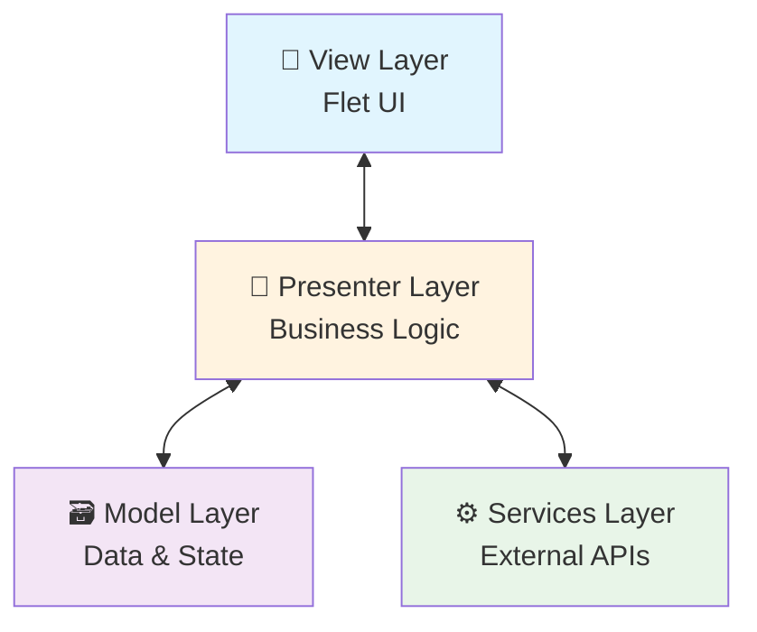
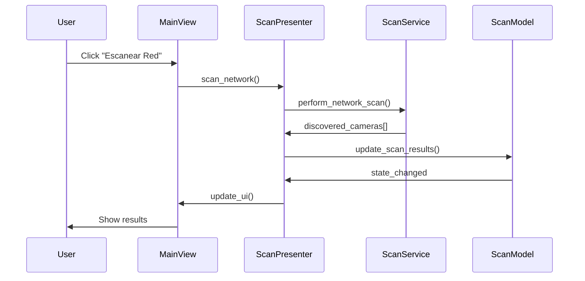
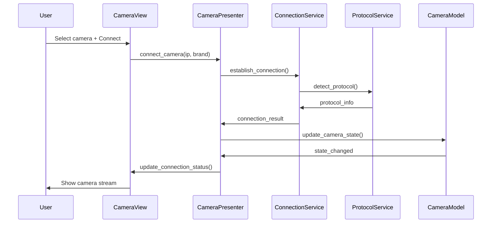

# 🏛️ Arquitectura MVP

## 📋 Visión General

**Universal Camera Viewer** implementa el patrón **Model-View-Presenter (MVP)** para lograr separación de responsabilidades y facilitar el testing y mantenimiento.



## 🔄 Patrón MVP

### **Model (🗃️ Modelo)**

- **Responsabilidad:** Estado de la aplicación y datos
- **Ubicación:** `src/models/`
- **Estado:** ✅ **100% Completo**

```python
# camera_model.py
class CameraModel:
    """Estado y datos de cámaras conectadas"""
    
# connection_model.py  
class ConnectionModel:
    """Estado de conexiones activas"""
    
# scan_model.py
class ScanModel:
    """Estado de escaneos de red"""
```

### **View (📱 Vista)**

- **Responsabilidad:** Interfaz de usuario y eventos
- **Ubicación:** `src/views/`
- **Estado:** ✅ **95% Completo** (Flet + Material Design 3)

```python
# main_view.py
class MainView:
    """Vista principal con navegación y layout"""
    
# camera_view.py
class CameraView:
    """Vista de gestión de cámaras"""
```

### **Presenter (🔗 Presentador)**

- **Responsabilidad:** Lógica de negocio y coordinación
- **Ubicación:** `src/presenters/`
- **Estado:** 🚧 **20% Completo** (EN DESARROLLO)

```python
# main_presenter.py
class MainPresenter:
    """Coordinación general de la aplicación"""
    
# camera_presenter.py
class CameraPresenter:
    """Lógica de gestión de cámaras"""
    
# scan_presenter.py  
class ScanPresenter:
    """Lógica de escaneo de red"""
```

## 🔧 Services Layer

### **Servicios de Negocio**

- **Ubicación:** `src/services/`
- **Estado:** ✅ **100% Completo**

```python
# protocol_service.py
class ProtocolService:
    """Gestión de protocolos ONVIF, RTSP, HTTP/CGI"""
    
# scan_service.py
class ScanService:
    """Escaneo de red y descubrimiento de cámaras"""
    
# connection_service.py
class ConnectionService:
    """Gestión de conexiones a cámaras"""
    
# config_service.py
class ConfigService:
    """Gestión de configuración"""
    
# data_service.py
class DataService:
    """Persistencia de datos"""
```

## 📊 Estado Actual del MVP

| Capa | Progreso | Archivos | Estado |
|------|----------|----------|--------|
| **Model** | 100% | 3/3 | ✅ Completo |
| **View** | 95% | 2/2 | ✅ Flet implementado |
| **Presenter** | 20% | 1/5 | 🚧 En desarrollo |
| **Services** | 100% | 5/5 | ✅ Completo |

## 🎯 Flujo de Datos

### **Escaneo de Red (Ejemplo)**



### **Conexión a Cámara (Ejemplo)**



## 🏗️ Estructura de Carpetas

```bash
src/
├── 📱 views/              # UI Layer (Flet)
│   ├── main_view.py      # ✅ Vista principal
│   └── camera_view.py    # ✅ Vista de cámaras
│
├── 🔗 presenters/         # Business Logic
│   ├── base_presenter.py # ✅ Clase base
│   ├── main_presenter.py # 🚧 20% implementado
│   ├── camera_presenter.py # ❌ Pendiente
│   ├── scan_presenter.py # ❌ Pendiente
│   └── config_presenter.py # ❌ Pendiente
│
├── 🗃️ models/             # Data & State
│   ├── camera_model.py   # ✅ Modelo de cámaras
│   ├── connection_model.py # ✅ Modelo de conexiones
│   └── scan_model.py     # ✅ Modelo de escaneos
│
├── ⚙️ services/           # External APIs
│   ├── protocol_service.py # ✅ Protocolos de cámara
│   ├── scan_service.py   # ✅ Escaneo de red
│   ├── connection_service.py # ✅ Gestión conexiones
│   ├── config_service.py # ✅ Configuración
│   └── data_service.py   # ✅ Persistencia
│
└── 🛠️ utils/             # Utilities
    ├── config.py         # ✅ Configuración global
    └── brand_manager.py  # ✅ Gestión marcas
```

## 🎨 Arquitectura de UI

### **Material Design 3 Implementation**

```python
# Color Scheme
color_scheme = ft.ColorScheme.from_seed(ft.Colors.BLUE_700)

# Component Hierarchy
AppBar
├── NavigationBar (Material 3)
├── Body Container
│   ├── Side Panel (Cards + TextFields)
│   └── Main Content Area
│       ├── Camera Grid
│       └── Status Bar
└── FloatingActionButton
```

### **Responsive Design**

```python
BREAKPOINTS = {
    'mobile': 600,
    'tablet': 900, 
    'desktop': 1200
}

def adaptive_layout(width: int) -> str:
    if width < 600: return 'mobile'
    elif width < 900: return 'tablet'
    else: return 'desktop'
```

## 🔌 Protocolos Soportados

### **Por Marca de Cámara**

| Marca | Protocolo Principal | Protocolo Secundario | Puerto |
|-------|-------------------|---------------------|--------|
| **Dahua** | ONVIF | HTTP/CGI | 80, 554 |
| **TP-Link** | ONVIF | RTSP | 554, 8080 |
| **Steren** | HTTP/CGI | ONVIF | 80, 8080 |
| **Generic** | ONVIF | RTSP | 554, 80 |

### **Architecture per Protocol**

```python
# protocol_service.py
class ProtocolService:
    def detect_protocol(self, ip: str, brand: str) -> str:
        """Auto-detecta el mejor protocolo"""
        
    def connect_onvif(self, ip: str, credentials: dict) -> bool:
        """Conexión ONVIF estándar"""
        
    def connect_rtsp(self, ip: str, stream_url: str) -> bool:
        """Conexión RTSP directa"""
        
    def connect_http_cgi(self, ip: str, api_endpoint: str) -> bool:
        """Conexión HTTP/CGI para marcas específicas"""
```

## 📈 Performance Architecture

### **Multithreading Strategy**

```python
# Concurrent operations
- Network scanning: ThreadPoolExecutor
- Camera connections: AsyncIO
- Stream processing: Background threads
- UI updates: Main thread only
```

### **Memory Management**

```python
# Efficient resource usage
- Stream buffers: Ring buffer pattern
- Connection pooling: Max 10 concurrent
- Cache management: LRU eviction
- Memory monitoring: psutil integration
```

## 🚀 Próximas Fases

### **Fase 1: Completar MVP (Sprint Actual)**

1. ✅ ~~Model Layer completo~~
2. ✅ ~~View Layer con Flet~~
3. 🚧 **Presenter Layer** (80% pendiente)
4. ✅ ~~Services Layer completo~~

### **Fase 2: Analytics & Testing**

1. 📊 Integración DuckDB para analytics
2. 🧪 Test suite completo (unit + integration)
3. 📈 Performance monitoring
4. 🔒 Security hardening

### **Fase 3: Distribution**

1. 📱 Build nativo con Flet
2. 🚀 CI/CD pipeline
3. 📦 Packaging automatizado
4. 📚 Documentación de usuario final

## 🎯 Próximos Pasos para Desarrolladores

1. **[💻 Setup Desarrollo](development.md#setup-inicial)**
2. **[📡 Entender Services](api-services.md)**
3. **[🔗 Implementar Presenters](development.md#tareas-prioritarias)**

---

**🏗️ Arquitectura:** MVP Pattern con separación clara de responsabilidades  
**🎨 UI:** Flet + Material Design 3 para experiencia moderna  
**⚡ Performance:** Multithreading + AsyncIO para operaciones concurrentes
