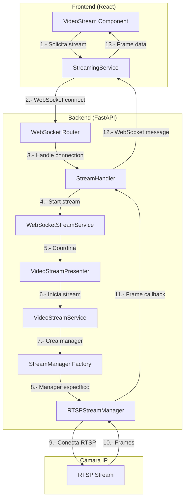
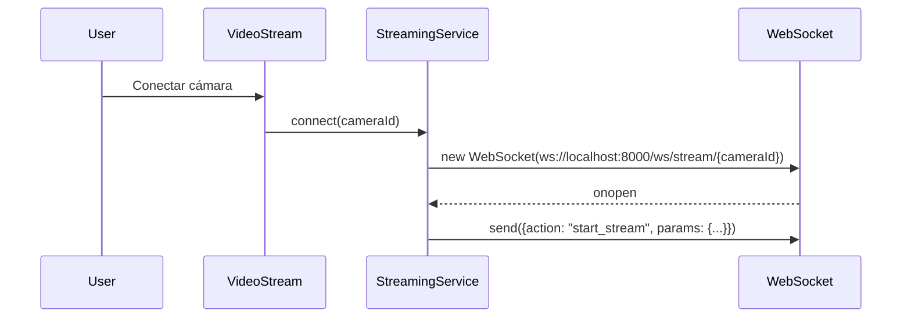
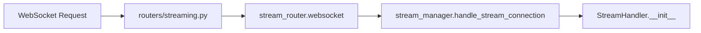
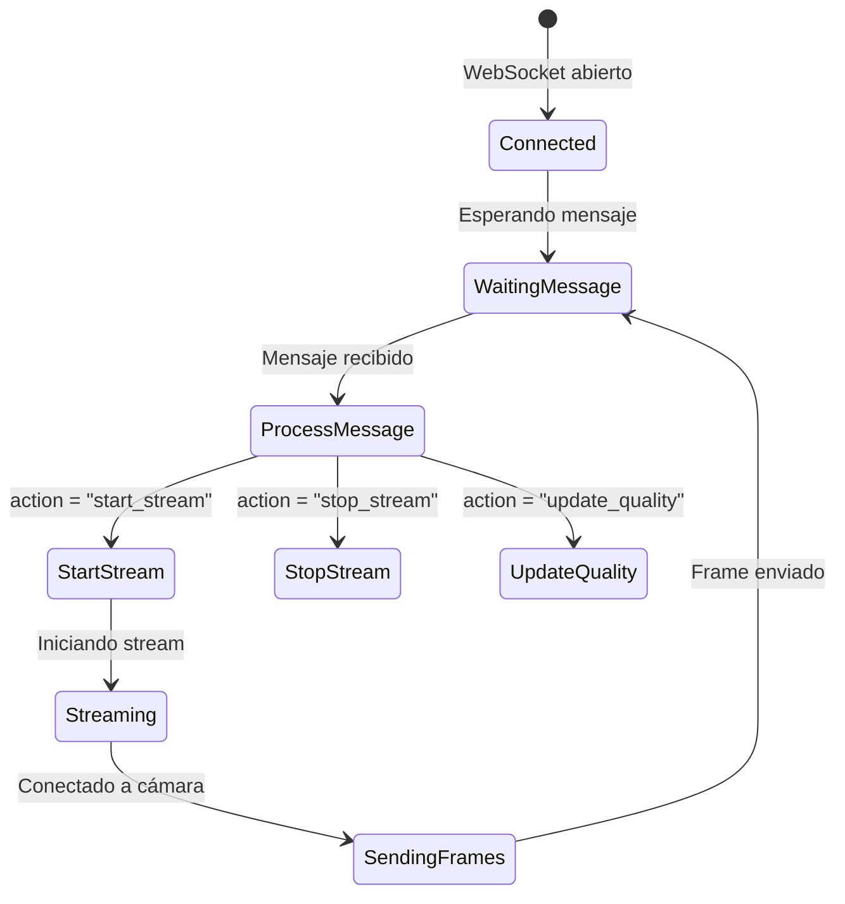
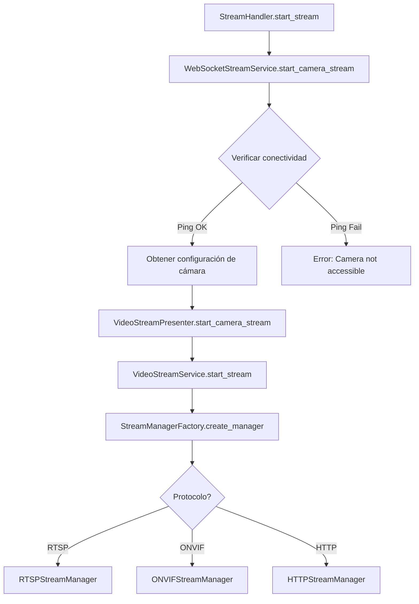
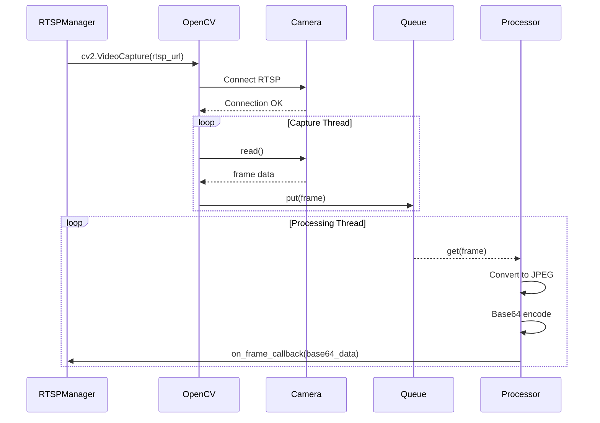
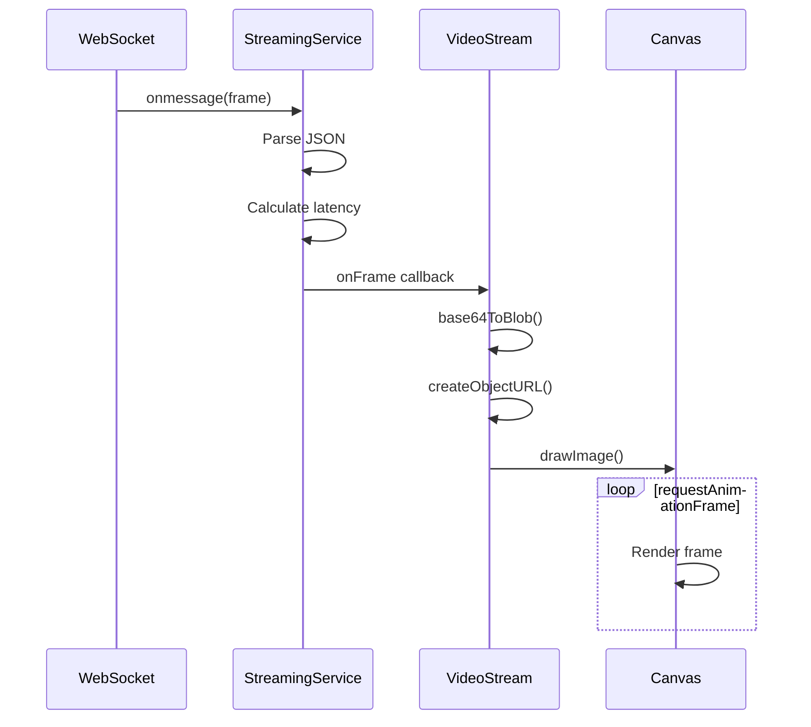
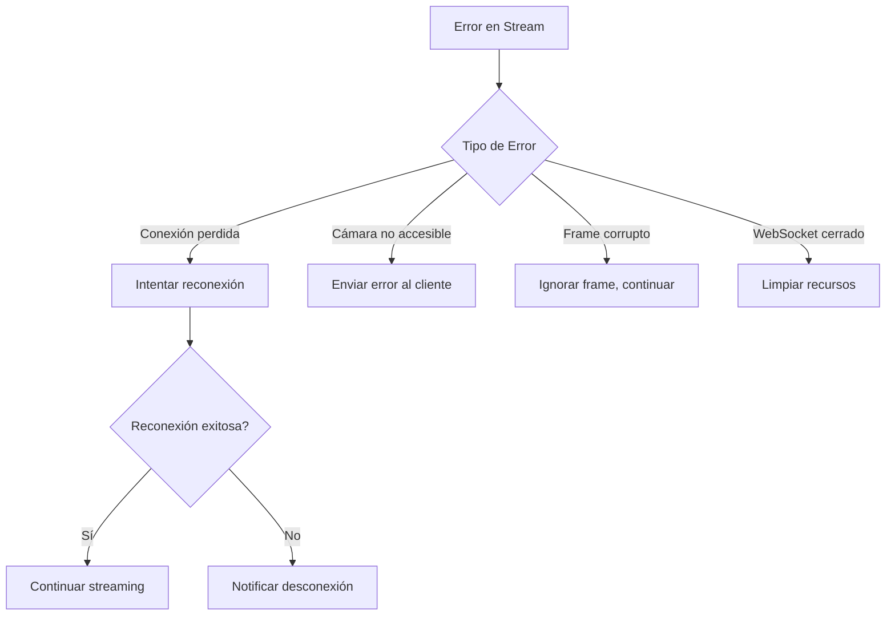

# Flujo de Streaming de Video - Universal Camera Viewer

## Resumen

Este documento explica el flujo completo del streaming de video desde que el frontend solicita el video de una cámara hasta que recibe los frames para mostrarlos al usuario.

## Arquitectura General



## Flujo Detallado

### 1. Inicio desde el Frontend



**Archivos involucrados:**

- `src/features/cameras/components/VideoStream.tsx`
- `src/services/python/streamingService.ts`

### 2. Recepción en el Backend



**Archivo:** `routers/streaming.py`

```python
@router.websocket("/stream/{camera_id}")
async def websocket_stream(websocket: WebSocket, camera_id: str):
    client_id = f"client_{uuid.uuid4()}"
    await stream_manager.handle_stream_connection(websocket, camera_id, client_id)
```

### 3. Manejo de Mensajes WebSocket



**Archivo:** `websocket/stream_handler.py`

```python
class StreamHandler:
    async def handle_message(self, message: dict) -> None:
        action = message.get("action")
        if action == "start_stream":
            await self.start_stream(params)
```

### 4. Establecimiento de Conexión con la Cámara



**Archivos involucrados:**

- `websocket/stream_handler.py`
- `services/websocket_stream_service.py`
- `presenters/streaming/video_stream_presenter.py`
- `services/video/video_stream_service.py`
- `services/video/stream_manager.py`

### 5. Captura de Frames desde la Cámara



**Archivo:** `services/video/rtsp_stream_manager.py`

```python
class RTSPStreamManager(BaseStreamManager):
    def _capture_loop(self):
        while self._running:
            ret, frame = self._capture.read()
            if ret and frame is not None:
                self._frame_queue.put(frame)
```

### 6. Flujo de Frames hacia el Frontend

```mermaid
graph LR
    A[Frame Capturado] --> B[Base64 Encoding]
    B --> C[StreamHandler._on_frame_received]
    C --> D[Agregar timestamp]
    D --> E[Calcular métricas]
    E --> F[send_frame]
    F --> G[WebSocket.send_json]
    G --> H[Frontend recibe]
    H --> I[Base64 to Blob]
    I --> J[Canvas render]
```



**Estructura del mensaje de frame:**

```json
{
    "type": "frame",
    "camera_id": "5c69e02a-bd5e-4559-85c9-90664032f860",
    "data": "base64_encoded_jpeg_data...",
    "timestamp": "2025-07-17T19:43:19.123Z",
    "capture_timestamp": "2025-07-17T19:43:19.100Z",
    "frame_number": 1234,
    "metrics": {
        "fps": 15.2,
        "target_fps": 15,
        "quality": "medium",
        "format": "jpeg",
        "frames_sent": 1234,
        "uptime_seconds": 120.5,
        "avg_fps": 14.8,
        "health_score": 85.0
    }
}
```

### 7. Renderizado en el Frontend



**Archivo:** `src/features/cameras/components/VideoStream.tsx`

## Clases y Archivos Clave

### Backend (Python)

| Archivo | Clase/Función | Responsabilidad |
|---------|---------------|-----------------|
| `routers/streaming.py` | `websocket_stream()` | Endpoint WebSocket principal |
| `websocket/stream_handler.py` | `StreamHandler` | Maneja conexión WebSocket individual |
| `websocket/connection_manager.py` | `ConnectionManager` | Gestiona múltiples conexiones |
| `services/websocket_stream_service.py` | `WebSocketStreamService` | Lógica de negocio para WebSocket |
| `presenters/streaming/video_stream_presenter.py` | `VideoStreamPresenter` | Coordinación MVP |
| `services/video/video_stream_service.py` | `VideoStreamService` | Servicio principal de video (Singleton) |
| `services/video/stream_manager.py` | `StreamManagerFactory` | Factory para crear managers |
| `services/video/rtsp_stream_manager.py` | `RTSPStreamManager` | Implementación RTSP con OpenCV |
| `services/video/frame_converter.py` | `FrameConverter` | Convierte frames a diferentes formatos |
| `models/streaming/stream_model.py` | `StreamModel` | Modelo de datos del stream |

### Frontend (TypeScript/React)

| Archivo | Clase/Función | Responsabilidad |
|---------|---------------|-----------------|
| `src/services/python/streamingService.ts` | `StreamingService` | Cliente WebSocket |
| `src/features/cameras/components/VideoStream.tsx` | `VideoStream` | Componente React para mostrar video |
| `src/features/cameras/components/CameraCard.tsx` | `CameraCard` | Tarjeta de cámara con controles |

## Optimizaciones Implementadas

### 1. **Buffer de Frames**

- Se usa una cola asíncrona para evitar pérdida de frames
- Tamaño configurable según la calidad deseada

### 2. **Threading Separado**

- Captura en un thread
- Procesamiento en otro thread
- Evita bloqueos en la captura

### 3. **Canvas Rendering**

- Uso de `requestAnimationFrame` para renderizado fluido
- Conversión a Blob para evitar re-parseo de base64

### 4. **Compresión JPEG Adaptativa**

- Calidad ajustable: low (60%), medium (80%), high (95%)
- Balance entre calidad y ancho de banda

### 5. **Métricas en Tiempo Real**

- FPS actual y promedio
- Latencia basada en timestamp de captura
- Health score del stream

## Manejo de Errores



## Consideraciones de Performance

1. **Múltiples Cámaras**: El sistema puede manejar múltiples streams simultáneos
2. **CPU Usage**: Procesamiento distribuido en threads
3. **Memoria**: Buffers limitados para evitar memory leaks
4. **Red**: Compresión adaptativa según ancho de banda
5. **Latencia**: Típicamente < 100ms en red local

## Conclusión

El sistema de streaming está diseñado con una arquitectura en capas que facilita el mantenimiento y la escalabilidad. La separación de responsabilidades permite modificar componentes individuales sin afectar el resto del sistema.
