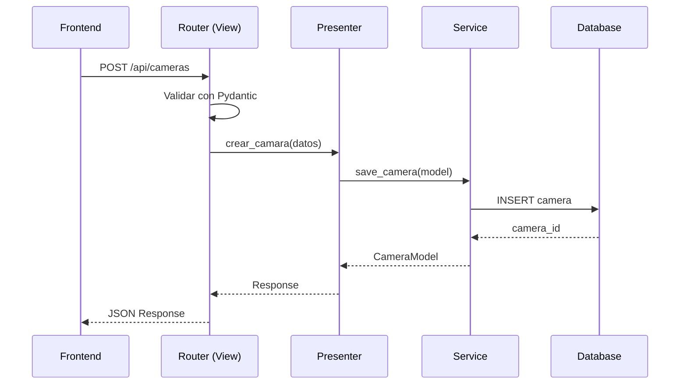
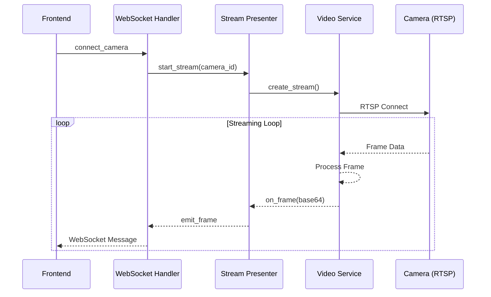
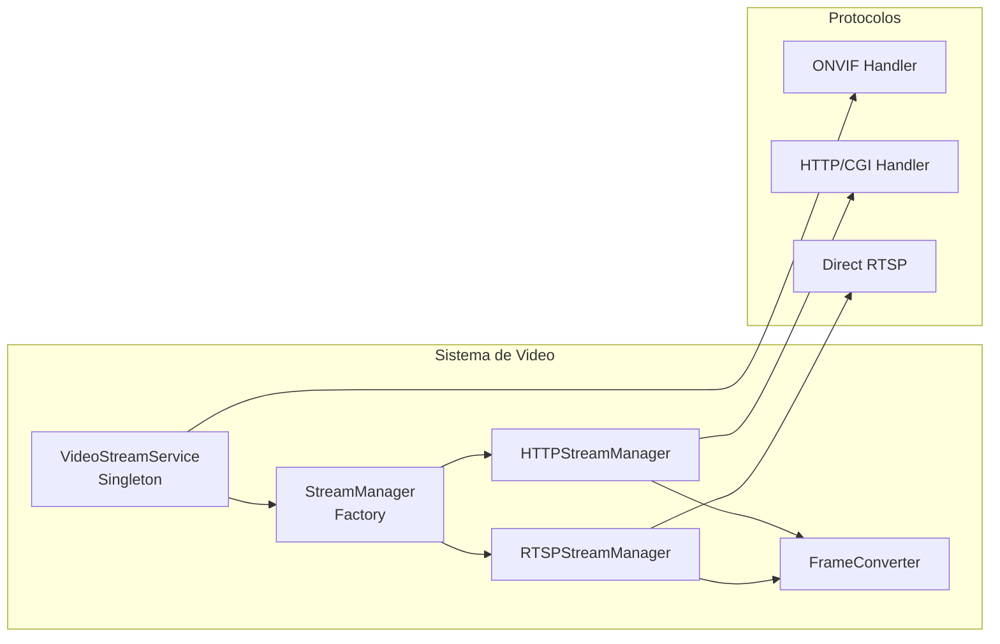
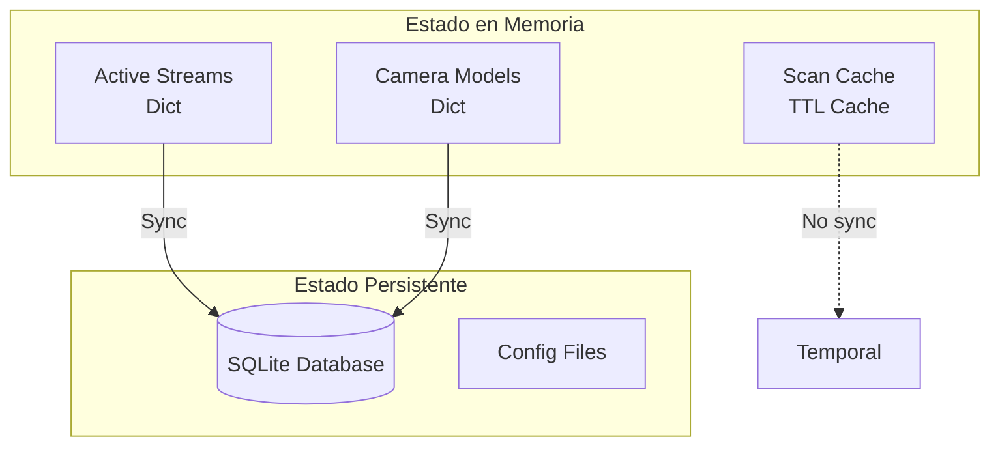
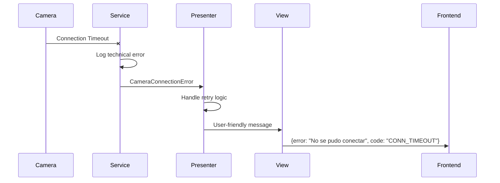

# Arquitectura del Backend - Universal Camera Viewer

## 📋 Índice

1. [Visión General](#visión-general)
2. [Patrón Arquitectónico MVP](#patrón-arquitectónico-mvp)
3. [Capas de la Arquitectura](#capas-de-la-arquitectura)
4. [Flujo de Comunicación](#flujo-de-comunicación)
5. [Servicios y Componentes Clave](#servicios-y-componentes-clave)
6. [Gestión de Estado](#gestión-de-estado)
7. [Seguridad y Manejo de Errores](#seguridad-y-manejo-de-errores)

## 🎯 Visión General

Universal Camera Viewer es una aplicación de gestión y visualización de cámaras IP que implementa el patrón **Model-View-Presenter (MVP)** con una arquitectura por capas bien definida. El backend está desarrollado en Python y se comunica con un frontend React/TypeScript a través de WebSockets y API REST.

### Principios Arquitectónicos

- **Separación de Responsabilidades**: Cada capa tiene un propósito específico y no conoce los detalles de implementación de otras capas
- **Inversión de Dependencias**: Las capas superiores dependen de abstracciones, no de implementaciones concretas
- **Principio de Responsabilidad Única**: Cada clase/módulo tiene una sola razón para cambiar
- **Comunicación Unidireccional**: El flujo de datos sigue patrones predecibles y documentados

## 🏗️ Patrón Arquitectónico MVP



```mermaid
graph TB
    subgraph FRONTEND["Frontend (React)"]
        UI[Componentes UI]
        WS[WebSocket Client]
        HTTP[HTTP Client]
    end
    
    subgraph BACKEND["Backend MVP"]
        subgraph VIEW["View Layer"]
            API[FastAPI Routes]
            WSH[WebSocket Handlers]
        end
        
        subgraph PRESENTER["Presenter Layer"]
            CP[Camera Presenter]
            SP[Streaming Presenter]
            SCAN[Scan Presenter]
        end
        
        subgraph MODEL["Model Layer"]
            CM[Camera Model]
            SM[Stream Model]
            SCM[Scan Model]
        end
        
        subgraph SERVICE["Service Layer"]
            CS[Camera Service]
            VS[Video Service]
            PS[Protocol Service]
            DB[(SQLite DB)]
        end
    end
    
    UI --> HTTP
    UI --> WS
    HTTP --> API
    WS --> WSH
    
    API --> CP
    WSH --> SP
    
    CP --> CM
    CP --> CS
    SP --> SM
    SP --> VS
    SCAN --> SCM
    SCAN --> PS
    
    CS --> DB
    VS --> PS
    
    style FRONTEND fill:#2C2E3E
    style VIEW fill:#3E362C
    style PRESENTER fill:#393E2C
    style MODEL fill:#2C3E2F
    style SERVICE fill:#3A2C3E
    style BACKEND fill:#3E2C2C
```

### Responsabilidades por Capa

1. **View Layer**:
   - Expone endpoints REST y WebSocket
   - Valida entrada de datos con Pydantic
   - Transforma respuestas para el cliente
   - No contiene lógica de negocio

2. **Presenter Layer**:
   - Coordina la lógica de negocio
   - Orquesta servicios
   - Gestiona el estado de la aplicación
   - Maneja errores y los transforma para la vista

3. **Model Layer**:
   - Define estructuras de datos del dominio
   - Implementa validaciones de negocio
   - Mantiene el estado en memoria
   - No realiza operaciones I/O

4. **Service Layer**:
   - Implementa operaciones externas (DB, red, archivos)
   - Maneja conexiones con cámaras
   - Gestiona protocolos (RTSP, ONVIF)
   - Implementa patrones Singleton cuando es necesario

## 🔄 Flujo de Comunicación

### Flujo HTTP (CRUD Operations)



### Flujo WebSocket (Streaming)



## 🔧 Servicios y Componentes Clave

### 1. Sistema de Streaming



### 2. Gestión de Cámaras

- **CameraManagerService**: Servicio singleton que gestiona el ciclo de vida de las cámaras
- **ProtocolService**: Descubrimiento automático de protocolos y capacidades
- **ConnectionService**: Gestión de conexiones y reconexión automática
- **EncryptionService**: Cifrado de credenciales sensibles

### 3. API REST

```python
# Estructura de rutas
/api/
├── cameras/          # CRUD básico de cámaras
├── cameras/v2/       # API extendida con credenciales, perfiles, etc.
├── scan/            # Escaneo de red
├── streaming/       # Control de streaming
└── system/          # Estado del sistema
```

## 📊 Gestión de Estado

### Estado en Memoria



### Sincronización de Estado

1. **Modelos en Memoria**: Cachean datos frecuentemente accedidos
2. **Base de Datos**: Fuente de verdad para configuración persistente
3. **Cache con TTL**: Para resultados de escaneo y descubrimiento
4. **WebSocket State**: Mantiene estado de conexiones activas

## 🔒 Seguridad y Manejo de Errores

### Jerarquía de Excepciones

```python
CameraViewerError (Base)
├── ValidationError
├── CameraConnectionError
├── StreamingError
├── ProtocolError
└── ServiceError
```

### Patrones de Seguridad

1. **Encriptación de Credenciales**:
   - Uso de Fernet para cifrado simétrico
   - Claves únicas por instalación
   - Credenciales nunca en texto plano en DB

2. **Validación de Entrada**:
   - Pydantic models en todas las APIs
   - Validación de IPs y puertos
   - Sanitización de rutas y URLs

3. **Manejo de Errores**:
   - Errores específicos por capa
   - Logging detallado para debugging
   - Mensajes user-friendly para el frontend

### Ejemplo de Flujo de Error



## 🚀 Optimizaciones y Patrones

### 1. Singleton Services

- `VideoStreamService`: Una instancia global para todos los streams
- `CameraManagerService`: Gestión centralizada de cámaras
- `EncryptionService`: Clave única por aplicación

### 2. Factory Pattern

- `StreamManagerFactory`: Crea managers según protocolo
- `ProtocolHandlerFactory`: Instancia handlers específicos

### 3. Async/Await

- Todas las operaciones I/O son asíncronas
- Uso de `asyncio` para concurrencia
- Timeouts en todas las operaciones de red

### 4. Connection Pooling

- Reutilización de conexiones HTTP
- Gestión de sesiones aiohttp
- Límites de conexiones concurrentes

## 📈 Métricas y Monitoreo

El sistema incluye recolección de métricas en tiempo real:

- **FPS actual y promedio** por stream
- **Latencia de red** (timestamp-based)
- **Frames perdidos** y reconexiones
- **Health Score** calculado por stream
- **Uso de recursos** (CPU, memoria)

Estas métricas se transmiten al frontend a través de WebSocket para mostrar el estado en tiempo real de cada cámara.
