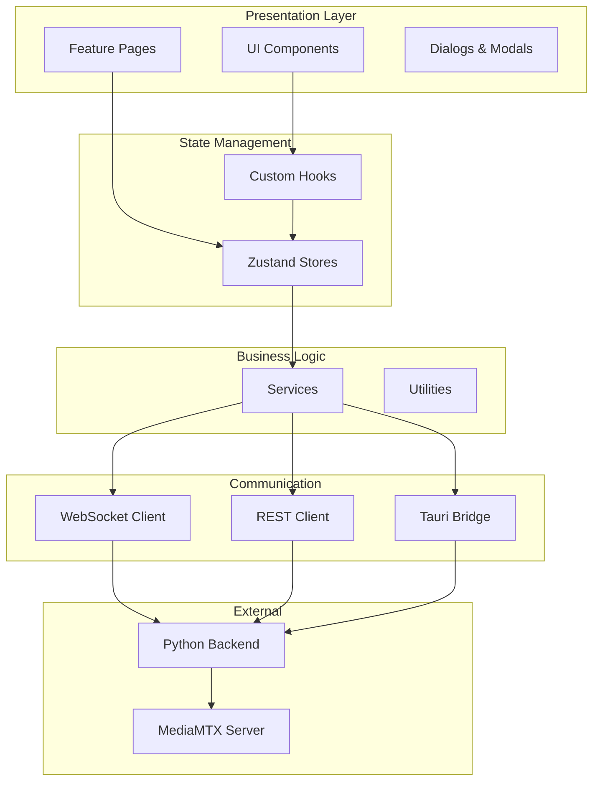
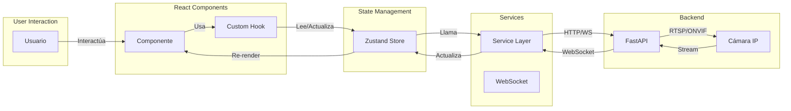
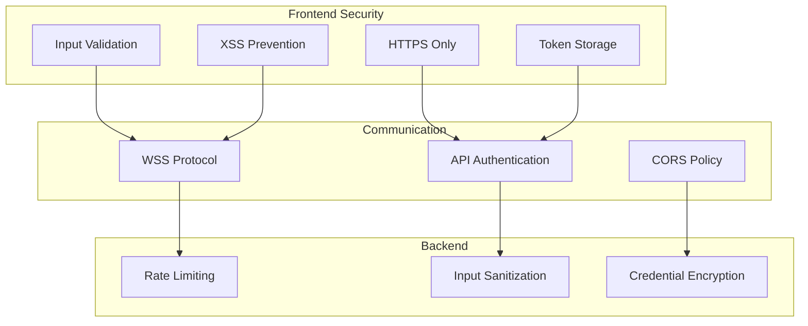

# 🏗️ Arquitectura - Universal Camera Viewer

[← Introducción](./introduccion.md) | [Índice](./README.md) | [Estructura del Proyecto →](./estructura-proyecto.md)

## 🎯 Visión General

La arquitectura del frontend sigue un modelo basado en componentes con gestión de estado centralizada y comunicación asíncrona con el backend.

## 🏛️ Arquitectura de Alto Nivel



## 🎨 Patrones de Diseño

### 1. **Component-Based Architecture**
```typescript
// Componentes funcionales con hooks
const CameraCard: React.FC<Props> = memo(({ camera }) => {
  const { connect, disconnect } = useCamera(camera.id);
  return <Card>...</Card>;
});
```

### 2. **State Management con Zustand**
```typescript
// Store centralizado sin boilerplate
const useCameraStore = create<CameraStore>((set, get) => ({
  cameras: [],
  addCamera: (camera) => set((state) => ({
    cameras: [...state.cameras, camera]
  }))
}));
```

### 3. **Service Layer Pattern**
```typescript
// Servicios para lógica de negocio
class CameraService {
  async scanNetwork(): Promise<Camera[]> {
    // Lógica de escaneo
  }
}
```

### 4. **WebSocket para Real-Time**
```typescript
// Comunicación bidireccional
ws.on('frame', (data) => {
  updateVideoStream(data);
});
```

## 🔄 Flujo de Datos



## 🏗️ Decisiones Arquitectónicas

### 1. **React + TypeScript**
- ✅ **Tipo seguro**: Detección de errores en tiempo de compilación
- ✅ **IntelliSense**: Mejor experiencia de desarrollo
- ✅ **Refactoring**: Más seguro y confiable

### 2. **Zustand sobre Redux**
- ✅ **Simplicidad**: Menos boilerplate
- ✅ **Performance**: Re-renders optimizados
- ✅ **TypeScript**: Soporte nativo excelente
- ✅ **Tamaño**: Solo 8KB vs 60KB de Redux

### 3. **Material-UI v6**
- ✅ **Componentes robustos**: Ahorra tiempo de desarrollo
- ✅ **Temas**: Sistema de diseño consistente
- ✅ **Accesibilidad**: WCAG 2.1 compliant
- ✅ **Tree-shaking**: Solo importa lo necesario

### 4. **Vite como bundler**
- ✅ **HMR rápido**: Desarrollo más ágil
- ✅ **Build optimizado**: Bundles más pequeños
- ✅ **ESM nativo**: Mejor performance
- ✅ **Plugin ecosystem**: Extensible

### 5. **WebSocket para streaming**
- ✅ **Baja latencia**: Comunicación en tiempo real
- ✅ **Bidireccional**: Comandos y datos
- ✅ **Eficiente**: Menos overhead que polling

## 🔌 Capas de la Aplicación

### 1. **Presentation Layer**
- Componentes React puramente visuales
- Sin lógica de negocio
- Responsivos y accesibles

### 2. **Container Layer**
- Componentes que conectan UI con estado
- Manejo de efectos secundarios
- Orquestación de componentes

### 3. **State Layer**
- Stores de Zustand
- Estado global de la aplicación
- Acciones y selectores

### 4. **Service Layer**
- Comunicación con backend
- Transformación de datos
- Manejo de errores

### 5. **Infrastructure Layer**
- Configuración de WebSocket
- Cliente HTTP
- Utilidades comunes

## 🔒 Seguridad



## 📊 Métricas de Arquitectura

| Aspecto | Métrica | Target | Status |
|---------|---------|--------|--------|
| Bundle Size | < 500KB | 420KB | ✅ |
| Code Coverage | > 80% | 75% | ⚠️ |
| Lighthouse Score | > 90 | 92 | ✅ |
| Time to Interactive | < 3s | 2.4s | ✅ |
| Memory Leaks | 0 | 0 | ✅ |

## 🚀 Optimizaciones Implementadas

1. **Code Splitting**: Lazy loading de rutas
2. **React.memo**: Prevención de re-renders
3. **useMemo/useCallback**: Optimización de cálculos
4. **Virtual Scrolling**: Para listas largas
5. **Image Optimization**: Lazy loading de imágenes
6. **Bundle Analysis**: Tree shaking efectivo

## 🔄 Patrones de Comunicación

### REST API
```typescript
// Para operaciones CRUD
GET    /api/cameras
POST   /api/cameras
PUT    /api/cameras/:id
DELETE /api/cameras/:id
```

### WebSocket Events
```typescript
// Para datos en tiempo real
ws.emit('camera:connect', { cameraId });
ws.on('stream:frame', handleFrame);
ws.on('metrics:update', updateMetrics);
```

### Tauri IPC
```typescript
// Para operaciones nativas
invoke('scan_network', { subnet: '192.168.1.0/24' });
```

---

[← Introducción](./introduccion.md) | [Índice](./README.md) | [Estructura del Proyecto →](./estructura-proyecto.md)