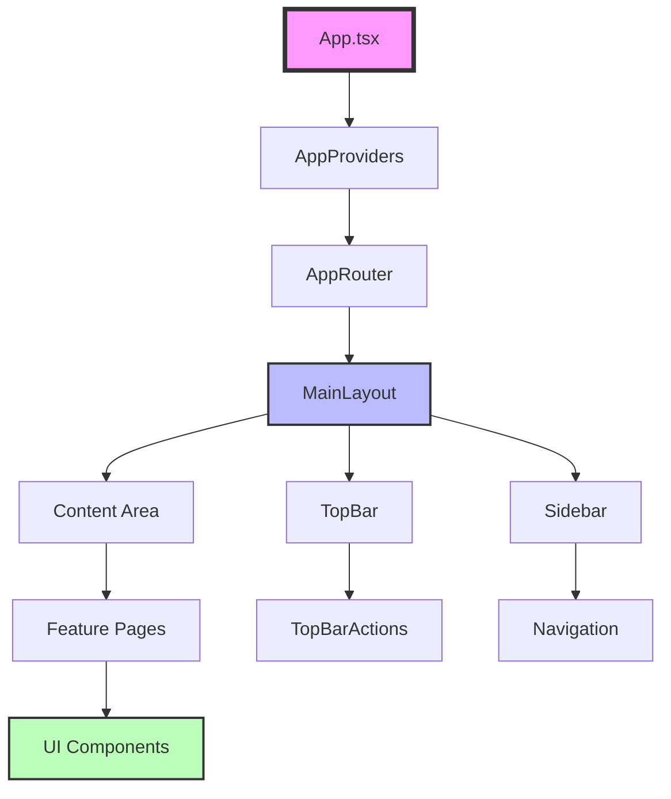
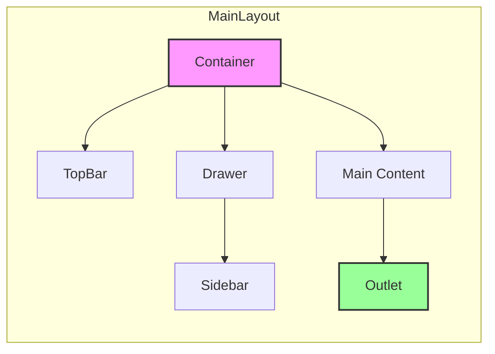

# 🧩 Componentes Principales - Universal Camera Viewer

[← Flujo de Datos](./flujo-datos.md) | [Índice](./README.md) | [Features →](./features.md)

## 🎯 Visión General

Los componentes principales forman la base reutilizable de la aplicación, siguiendo principios de composición y separación de responsabilidades.

## 🏗️ Jerarquía de Componentes



## 📦 Componentes Core

### 1. **App Component** - Punto de Entrada
```typescript
// App.tsx
const App: React.FC = () => {
  return (
    <AppProviders>
      <CssBaseline />
      <AppRouter />
      <Toaster />
    </AppProviders>
  );
};
```

### 2. **AppProviders** - Contextos Globales
```typescript
// app/providers/AppProviders.tsx
export const AppProviders: React.FC<{ children: ReactNode }> = ({ children }) => {
  const theme = useThemeStore((state) => state.theme);
  
  return (
    <StyledEngineProvider injectFirst>
      <ThemeProvider theme={theme === 'light' ? lightTheme : darkTheme}>
        <LocalizationProvider dateAdapter={AdapterDateFns}>
          <SnackbarProvider maxSnack={3}>
            <ErrorBoundary>
              {children}
            </ErrorBoundary>
          </SnackbarProvider>
        </LocalizationProvider>
      </ThemeProvider>
    </StyledEngineProvider>
  );
};
```

## 🎨 Componentes de Layout

### 1. **MainLayout** - Estructura Principal



```typescript
// components/layout/MainLayout.tsx
export const MainLayout: React.FC = () => {
  const [sidebarOpen, setSidebarOpen] = useState(true);
  
  return (
    <Box sx={{ display: 'flex', minHeight: '100vh' }}>
      <TopBar onMenuClick={() => setSidebarOpen(!sidebarOpen)} />
      
      <Drawer
        variant="permanent"
        open={sidebarOpen}
        sx={{
          width: sidebarOpen ? drawerWidth : closedDrawerWidth,
          transition: theme.transitions.create('width')
        }}
      >
        <Sidebar collapsed={!sidebarOpen} />
      </Drawer>
      
      <Box component="main" sx={{ flexGrow: 1, p: 3 }}>
        <Toolbar /> {/* Spacer */}
        <Suspense fallback={<LoadingScreen />}>
          <Outlet />
        </Suspense>
      </Box>
    </Box>
  );
};
```

### 2. **TopBar** - Barra Superior

```typescript
// components/layout/TopBar/TopBar.tsx
interface TopBarProps {
  onMenuClick: () => void;
}

export const TopBar: React.FC<TopBarProps> = memo(({ onMenuClick }) => {
  const { toggleTheme, theme } = useThemeStore();
  
  return (
    <AppBar position="fixed" sx={{ zIndex: (theme) => theme.zIndex.drawer + 1 }}>
      <Toolbar>
        <IconButton onClick={onMenuClick} edge="start">
          <MenuIcon />
        </IconButton>
        
        <Typography variant="h6" sx={{ flexGrow: 1 }}>
          Universal Camera Viewer
        </Typography>
        
        <TopBarActions>
          <IconButton onClick={toggleTheme}>
            {theme === 'light' ? <DarkModeIcon /> : <LightModeIcon />}
          </IconButton>
          
          <NotificationBell />
          <UserMenu />
        </TopBarActions>
      </Toolbar>
    </AppBar>
  );
});
```

### 3. **Sidebar** - Navegación Lateral

```typescript
// components/layout/Sidebar/Sidebar.tsx
interface SidebarProps {
  collapsed: boolean;
}

export const Sidebar: React.FC<SidebarProps> = memo(({ collapsed }) => {
  const location = useLocation();
  
  const menuItems = [
    { path: '/cameras', icon: <CameraIcon />, label: 'Cámaras' },
    { path: '/scanner', icon: <ScanIcon />, label: 'Escáner' },
    { path: '/statistics', icon: <ChartIcon />, label: 'Estadísticas' },
    { path: '/settings', icon: <SettingsIcon />, label: 'Configuración' }
  ];
  
  return (
    <Box sx={{ height: '100%', display: 'flex', flexDirection: 'column' }}>
      <Toolbar /> {/* Spacer for TopBar */}
      
      <List sx={{ flexGrow: 1 }}>
        {menuItems.map((item) => (
          <ListItemButton
            key={item.path}
            component={Link}
            to={item.path}
            selected={location.pathname.startsWith(item.path)}
            sx={{
              justifyContent: collapsed ? 'center' : 'initial',
              px: 2.5
            }}
          >
            <ListItemIcon sx={{ justifyContent: 'center' }}>
              {item.icon}
            </ListItemIcon>
            {!collapsed && (
              <ListItemText primary={item.label} />
            )}
          </ListItemButton>
        ))}
      </List>
      
      <SidebarFooter collapsed={collapsed} />
    </Box>
  );
});
```

## 🎯 Componentes de UI Reutilizables

### 1. **Card Components**

```typescript
// components/ui/cards/InfoCard.tsx
interface InfoCardProps {
  title: string;
  value: string | number;
  icon?: ReactNode;
  trend?: number;
  loading?: boolean;
}

export const InfoCard: React.FC<InfoCardProps> = memo(({
  title,
  value,
  icon,
  trend,
  loading
}) => {
  return (
    <Card sx={{ height: '100%' }}>
      <CardContent>
        <Box sx={{ display: 'flex', alignItems: 'center', mb: 2 }}>
          {icon && (
            <Avatar sx={{ bgcolor: 'primary.light', mr: 2 }}>
              {icon}
            </Avatar>
          )}
          <Typography variant="subtitle2" color="text.secondary">
            {title}
          </Typography>
        </Box>
        
        {loading ? (
          <Skeleton variant="text" width="60%" height={32} />
        ) : (
          <Typography variant="h4" component="div">
            {value}
          </Typography>
        )}
        
        {trend !== undefined && (
          <Box sx={{ display: 'flex', alignItems: 'center', mt: 1 }}>
            {trend > 0 ? (
              <TrendingUpIcon color="success" />
            ) : (
              <TrendingDownIcon color="error" />
            )}
            <Typography
              variant="body2"
              color={trend > 0 ? 'success.main' : 'error.main'}
            >
              {Math.abs(trend)}%
            </Typography>
          </Box>
        )}
      </CardContent>
    </Card>
  );
});
```

### 2. **Table Components**

```typescript
// components/ui/tables/DataTable.tsx
interface DataTableProps<T> {
  columns: Column<T>[];
  data: T[];
  loading?: boolean;
  onRowClick?: (row: T) => void;
  pagination?: boolean;
}

export function DataTable<T>({
  columns,
  data,
  loading,
  onRowClick,
  pagination = true
}: DataTableProps<T>) {
  const [page, setPage] = useState(0);
  const [rowsPerPage, setRowsPerPage] = useState(10);
  
  return (
    <TableContainer component={Paper}>
      <Table>
        <TableHead>
          <TableRow>
            {columns.map((column) => (
              <TableCell key={column.id} align={column.align}>
                {column.label}
              </TableCell>
            ))}
          </TableRow>
        </TableHead>
        
        <TableBody>
          {loading ? (
            <TableRowSkeleton columns={columns.length} rows={5} />
          ) : (
            data
              .slice(page * rowsPerPage, page * rowsPerPage + rowsPerPage)
              .map((row, index) => (
                <TableRow
                  key={index}
                  hover
                  onClick={() => onRowClick?.(row)}
                  sx={{ cursor: onRowClick ? 'pointer' : 'default' }}
                >
                  {columns.map((column) => (
                    <TableCell key={column.id} align={column.align}>
                      {column.render
                        ? column.render(row)
                        : String(row[column.field])}
                    </TableCell>
                  ))}
                </TableRow>
              ))
          )}
        </TableBody>
      </Table>
      
      {pagination && (
        <TablePagination
          component="div"
          count={data.length}
          page={page}
          onPageChange={(_, newPage) => setPage(newPage)}
          rowsPerPage={rowsPerPage}
          onRowsPerPageChange={(e) => {
            setRowsPerPage(parseInt(e.target.value, 10));
            setPage(0);
          }}
        />
      )}
    </TableContainer>
  );
}
```

### 3. **Form Components**

```typescript
// components/ui/forms/ValidatedInput.tsx
interface ValidatedInputProps extends TextFieldProps {
  validation?: (value: string) => string | null;
  onValidChange?: (isValid: boolean) => void;
}

export const ValidatedInput: React.FC<ValidatedInputProps> = memo(({
  validation,
  onValidChange,
  onChange,
  ...props
}) => {
  const [error, setError] = useState<string | null>(null);
  const [touched, setTouched] = useState(false);
  
  const handleChange = (e: React.ChangeEvent<HTMLInputElement>) => {
    const value = e.target.value;
    
    if (validation && touched) {
      const validationError = validation(value);
      setError(validationError);
      onValidChange?.(validationError === null);
    }
    
    onChange?.(e);
  };
  
  const handleBlur = () => {
    setTouched(true);
    if (validation && props.value) {
      const validationError = validation(String(props.value));
      setError(validationError);
      onValidChange?.(validationError === null);
    }
  };
  
  return (
    <TextField
      {...props}
      error={!!error}
      helperText={error || props.helperText}
      onChange={handleChange}
      onBlur={handleBlur}
    />
  );
});
```

## 🔄 Componentes de Estado

### 1. **Loading States**

```typescript
// components/feedback/LoadingStates.tsx
export const LoadingScreen: React.FC = () => (
  <Box
    sx={{
      display: 'flex',
      flexDirection: 'column',
      alignItems: 'center',
      justifyContent: 'center',
      minHeight: '100vh'
    }}
  >
    <CircularProgress size={60} thickness={4} />
    <Typography variant="h6" sx={{ mt: 2 }}>
      Cargando...
    </Typography>
  </Box>
);

export const LoadingOverlay: React.FC<{ open: boolean }> = ({ open }) => (
  <Backdrop open={open} sx={{ zIndex: 9999 }}>
    <CircularProgress color="inherit" />
  </Backdrop>
);

export const InlineLoader: React.FC = () => (
  <Box sx={{ display: 'flex', justifyContent: 'center', p: 2 }}>
    <CircularProgress size={24} />
  </Box>
);
```

### 2. **Error States**

```typescript
// components/feedback/ErrorStates.tsx
interface ErrorMessageProps {
  error: Error | string;
  onRetry?: () => void;
}

export const ErrorMessage: React.FC<ErrorMessageProps> = ({ error, onRetry }) => {
  const errorMessage = typeof error === 'string' ? error : error.message;
  
  return (
    <Alert
      severity="error"
      action={
        onRetry && (
          <Button color="inherit" size="small" onClick={onRetry}>
            Reintentar
          </Button>
        )
      }
    >
      <AlertTitle>Error</AlertTitle>
      {errorMessage}
    </Alert>
  );
};

export const ErrorBoundaryFallback: React.FC<{ error: Error }> = ({ error }) => (
  <Box sx={{ p: 3, textAlign: 'center' }}>
    <ErrorOutlineIcon sx={{ fontSize: 60, color: 'error.main', mb: 2 }} />
    <Typography variant="h5" gutterBottom>
      Algo salió mal
    </Typography>
    <Typography color="text.secondary" paragraph>
      {error.message}
    </Typography>
    <Button variant="contained" onClick={() => window.location.reload()}>
      Recargar página
    </Button>
  </Box>
);
```

### 3. **Empty States**

```typescript
// components/feedback/EmptyStates.tsx
interface EmptyStateProps {
  icon?: ReactNode;
  title: string;
  description?: string;
  action?: {
    label: string;
    onClick: () => void;
  };
}

export const EmptyState: React.FC<EmptyStateProps> = ({
  icon,
  title,
  description,
  action
}) => (
  <Box
    sx={{
      display: 'flex',
      flexDirection: 'column',
      alignItems: 'center',
      justifyContent: 'center',
      p: 4,
      textAlign: 'center'
    }}
  >
    {icon && (
      <Box sx={{ mb: 2, opacity: 0.5 }}>
        {icon}
      </Box>
    )}
    
    <Typography variant="h6" gutterBottom>
      {title}
    </Typography>
    
    {description && (
      <Typography variant="body2" color="text.secondary" paragraph>
        {description}
      </Typography>
    )}
    
    {action && (
      <Button
        variant="contained"
        onClick={action.onClick}
        sx={{ mt: 2 }}
      >
        {action.label}
      </Button>
    )}
  </Box>
);
```

## 🎯 Componentes de Diálogo

### 1. **Confirmation Dialog**

```typescript
// components/dialogs/ConfirmationDialog.tsx
interface ConfirmationDialogProps {
  open: boolean;
  title: string;
  message: string;
  confirmText?: string;
  cancelText?: string;
  severity?: 'warning' | 'error' | 'info';
  onConfirm: () => void;
  onCancel: () => void;
}

export const ConfirmationDialog: React.FC<ConfirmationDialogProps> = memo(({
  open,
  title,
  message,
  confirmText = 'Confirmar',
  cancelText = 'Cancelar',
  severity = 'warning',
  onConfirm,
  onCancel
}) => {
  const getSeverityColor = () => {
    switch (severity) {
      case 'error': return 'error.main';
      case 'warning': return 'warning.main';
      default: return 'info.main';
    }
  };
  
  return (
    <Dialog open={open} onClose={onCancel} maxWidth="xs" fullWidth>
      <DialogTitle sx={{ display: 'flex', alignItems: 'center', gap: 1 }}>
        <WarningIcon sx={{ color: getSeverityColor() }} />
        {title}
      </DialogTitle>
      
      <DialogContent>
        <Typography>{message}</Typography>
      </DialogContent>
      
      <DialogActions>
        <Button onClick={onCancel} color="inherit">
          {cancelText}
        </Button>
        <Button
          onClick={onConfirm}
          variant="contained"
          color={severity}
          autoFocus
        >
          {confirmText}
        </Button>
      </DialogActions>
    </Dialog>
  );
});
```

### 2. **Form Dialog**

```typescript
// components/dialogs/FormDialog.tsx
interface FormDialogProps {
  open: boolean;
  title: string;
  onClose: () => void;
  onSubmit: (data: any) => Promise<void>;
  children: ReactNode;
}

export const FormDialog: React.FC<FormDialogProps> = ({
  open,
  title,
  onClose,
  onSubmit,
  children
}) => {
  const [loading, setLoading] = useState(false);
  
  const handleSubmit = async (e: React.FormEvent) => {
    e.preventDefault();
    setLoading(true);
    
    try {
      const formData = new FormData(e.target as HTMLFormElement);
      const data = Object.fromEntries(formData);
      await onSubmit(data);
      onClose();
    } catch (error) {
      console.error('Form submission error:', error);
    } finally {
      setLoading(false);
    }
  };
  
  return (
    <Dialog open={open} onClose={onClose} maxWidth="sm" fullWidth>
      <form onSubmit={handleSubmit}>
        <DialogTitle>{title}</DialogTitle>
        
        <DialogContent>
          {children}
        </DialogContent>
        
        <DialogActions>
          <Button onClick={onClose} disabled={loading}>
            Cancelar
          </Button>
          <LoadingButton
            type="submit"
            variant="contained"
            loading={loading}
          >
            Guardar
          </LoadingButton>
        </DialogActions>
      </form>
    </Dialog>
  );
};
```

## 🔧 Componentes Utilitarios

### 1. **Animated Components**

```typescript
// components/ui/animations/AnimatedContainer.tsx
interface AnimatedContainerProps {
  children: ReactNode;
  animation?: 'fade' | 'slide' | 'grow';
  delay?: number;
}

export const AnimatedContainer: React.FC<AnimatedContainerProps> = ({
  children,
  animation = 'fade',
  delay = 0
}) => {
  const getAnimation = () => {
    switch (animation) {
      case 'slide':
        return <Slide direction="up" in timeout={300 + delay}>{children}</Slide>;
      case 'grow':
        return <Grow in timeout={300 + delay}>{children}</Grow>;
      default:
        return <Fade in timeout={300 + delay}>{children}</Fade>;
    }
  };
  
  return getAnimation();
};
```

### 2. **Responsive Components**

```typescript
// components/ui/responsive/ResponsiveGrid.tsx
interface ResponsiveGridProps {
  children: ReactNode;
  minItemWidth?: number;
  spacing?: number;
}

export const ResponsiveGrid: React.FC<ResponsiveGridProps> = ({
  children,
  minItemWidth = 300,
  spacing = 2
}) => {
  return (
    <Box
      sx={{
        display: 'grid',
        gridTemplateColumns: `repeat(auto-fill, minmax(${minItemWidth}px, 1fr))`,
        gap: spacing
      }}
    >
      {children}
    </Box>
  );
};
```

## ✅ Best Practices

1. **Memoización**: Usar `React.memo` para componentes puros
2. **Lazy Loading**: Cargar componentes grandes bajo demanda
3. **Composición**: Preferir composición sobre herencia
4. **Props Types**: Definir interfaces claras para props
5. **Accesibilidad**: Incluir ARIA labels y keyboard navigation

---

[← Flujo de Datos](./flujo-datos.md) | [Índice](./README.md) | [Features →](./features.md)