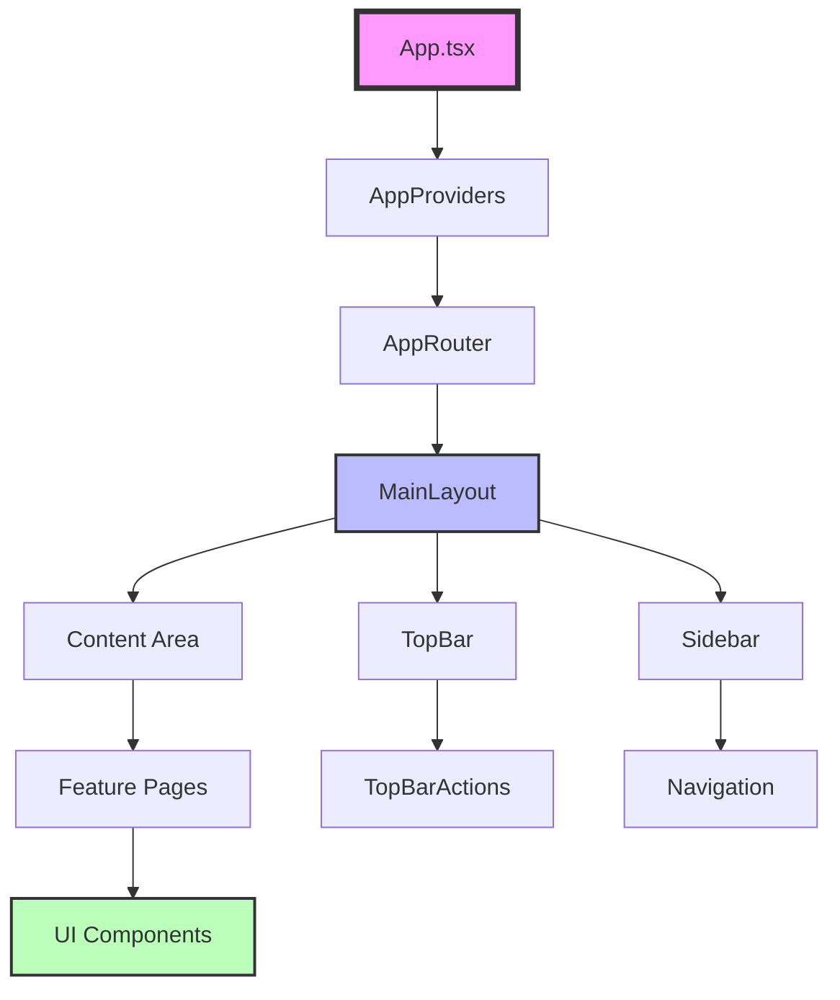
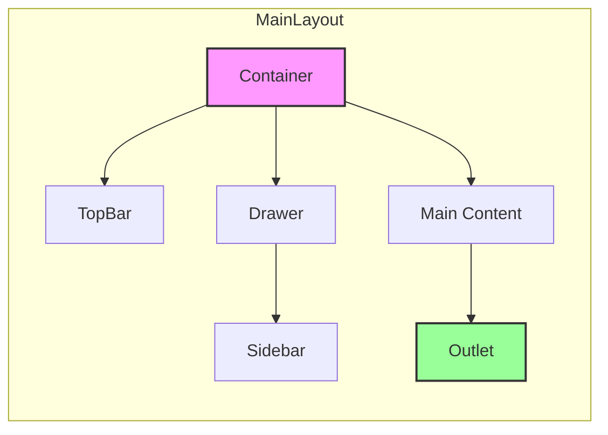

# 🧩 Componentes Principales - Universal Camera Viewer

[← Flujo de Datos](./flujo-datos.md) | [Índice](./README.md) | [Features →](./features.md)

## 🎯 Visión General

Los componentes principales forman la base reutilizable de la aplicación, siguiendo principios de composición y separación de responsabilidades.

## 🏗️ Jerarquía de Componentes

## 📦 Componentes Core

### 1. **App Component** - Punto de Entrada

- Componente raíz de la aplicación
- Envuelve toda la app con los providers necesarios
- Incluye CssBaseline de Material-UI para resetear estilos
- Renderiza el router principal y sistema de notificaciones

### 2. **AppProviders** - Contextos Globales  

- Centraliza todos los providers de la aplicación
- Gestiona el tema (claro/oscuro) con ThemeProvider
- Configura localización de fechas con LocalizationProvider
- Incluye SnackbarProvider para notificaciones
- ErrorBoundary para manejo global de errores

## 🎨 Componentes de Layout

### 1. **MainLayout** - Estructura Principal

**Características del MainLayout:**

- Layout tipo VS Code con sidebar colapsable
- TopBar fija con acciones globales
- Drawer persistente con transiciones suaves
- Área de contenido principal con lazy loading
- Responsive: se adapta a dispositivos móviles
- Manejo de estados para sidebar abierto/cerrado

### 2. **TopBar** - Barra Superior

**Componentes incluidos:**

- Botón de menú para toggle del sidebar
- Título de la aplicación
- Selector de tema (claro/oscuro)
- Campana de notificaciones
- Menú de usuario
- Posición fija con z-index apropiado

### 3. **Sidebar** - Navegación Lateral

**Funcionalidades:**

- Menú de navegación principal con iconos
- Soporta estado colapsado/expandido
- Resalta la sección activa automáticamente
- Footer con información adicional
- Navegación entre: Cámaras, Escáner, Estadísticas y Configuración
- Animaciones suaves en transiciones

## 🎯 Componentes de UI Reutilizables

### 1. **Card Components**

- **InfoCard**: Muestra métricas con título, valor, icono y tendencia
- **ActionCard**: Cards con acciones rápidas integradas
- **StatusCard**: Visualización de estados con colores semánticos
- Soporte para estados de carga con Skeleton
- Indicadores de tendencia (positiva/negativa)

### 2. **Table Components**

- **DataTable**: Tabla genérica con tipado fuerte
- Soporte para paginación integrada
- Columnas configurables con renderizado personalizado
- Estados de carga con skeleton rows
- Filas clickeables con hover effect
- Ordenamiento y filtrado opcional

### 3. **Form Components**

- **ValidatedInput**: TextField con validación integrada
- **PasswordInput**: Campo de contraseña con toggle de visibilidad
- **IPAddressInput**: Input especializado para direcciones IP
- **SelectField**: Dropdown con opciones tipadas
- Validación en tiempo real con mensajes de error
- Integración con react-hook-form opcional

## 🔄 Componentes de Estado

### 1. **Loading States**

- **LoadingScreen**: Pantalla completa de carga para transiciones
- **LoadingOverlay**: Overlay con backdrop para operaciones asíncronas
- **InlineLoader**: Loader pequeño para contenido parcial
- **SkeletonLoaders**: Placeholders para diferentes tipos de contenido

### 2. **Error States**

- **ErrorMessage**: Alerta de error con opción de reintentar
- **ErrorBoundaryFallback**: Fallback para errores críticos
- **ConnectionError**: Estado especial para errores de conexión
- **ValidationError**: Mensajes de error para formularios
- Integración con sistema de notificaciones

### 3. **Empty States**

- **EmptyState**: Estado genérico para contenido vacío
- **NoResultsFound**: Cuando las búsquedas no tienen resultados
- **NoCamerasState**: Estado especial para lista de cámaras vacía
- Iconos y mensajes personalizables
- Acciones sugeridas integradas

## 🎯 Componentes de Diálogo

### 1. **Confirmation Dialog**

- Diálogo reutilizable para confirmaciones
- Soporte para diferentes niveles de severidad (warning, error, info)
- Textos de botones personalizables
- Iconos y colores semánticos según severidad
- Focus automático en botón de confirmación

### 2. **Form Dialog**

- Diálogo genérico para formularios
- Manejo automático de submit con loading state
- Extracción de datos con FormData
- Botón de submit con LoadingButton
- Cierre automático al completar exitosamente

## 🔧 Componentes Utilitarios

### 1. **Animated Components**

- **AnimatedContainer**: Wrapper para animaciones de entrada
- Tipos de animación: fade, slide, grow
- Delay configurable para animaciones secuenciales
- Integración con Material-UI transitions

### 2. **Responsive Components**

- **ResponsiveGrid**: Grid automático responsive
- **ResponsiveContainer**: Ajusta padding según breakpoints
- **MobileDrawer**: Drawer adaptativo para móvil/desktop
- Uso de CSS Grid para layouts fluidos

## ✅ Best Practices

1. **Memoización**: Usar `React.memo` para componentes puros
2. **Lazy Loading**: Cargar componentes grandes bajo demanda
3. **Composición**: Preferir composición sobre herencia
4. **Props Types**: Definir interfaces claras para props
5. **Accesibilidad**: Incluir ARIA labels y keyboard navigation

---

[← Flujo de Datos](./flujo-datos.md) | [Índice](./README.md) | [Features →](./features.md)
