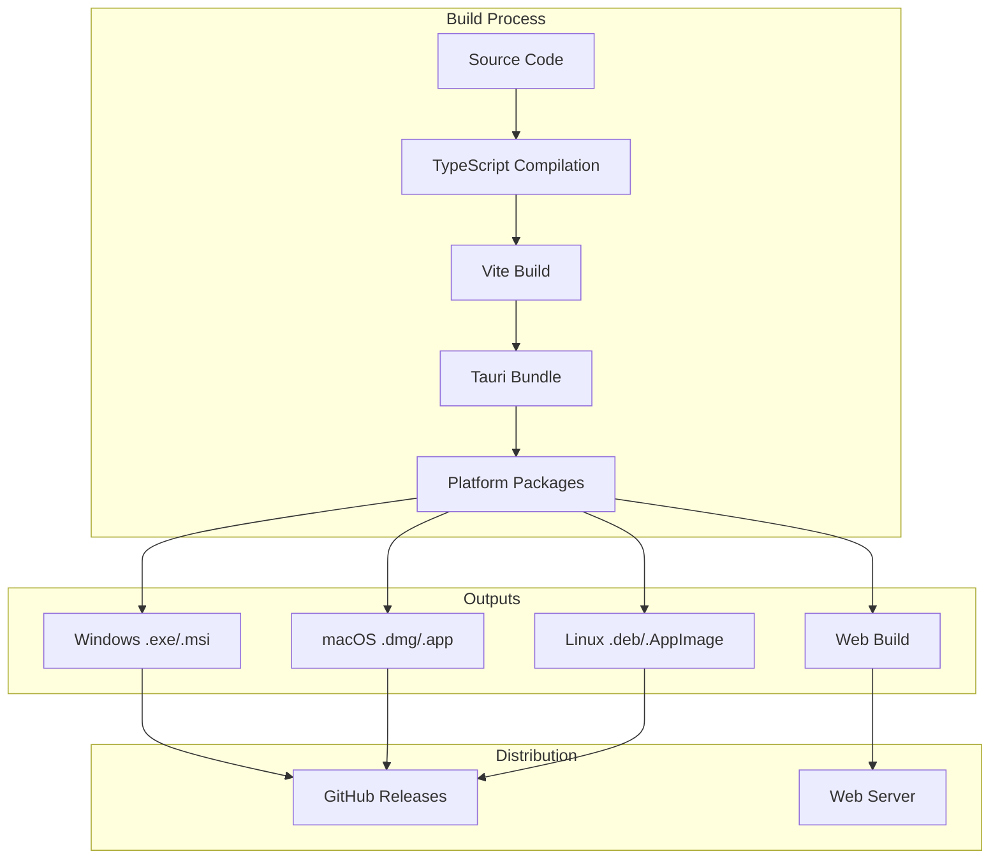

# 🚀 Deployment y Build - Universal Camera Viewer

[← Testing](./testing.md) | [Índice](./README.md)

## 🎯 Visión General

Esta guía cubre el proceso completo de compilación, empaquetado y despliegue de Universal Camera Viewer para diferentes plataformas.

## 🏗️ Arquitectura de Build



## 📦 Configuración de Build

### Vite Configuration

```typescript
// vite.config.ts
import { defineConfig, loadEnv } from 'vite';
import react from '@vitejs/plugin-react';
import { resolve } from 'path';
import { compression } from 'vite-plugin-compression2';
import { VitePWA } from 'vite-plugin-pwa';

export default defineConfig(({ mode }) => {
  const env = loadEnv(mode, process.cwd(), '');
  
  return {
    plugins: [
      react(),
      // Compresión gzip/brotli
      compression({
        algorithm: 'gzip',
        exclude: [/\.(br)$/, /\.(gz)$/],
      }),
      compression({
        algorithm: 'brotliCompress',
        exclude: [/\.(br)$/, /\.(gz)$/],
      }),
      // PWA support
      VitePWA({
        registerType: 'autoUpdate',
        includeAssets: ['favicon.ico', 'robots.txt', 'apple-touch-icon.png'],
        manifest: {
          name: 'Universal Camera Viewer',
          short_name: 'UCamViewer',
          theme_color: '#2196f3',
          icons: [
            {
              src: '/icon-192.png',
              sizes: '192x192',
              type: 'image/png'
            },
            {
              src: '/icon-512.png',
              sizes: '512x512',
              type: 'image/png'
            }
          ]
        }
      })
    ],
    
    resolve: {
      alias: {
        '@': resolve(__dirname, './src')
      }
    },
    
    build: {
      outDir: 'dist',
      sourcemap: mode === 'development',
      minify: mode === 'production' ? 'terser' : false,
      terserOptions: {
        compress: {
          drop_console: true,
          drop_debugger: true
        }
      },
      rollupOptions: {
        output: {
          manualChunks: {
            'react-vendor': ['react', 'react-dom', 'react-router-dom'],
            'mui-vendor': ['@mui/material', '@mui/icons-material', '@mui/lab'],
            'utils': ['axios', 'date-fns', 'zustand'],
            'charts': ['recharts'],
            'camera': ['./src/features/cameras/index.ts'],
            'scanner': ['./src/features/scanner/index.ts'],
            'statistics': ['./src/features/statistics/index.ts']
          },
          assetFileNames: (assetInfo) => {
            let extType = assetInfo.name.split('.').at(1);
            if (/png|jpe?g|svg|gif|tiff|bmp|ico/i.test(extType)) {
              extType = 'img';
            }
            return `assets/${extType}/[name]-[hash][extname]`;
          },
          chunkFileNames: 'assets/js/[name]-[hash].js',
          entryFileNames: 'assets/js/[name]-[hash].js',
        }
      },
      // Optimizaciones
      chunkSizeWarningLimit: 1000,
      cssCodeSplit: true,
      assetsInlineLimit: 4096
    },
    
    // Optimizaciones para preview
    preview: {
      port: 4173,
      strictPort: true,
      host: true
    }
  };
});
```

### Tauri Configuration

```json
// src-tauri/tauri.conf.json
{
  "build": {
    "beforeDevCommand": "yarn dev",
    "beforeBuildCommand": "yarn build",
    "devPath": "http://localhost:5173",
    "distDir": "../dist",
    "withGlobalTauri": false
  },
  "package": {
    "productName": "Universal Camera Viewer",
    "version": "0.9.13"
  },
  "tauri": {
    "allowlist": {
      "all": false,
      "shell": {
        "all": false,
        "open": true
      },
      "window": {
        "all": true
      },
      "fs": {
        "all": false,
        "readFile": true,
        "writeFile": true,
        "exists": true,
        "createDir": true
      },
      "path": {
        "all": true
      },
      "protocol": {
        "all": false,
        "asset": true
      }
    },
    "bundle": {
      "active": true,
      "targets": ["msi", "deb", "dmg", "app", "appimage"],
      "identifier": "com.universalcameraviewer.app",
      "icon": [
        "icons/32x32.png",
        "icons/128x128.png",
        "icons/128x128@2x.png",
        "icons/icon.icns",
        "icons/icon.ico"
      ],
      "resources": [
        "resources/*"
      ],
      "externalBin": [
        "binaries/mediamtx",
        "binaries/ffmpeg"
      ],
      "copyright": "© 2025 Universal Camera Viewer",
      "category": "Utility",
      "shortDescription": "Visualizador universal de cámaras IP",
      "longDescription": "Aplicación profesional para visualizar y gestionar cámaras IP de múltiples marcas con soporte ONVIF, RTSP y HTTP.",
      "deb": {
        "depends": ["libwebkit2gtk-4.0-37", "libgtk-3-0"]
      },
      "macOS": {
        "frameworks": [],
        "minimumSystemVersion": "10.15",
        "entitlements": null,
        "exceptionDomain": "",
        "signingIdentity": null,
        "providerShortName": null
      },
      "windows": {
        "certificateThumbprint": null,
        "digestAlgorithm": "sha256",
        "timestampUrl": "",
        "wix": {
          "language": "es-ES",
          "template": "wix/template.wxs"
        }
      }
    },
    "security": {
      "csp": "default-src 'self'; img-src 'self' data: https:; media-src 'self' http: https: ws: wss:; connect-src 'self' http://localhost:* ws://localhost:* https: wss:"
    },
    "updater": {
      "active": true,
      "endpoints": [
        "https://releases.universalcameraviewer.com/{{target}}/{{arch}}/{{current_version}}"
      ],
      "dialog": true,
      "pubkey": "YOUR_PUBLIC_KEY_HERE"
    },
    "windows": [
      {
        "title": "Universal Camera Viewer",
        "width": 1200,
        "height": 800,
        "minWidth": 800,
        "minHeight": 600,
        "resizable": true,
        "fullscreen": false,
        "center": true,
        "decorations": true,
        "transparent": false,
        "skipTaskbar": false,
        "fileDropEnabled": true
      }
    ]
  }
}
```

## 🏗️ Build Scripts

### Package.json Scripts

```json
{
  "scripts": {
    // Development
    "dev": "vite",
    "tauri-dev": "tauri dev",
    
    // Build
    "build": "tsc && vite build",
    "build:web": "tsc && vite build --mode production",
    "build:desktop": "yarn build && tauri build",
    
    // Platform specific builds
    "build:windows": "yarn build && tauri build --target x86_64-pc-windows-msvc",
    "build:mac": "yarn build && tauri build --target universal-apple-darwin",
    "build:linux": "yarn build && tauri build --target x86_64-unknown-linux-gnu",
    
    // Release preparation
    "release:patch": "npm version patch && yarn build:desktop",
    "release:minor": "npm version minor && yarn build:desktop",
    "release:major": "npm version major && yarn build:desktop",
    
    // Quality checks before build
    "prebuild": "yarn lint && yarn type-check && yarn test",
    
    // Post build
    "postbuild": "yarn analyze-bundle",
    
    // Bundle analysis
    "analyze-bundle": "vite-bundle-visualizer"
  }
}
```

### Build Automation Script

```typescript
// scripts/build.ts
import { execSync } from 'child_process';
import { readFileSync, writeFileSync } from 'fs';
import { join } from 'path';

interface BuildOptions {
  platform: 'windows' | 'mac' | 'linux' | 'all';
  mode: 'development' | 'production';
  sign?: boolean;
  notarize?: boolean;
}

async function build(options: BuildOptions) {
  console.log('🚀 Starting build process...');
  
  // 1. Clean previous builds
  console.log('🧹 Cleaning previous builds...');
  execSync('rm -rf dist src-tauri/target/release/bundle', { stdio: 'inherit' });
  
  // 2. Update version
  const version = updateVersion();
  console.log(`📦 Building version ${version}`);
  
  // 3. Run tests
  console.log('🧪 Running tests...');
  execSync('yarn test', { stdio: 'inherit' });
  
  // 4. Build frontend
  console.log('🏗️ Building frontend...');
  execSync(`yarn build:web --mode ${options.mode}`, { stdio: 'inherit' });
  
  // 5. Build for platforms
  if (options.platform === 'all') {
    await buildAllPlatforms(options);
  } else {
    await buildPlatform(options.platform, options);
  }
  
  // 6. Generate checksums
  console.log('🔐 Generating checksums...');
  generateChecksums();
  
  console.log('✅ Build completed successfully!');
}

function updateVersion(): string {
  const packageJson = JSON.parse(readFileSync('package.json', 'utf-8'));
  const tauriConf = JSON.parse(readFileSync('src-tauri/tauri.conf.json', 'utf-8'));
  
  // Sincronizar versiones
  tauriConf.package.version = packageJson.version;
  writeFileSync('src-tauri/tauri.conf.json', JSON.stringify(tauriConf, null, 2));
  
  return packageJson.version;
}

async function buildPlatform(platform: string, options: BuildOptions) {
  console.log(`🎯 Building for ${platform}...`);
  
  const env = { ...process.env };
  
  if (options.sign && platform === 'windows') {
    env.TAURI_PRIVATE_KEY = process.env.WINDOWS_CERT_PASSWORD;
    env.TAURI_KEY_PASSWORD = process.env.WINDOWS_CERT_PASSWORD;
  }
  
  if (options.notarize && platform === 'mac') {
    env.APPLE_ID = process.env.APPLE_ID;
    env.APPLE_PASSWORD = process.env.APPLE_PASSWORD;
  }
  
  execSync(`yarn build:${platform}`, { stdio: 'inherit', env });
}

// Ejecutar
const options: BuildOptions = {
  platform: process.argv[2] as any || 'all',
  mode: process.argv[3] as any || 'production',
  sign: process.env.CI === 'true',
  notarize: process.env.CI === 'true'
};

build(options).catch(console.error);
```

## 📱 Platform-Specific Builds

### Windows Build

```yaml
# .github/workflows/build-windows.yml
name: Build Windows

on:
  push:
    tags:
      - 'v*'

jobs:
  build-windows:
    runs-on: windows-latest
    
    steps:
      - uses: actions/checkout@v3
      
      - name: Setup Node.js
        uses: actions/setup-node@v3
        with:
          node-version: 18
          
      - name: Install Rust
        uses: actions-rs/toolchain@v1
        with:
          toolchain: stable
          
      - name: Install dependencies
        run: |
          yarn install --frozen-lockfile
          cargo install tauri-cli
          
      - name: Build
        env:
          TAURI_PRIVATE_KEY: ${{ secrets.TAURI_PRIVATE_KEY }}
          TAURI_KEY_PASSWORD: ${{ secrets.TAURI_KEY_PASSWORD }}
        run: yarn build:windows
        
      - name: Code signing
        run: |
          & "C:\Program Files (x86)\Windows Kits\10\bin\10.0.19041.0\x86\signtool.exe" sign `
            /f certificate.pfx `
            /p ${{ secrets.WINDOWS_CERT_PASSWORD }} `
            /t http://timestamp.sectigo.com `
            /fd sha256 `
            "src-tauri\target\release\bundle\msi\*.msi"
            
      - name: Upload artifacts
        uses: actions/upload-artifact@v3
        with:
          name: windows-build
          path: |
            src-tauri/target/release/bundle/msi/*.msi
            src-tauri/target/release/bundle/nsis/*.exe
```

### macOS Build

```yaml
# .github/workflows/build-macos.yml
name: Build macOS

on:
  push:
    tags:
      - 'v*'

jobs:
  build-macos:
    runs-on: macos-latest
    
    steps:
      - uses: actions/checkout@v3
      
      - name: Setup Node.js
        uses: actions/setup-node@v3
        with:
          node-version: 18
          
      - name: Install Rust
        uses: actions-rs/toolchain@v1
        with:
          toolchain: stable
          target: aarch64-apple-darwin
          
      - name: Install dependencies
        run: |
          yarn install --frozen-lockfile
          cargo install tauri-cli
          
      - name: Build Universal Binary
        run: |
          yarn build
          cargo tauri build --target universal-apple-darwin
          
      - name: Code signing & Notarization
        env:
          APPLE_CERTIFICATE: ${{ secrets.APPLE_CERTIFICATE }}
          APPLE_CERTIFICATE_PASSWORD: ${{ secrets.APPLE_CERTIFICATE_PASSWORD }}
          APPLE_ID: ${{ secrets.APPLE_ID }}
          APPLE_PASSWORD: ${{ secrets.APPLE_PASSWORD }}
          APPLE_TEAM_ID: ${{ secrets.APPLE_TEAM_ID }}
        run: |
          # Import certificate
          echo $APPLE_CERTIFICATE | base64 --decode > certificate.p12
          security create-keychain -p actions temp.keychain
          security import certificate.p12 -k temp.keychain -P $APPLE_CERTIFICATE_PASSWORD -T /usr/bin/codesign
          
          # Sign
          codesign --deep --force --verify --verbose --sign "$APPLE_TEAM_ID" --options runtime "target/release/bundle/macos/Universal Camera Viewer.app"
          
          # Notarize
          xcrun altool --notarize-app --primary-bundle-id "com.universalcameraviewer.app" --username "$APPLE_ID" --password "$APPLE_PASSWORD" --file "target/release/bundle/dmg/Universal Camera Viewer.dmg"
          
      - name: Upload artifacts
        uses: actions/upload-artifact@v3
        with:
          name: macos-build
          path: |
            src-tauri/target/release/bundle/dmg/*.dmg
            src-tauri/target/release/bundle/macos/*.app
```

### Linux Build

```yaml
# .github/workflows/build-linux.yml
name: Build Linux

on:
  push:
    tags:
      - 'v*'

jobs:
  build-linux:
    runs-on: ubuntu-latest
    
    steps:
      - uses: actions/checkout@v3
      
      - name: Install system dependencies
        run: |
          sudo apt-get update
          sudo apt-get install -y \
            libwebkit2gtk-4.0-dev \
            build-essential \
            curl \
            wget \
            libssl-dev \
            libgtk-3-dev \
            libayatana-appindicator3-dev \
            librsvg2-dev
            
      - name: Setup Node.js
        uses: actions/setup-node@v3
        with:
          node-version: 18
          
      - name: Install Rust
        uses: actions-rs/toolchain@v1
        with:
          toolchain: stable
          
      - name: Install dependencies
        run: |
          yarn install --frozen-lockfile
          cargo install tauri-cli
          
      - name: Build
        run: yarn build:linux
        
      - name: Create AppImage
        run: |
          wget https://github.com/AppImage/AppImageKit/releases/download/continuous/appimagetool-x86_64.AppImage
          chmod +x appimagetool-x86_64.AppImage
          ./appimagetool-x86_64.AppImage src-tauri/target/release/bundle/appimage/universal-camera-viewer.AppDir
          
      - name: Upload artifacts
        uses: actions/upload-artifact@v3
        with:
          name: linux-build
          path: |
            src-tauri/target/release/bundle/deb/*.deb
            src-tauri/target/release/bundle/appimage/*.AppImage
```

## 🌐 Web Deployment

### Static Hosting (Vercel/Netlify)

```json
// vercel.json
{
  "buildCommand": "yarn build:web",
  "outputDirectory": "dist",
  "framework": "vite",
  "rewrites": [
    { "source": "/(.*)", "destination": "/" }
  ],
  "headers": [
    {
      "source": "/assets/(.*)",
      "headers": [
        {
          "key": "Cache-Control",
          "value": "public, max-age=31536000, immutable"
        }
      ]
    }
  ]
}
```

### Docker Deployment

```dockerfile
# Dockerfile
FROM node:18-alpine AS builder

WORKDIR /app

# Copy package files
COPY package.json yarn.lock ./
RUN yarn install --frozen-lockfile

# Copy source
COPY . .

# Build
RUN yarn build:web

# Production stage
FROM nginx:alpine

# Copy built files
COPY --from=builder /app/dist /usr/share/nginx/html

# Copy nginx config
COPY nginx.conf /etc/nginx/conf.d/default.conf

# Health check
HEALTHCHECK --interval=30s --timeout=3s --start-period=5s --retries=3 \
  CMD wget --no-verbose --tries=1 --spider http://localhost || exit 1

EXPOSE 80

CMD ["nginx", "-g", "daemon off;"]
```

```nginx
# nginx.conf
server {
    listen 80;
    server_name localhost;
    root /usr/share/nginx/html;
    index index.html;

    # Gzip
    gzip on;
    gzip_vary on;
    gzip_min_length 1024;
    gzip_types text/plain text/css text/xml application/json application/javascript application/xml+rss application/atom+xml image/svg+xml;

    # Security headers
    add_header X-Frame-Options "SAMEORIGIN" always;
    add_header X-Content-Type-Options "nosniff" always;
    add_header X-XSS-Protection "1; mode=block" always;
    add_header Referrer-Policy "no-referrer-when-downgrade" always;
    add_header Content-Security-Policy "default-src 'self' http: https: data: blob: 'unsafe-inline' 'unsafe-eval'" always;

    # Cache static assets
    location /assets/ {
        expires 1y;
        add_header Cache-Control "public, immutable";
    }

    # SPA fallback
    location / {
        try_files $uri $uri/ /index.html;
    }

    # API proxy (opcional)
    location /api/ {
        proxy_pass http://backend:8000;
        proxy_http_version 1.1;
        proxy_set_header Upgrade $http_upgrade;
        proxy_set_header Connection 'upgrade';
        proxy_set_header Host $host;
        proxy_cache_bypass $http_upgrade;
    }
}
```

## 🔄 Auto Updates

### Tauri Updater Configuration

```typescript
// src/utils/updater.ts
import { checkUpdate, installUpdate } from '@tauri-apps/api/updater';
import { relaunch } from '@tauri-apps/api/process';
import { confirm, message } from '@tauri-apps/api/dialog';

export async function checkForUpdates() {
  try {
    const update = await checkUpdate();
    
    if (update.shouldUpdate) {
      const yes = await confirm(
        `Versión ${update.manifest?.version} está disponible. ¿Desea actualizar?`,
        { 
          title: 'Actualización Disponible',
          type: 'info'
        }
      );
      
      if (yes) {
        await installUpdate();
        await relaunch();
      }
    }
  } catch (error) {
    console.error('Error checking for updates:', error);
  }
}

// Auto-check al iniciar
setTimeout(checkForUpdates, 5000);

// Check periódico
setInterval(checkForUpdates, 12 * 60 * 60 * 1000); // Cada 12 horas
```

### Update Server

```typescript
// update-server/index.ts
import express from 'express';
import { readFileSync } from 'fs';
import { join } from 'path';

const app = express();

app.get('/update/:target/:arch/:current_version', (req, res) => {
  const { target, arch, current_version } = req.params;
  
  // Leer manifest de versiones
  const manifest = JSON.parse(
    readFileSync(join(__dirname, 'releases', 'manifest.json'), 'utf-8')
  );
  
  const latestVersion = manifest.version;
  
  // Comparar versiones
  if (compareVersions(current_version, latestVersion) >= 0) {
    res.status(204).send();
    return;
  }
  
  // Retornar información de actualización
  res.json({
    version: latestVersion,
    notes: manifest.notes,
    pub_date: manifest.pub_date,
    platforms: {
      [`${target}-${arch}`]: {
        signature: manifest.platforms[`${target}-${arch}`].signature,
        url: `https://releases.universalcameraviewer.com/download/${latestVersion}/${target}-${arch}`,
        with_elevated_task: false
      }
    }
  });
});

app.listen(3000);
```

## 📊 Monitoring y Analytics

### Sentry Integration

```typescript
// src/utils/monitoring.ts
import * as Sentry from '@sentry/react';
import { BrowserTracing } from '@sentry/tracing';

export function initializeMonitoring() {
  if (import.meta.env.PROD) {
    Sentry.init({
      dsn: import.meta.env.VITE_SENTRY_DSN,
      integrations: [
        new BrowserTracing(),
      ],
      tracesSampleRate: 0.1,
      environment: import.meta.env.MODE,
      beforeSend(event, hint) {
        // Filtrar información sensible
        if (event.request?.cookies) {
          delete event.request.cookies;
        }
        return event;
      }
    });
  }
}

// Error Boundary con Sentry
export const ErrorBoundary = Sentry.withErrorBoundary(
  ({ children }) => children,
  {
    fallback: ({ error }) => <ErrorFallback error={error} />,
    showDialog: true
  }
);
```

### Analytics

```typescript
// src/utils/analytics.ts
interface AnalyticsEvent {
  category: string;
  action: string;
  label?: string;
  value?: number;
}

export function trackEvent(event: AnalyticsEvent) {
  if (import.meta.env.PROD) {
    // Google Analytics
    if (window.gtag) {
      window.gtag('event', event.action, {
        event_category: event.category,
        event_label: event.label,
        value: event.value
      });
    }
    
    // Mixpanel
    if (window.mixpanel) {
      window.mixpanel.track(`${event.category}_${event.action}`, {
        label: event.label,
        value: event.value
      });
    }
  }
}

// Uso
trackEvent({
  category: 'Camera',
  action: 'Connect',
  label: 'Dahua',
  value: 1
});
```

## ✅ Deployment Checklist

### Pre-deployment

- [ ] Versión actualizada en package.json
- [ ] CHANGELOG.md actualizado
- [ ] Tests pasando (unit, integration, e2e)
- [ ] Build de producción sin errores
- [ ] Bundle size dentro de límites
- [ ] Variables de entorno configuradas
- [ ] Certificados de firma listos

### Post-deployment

- [ ] Verificar auto-updater
- [ ] Verificar analytics
- [ ] Monitorear errores en Sentry
- [ ] Verificar performance metrics
- [ ] Anunciar release en canales

### Rollback Plan

```bash
# Script de rollback
#!/bin/bash

PREVIOUS_VERSION=$1

# 1. Revertir en servidor de actualizaciones
aws s3 cp s3://releases/manifest-$PREVIOUS_VERSION.json s3://releases/manifest.json

# 2. Revertir tags en git
git tag -d v$CURRENT_VERSION
git push origin :refs/tags/v$CURRENT_VERSION

# 3. Notificar a usuarios
curl -X POST https://api.notifications.com/broadcast \
  -d "message=Se ha revertido a la versión $PREVIOUS_VERSION debido a un problema"
```

---

[← Testing](./testing.md) | [Índice](./README.md)