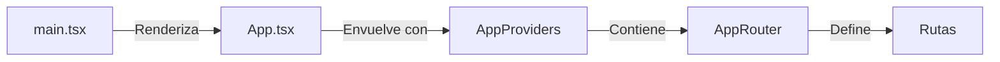
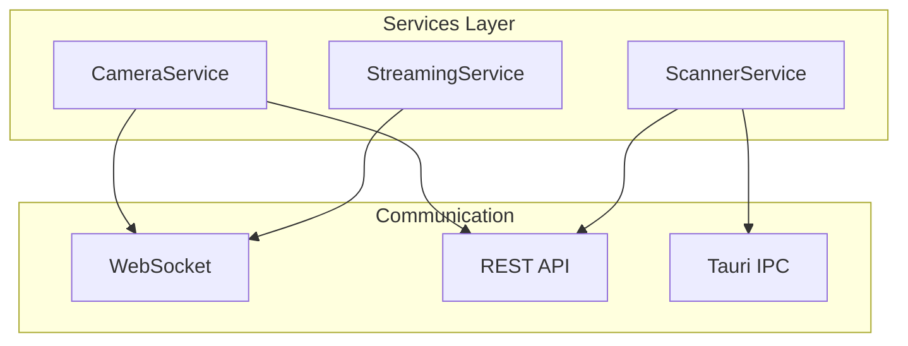
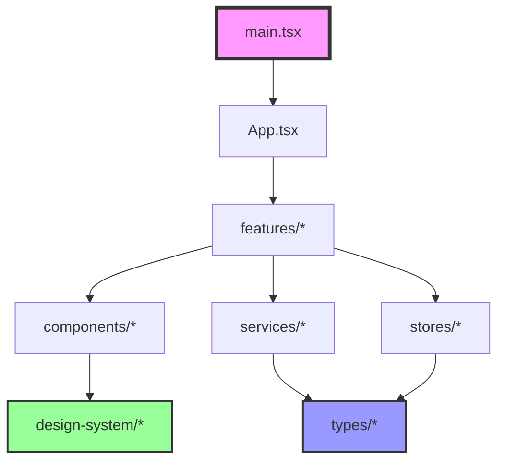

# 📁 Estructura del Proyecto - Universal Camera Viewer

[← Arquitectura](./arquitectura.md) | [Índice](./README.md) | [Flujo de Datos →](./flujo-datos.md)

## 🎯 Visión General

El proyecto sigue una estructura modular y escalable, organizando el código por features y responsabilidades.

## 📂 Estructura de Carpetas

```bash
src/
├── 📱 app/                    # Configuración core de la aplicación
│   ├── providers/            # Providers de contexto global
│   ├── router/              # Configuración de rutas
│   └── theme/               # Configuración de temas (legacy)
│
├── 🎨 assets/                # Recursos estáticos
│   ├── icons/               # Iconos SVG personalizados
│   ├── images/              # Imágenes y logos
│   └── styles/              # Estilos globales CSS
│
├── 🧩 components/            # Componentes reutilizables
│   ├── common/              # Componentes genéricos
│   ├── dialogs/             # Diálogos y modales
│   ├── feedback/            # Estados de error/carga
│   ├── layout/              # Layout principal
│   ├── menus/               # Menús contextuales
│   └── ui/                  # Componentes UI base
│
├── ⚙️ config/                # Configuración de la app
│   └── appConfig.ts         # Constantes y configuración
│
├── 🎨 design-system/         # Sistema de diseño
│   ├── tokens.ts            # Design tokens
│   ├── theme.ts             # Tema de Material-UI
│   └── typography.ts        # Sistema tipográfico
│
├── 📚 docs/                  # Documentación del proyecto
│   └── *.md                 # Archivos de documentación
│
├── ✨ features/              # Módulos por funcionalidad
│   ├── cameras/             # Gestión de cámaras
│   ├── scanner/             # Escaneo de red
│   ├── settings/            # Configuración
│   └── statistics/          # Estadísticas
│
├── 🪝 hooks/                 # Custom React hooks
│   ├── useCamera.ts         # Hook para cámaras
│   └── useTheme.ts          # Hook para temas
│
├── 📡 services/              # Servicios y APIs
│   ├── api/                 # Cliente API REST
│   ├── python/              # Servicios Python
│   ├── scanner/             # Servicio de escaneo
│   └── tauri/               # Bridge con Tauri
│
├── 🗄️ stores/                # Estado global (Zustand)
│   ├── appStore.ts          # Estado de la app
│   ├── cameraStore.ts       # Estado de cámaras
│   └── streamingStore.ts    # Estado de streaming
│
├── 🔤 types/                 # TypeScript types
│   ├── api.types.ts         # Tipos de API
│   ├── camera.types.ts      # Tipos de cámara
│   └── common.types.ts      # Tipos comunes
│
└── 🛠️ utils/                 # Utilidades
    ├── constants.ts         # Constantes
    └── helpers.ts           # Funciones helper
```

## 📋 Descripción Detallada

### 📱 `/app` - Core de la Aplicación



- **`AppProviders.tsx`**: Agrupa todos los providers (Theme, Router, etc.)
- **`AppRouter.tsx`**: Define rutas con lazy loading y error boundaries

### 🧩 `/components` - Componentes Reutilizables

#### Organización por Categoría

- **`common/`**: Botones, inputs, cards genéricos
- **`dialogs/`**: AboutDialog, LicenseDialog
- **`feedback/`**: Estados de error y carga
- **`layout/`**: MainLayout, Sidebar, TopBar
- **`ui/`**: Componentes UI específicos

#### Patrón de Componente

- Uso de React.FC con tipado fuerte
- Memoización con React.memo
- Props claramente definidas en interfaces
- Separación de lógica y presentación

### ✨ `/features` - Módulos de Funcionalidad

Cada feature es un módulo independiente con su propia estructura:

```bash
features/cameras/
├── components/          # Componentes específicos
├── pages/              # Páginas/vistas
├── hooks/              # Hooks del feature
├── utils/              # Utilidades
└── types.ts            # Tipos locales
```

#### Features Principales

1. **📷 Cameras**: Visualización y gestión de cámaras
2. **🔍 Scanner**: Detección de dispositivos en red
3. **⚙️ Settings**: Configuración de la aplicación
4. **📊 Statistics**: Métricas y análisis

### 🗄️ `/stores` - Gestión de Estado

**Arquitectura con Zustand:**

- Stores tipados con interfaces
- Acciones para modificar estado
- Selectores para optimizar re-renders
- Estado persistente opcional con middleware

#### Stores Disponibles

- **`appStore`**: Estado general de la aplicación
- **`cameraStore`**: Gestión de cámaras
- **`streamingStore`**: Estado de streaming
- **`notificationStore`**: Sistema de notificaciones

### 📡 `/services` - Capa de Servicios



#### Tipos de Servicios

- **API Services**: Comunicación REST
- **WebSocket Services**: Datos en tiempo real
- **Tauri Services**: Operaciones nativas

### 🎨 `/design-system` - Sistema de Diseño

**Componentes del sistema:**

- **tokens.ts**: Design tokens (colores, espaciados, tipografía)
- **theme.ts**: Temas claro/oscuro de Material-UI
- **typography.ts**: Sistema tipográfico consistente
- **breakpoints.ts**: Puntos de quiebre responsive

### 🔤 `/types` - TypeScript Types

Organización de tipos:

- **Globales**: En `types/` raíz
- **Por Feature**: En `features/*/types.ts`
- **Compartidos**: En `types/common.types.ts`

## 📏 Convenciones de Nomenclatura

### Archivos y Carpetas

- **Componentes**: PascalCase (`CameraCard.tsx`)
- **Utilities**: camelCase (`formatDate.ts`)
- **Types**: camelCase con `.types` (`camera.types.ts`)
- **Carpetas**: kebab-case (`design-system`)

### Exports

**Convenciones de exportación:**

- **Named exports**: Para utilidades y funciones
- **Default export**: Para componentes principales
- **Barrel exports**: En archivos index.ts para APIs limpias
- **Re-exports**: Para simplificar rutas de importación

## 🔄 Flujo de Importación



## 🚫 Anti-patterns a Evitar

1. ❌ Importaciones circulares
2. ❌ Lógica de negocio en componentes UI
3. ❌ Estado local cuando debería ser global
4. ❌ Componentes muy grandes (> 300 líneas)
5. ❌ Mezclar responsabilidades

## ✅ Best Practices

1. ✅ Un archivo = Una responsabilidad
2. ✅ Componentes pequeños y enfocados
3. ✅ Types en archivos separados
4. ✅ Barrel exports para APIs limpias
5. ✅ Lazy loading para features grandes

---

[← Arquitectura](./arquitectura.md) | [Índice](./README.md) | [Flujo de Datos →](./flujo-datos.md)
