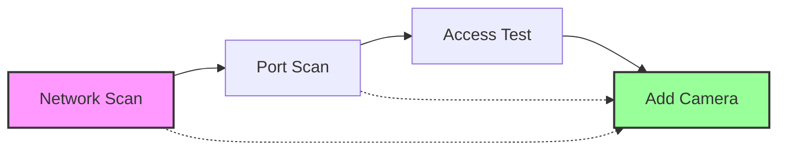
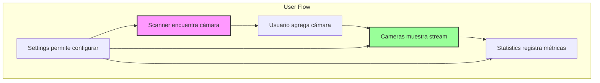

# ✨ Features y Módulos - Universal Camera Viewer

[← Componentes Principales](./componentes-principales.md) | [Índice](./README.md) | [Servicios y API →](./servicios-api.md)

## 🎯 Visión General

Los features representan las funcionalidades principales de la aplicación, cada uno encapsulado en su propio módulo con componentes, lógica y tipos específicos.

## 📦 Estructura de Features

```mermaid
graph TB
    subgraph "Features"
        A[Cameras]
        B[Scanner]
        C[Statistics]
        D[Settings]
        E[Publishing]
    end
    
    subgraph "Cameras Module"
        A --> A1[CameraGrid]
        A --> A2[VideoPlayer]
        A --> A3[CameraControls]
    end
    
    subgraph "Scanner Module"
        B --> B1[NetworkScan]
        B --> B2[PortScan]
        B --> B3[AccessTest]
    end
    
    subgraph "Statistics Module"
        C --> C1[Dashboard]
        C --> C2[Reports]
        C --> C3[Analytics]
    end
    
    subgraph "Settings Module"
        D --> D1[General]
        D --> D2[Network]
        D --> D3[Security]
    end
    
    subgraph "Publishing Module"
        E --> E1[Dashboard]
        E --> E2[ActivePublications]
        E --> E3[Metrics]
        E --> E4[History]
        E --> E5[Configuration]
    end
```



## 📷 Feature: Cameras

### Descripción

Módulo principal para visualización y gestión de cámaras IP, incluyendo streaming en tiempo real y controles PTZ.

### Estructura del Módulo

```bash
features/cameras/
├── components/
│   ├── CameraCard/
│   ├── CameraGrid/
│   ├── VideoPlayer/
│   └── CameraControls/
├── pages/
│   └── CamerasPage.tsx
├── hooks/
│   ├── useCamera.ts
│   └── useStream.ts
├── services/
│   └── cameraService.ts
└── types.ts
```

### Componentes Principales

#### 1. **CameraGrid** - Vista de Grilla

- Visualización de múltiples cámaras simultáneamente
- Layouts configurables: 2x2, 3x3, 4x4 o automático
- Vistas disponibles: grilla o lista
- Responsivo y adaptable a diferentes tamaños de pantalla
- Integración con CameraCard para cada cámara

#### 2. **VideoPlayer** - Reproductor de Video

- Streaming de video en tiempo real con WebRTC
- Baja latencia optimizada para vigilancia
- Controles de reproducción opcionales
- Indicador de carga y manejo de errores
- Soporte para múltiples formatos de stream
- Visualización de FPS en tiempo real

#### 3. **CameraControls** - Controles PTZ

- Control Pan/Tilt/Zoom para cámaras compatibles
- Interfaz intuitiva con botones direccionales
- Botón Home para posición inicial
- Control de zoom con slider
- Velocidad de movimiento ajustable
- Detección automática de capacidades PTZ

## 🔍 Feature: Scanner

### Descripción

Herramientas de detección y diagnóstico de cámaras en la red local.

### Flujo de Escaneo



### Componentes del Scanner

#### 1. **NetworkScanPage** - Escaneo de Red

- Detección automática de dispositivos en la red local
- Configuración de subnet y puertos a escanear
- Timeout configurable para optimizar velocidad
- Progreso visual con barra de progreso
- Resultados en tiempo real durante el escaneo
- Navegación directa a escaneo de puertos

#### 2. **PortScanPage** - Escaneo de Puertos

- Escaneo de puertos comunes de cámaras IP
- Identificación de servicios (HTTP, RTSP, ONVIF)
- Indicadores visuales de estado por puerto
- Puertos predefinidos: 80, 554, 8000, 2020, 8080
- Resultados instantáneos con iconos de estado

## 📊 Feature: Statistics

### Descripción

Dashboard y análisis de métricas del sistema.

### Subsecciones

1. **General** - Vista general del sistema
2. **Conexiones** - Historial y métricas de conexión
3. **Eventos** - Log de eventos del sistema
4. **Rendimiento** - Métricas de performance
5. **Dispositivos** - Estadísticas por cámara
6. **Red** - Análisis de tráfico de red

### Dashboard Principal

**KPIs Principales:**

- **Cámaras Activas**: Total de cámaras conectadas con tendencia
- **Tiempo Activo**: Uptime del sistema formateado
- **FPS Promedio**: Frames por segundo promedio del sistema
- **Ancho de Banda**: Consumo de red en tiempo real

**Visualizaciones:**

- **Gráfico de Líneas**: Actividad del sistema (conexiones y FPS)
- **Gráfico Circular**: Distribución de cámaras por marca
- **Tablas de Datos**: Historial de eventos y conexiones
- **Métricas en Tiempo Real**: Actualización automática

## ⚙️ Feature: Settings

### Descripción

Configuración completa de la aplicación.

### Secciones de Configuración

#### 1. **GeneralSettings** - Configuración General

**Opciones disponibles:**

- **Inicio automático**: Iniciar con el sistema operativo
- **Idioma**: Español o Inglés
- **Tema**: Claro, Oscuro o Automático
- **Notificaciones**:
  - Pérdida de conexión con cámaras
  - Detección de movimiento
  - Eventos del sistema
- **Guardado de preferencias**: Persistente entre sesiones

#### 2. **NetworkSettings** - Configuración de Red

**Parámetros configurables:**

- **Timeouts**:
  - Conexión: 1-30 segundos
  - Streaming: 5-60 segundos
  - Reintentos máximos: 0-10
- **Configuración de Proxy**:
  - Activar/desactivar proxy
  - Servidor y puerto del proxy
  - Autenticación opcional
- **Optimización de Red**:
  - Buffer de streaming ajustable
  - Prioridad de protocolo (TCP/UDP)

## 🚀 Feature: Publishing (MediaMTX)

### Descripción

Módulo completo para publicación de streams hacia servidores MediaMTX, permitiendo compartir cámaras locales a través de RTSP/RTMP.

### Componentes Principales

- **PublishingDashboard**:
  - Estado general del sistema MediaMTX
  - Widgets de salud del sistema
  - Métricas agregadas en tiempo real
  - Lista de alertas activas

- **ActivePublications**:
  - Tabla interactiva de publicaciones activas
  - Control start/stop por cámara
  - Métricas en tiempo real (FPS, bitrate, viewers)
  - Estados visuales por colores

- **PublishingMetrics**:
  - Gráficos de línea temporal para FPS y bitrate
  - Indicadores radiales de rendimiento
  - Estadísticas de viewers conectados
  - Histórico de métricas por cámara

- **PublishingHistory**:
  - Registro completo de sesiones pasadas
  - Filtros por fecha, cámara y estado
  - Exportación a CSV/Excel
  - Limpieza de historial antiguo

- **PathConfiguration**:
  - Gestión de servidores MediaMTX
  - Formulario avanzado con tooltips
  - Configuración de autenticación
  - Prueba de conexión integrada

### Características Destacadas

- **Estado global con Zustand**: PublishingStore centralizado
- **Polling automático**: Actualización cada 5 segundos
- **Hooks personalizados**: usePublishingStatus, usePublishingHealth
- **Tooltips informativos**: Ayuda contextual en todas las vistas
- **Diseño responsive**: Adaptable a diferentes tamaños

## 🔗 Integración entre Features



## ✅ Best Practices para Features

1. **Modularidad**: Cada feature debe ser independiente
2. **Lazy Loading**: Cargar features bajo demanda
3. **Estado Local**: Preferir estado local cuando sea posible
4. **Reutilización**: Compartir componentes comunes
5. **Testing**: Tests unitarios y de integración por feature

---

[← Componentes Principales](./componentes-principales.md) | [Índice](./README.md) | [Servicios y API →](./servicios-api.md)
