# ✨ Features y Módulos - Universal Camera Viewer

[← Componentes Principales](./componentes-principales.md) | [Índice](./README.md) | [Servicios y API →](./servicios-api.md)

## 🎯 Visión General

Los features representan las funcionalidades principales de la aplicación, cada uno encapsulado en su propio módulo con componentes, lógica y tipos específicos.

## 📦 Estructura de Features


## 📷 Feature: Cameras

### Descripción
Módulo principal para visualización y gestión de cámaras IP, incluyendo streaming en tiempo real y controles PTZ.

### Estructura del Módulo
```
features/cameras/
├── components/
│   ├── CameraCard/
│   ├── CameraGrid/
│   ├── VideoPlayer/
│   └── CameraControls/
├── pages/
│   └── CamerasPage.tsx
├── hooks/
│   ├── useCamera.ts
│   └── useStream.ts
├── services/
│   └── cameraService.ts
└── types.ts
```

### Componentes Principales

#### 1. **CameraGrid** - Vista de Grilla
```typescript
// features/cameras/components/CameraGrid/CameraGrid.tsx
interface CameraGridProps {
  cameras: Camera[];
  viewMode: 'grid' | 'list';
  onCameraSelect: (camera: Camera) => void;
}

export const CameraGrid: React.FC<CameraGridProps> = memo(({
  cameras,
  viewMode,
  onCameraSelect
}) => {
  const { selectedLayout } = useLayoutStore();
  
  const getGridColumns = () => {
    switch (selectedLayout) {
      case '2x2': return 2;
      case '3x3': return 3;
      case '4x4': return 4;
      default: return 'auto-fit';
    }
  };
  
  return (
    <Box
      sx={{
        display: 'grid',
        gridTemplateColumns: viewMode === 'grid' 
          ? `repeat(${getGridColumns()}, 1fr)`
          : '1fr',
        gap: 2,
        height: '100%'
      }}
    >
      {cameras.map((camera) => (
        <CameraCard
          key={camera.id}
          camera={camera}
          onClick={() => onCameraSelect(camera)}
          viewMode={viewMode}
        />
      ))}
    </Box>
  );
});
```

#### 2. **VideoPlayer** - Reproductor de Video
```typescript
// features/cameras/components/VideoPlayer/VideoPlayer.tsx
interface VideoPlayerProps {
  cameraId: string;
  autoPlay?: boolean;
  controls?: boolean;
  onError?: (error: Error) => void;
}

export const VideoPlayer: React.FC<VideoPlayerProps> = ({
  cameraId,
  autoPlay = true,
  controls = true,
  onError
}) => {
  const videoRef = useRef<HTMLVideoElement>(null);
  const { stream, frameRate } = useStream(cameraId);
  const [isLoading, setIsLoading] = useState(true);
  
  // WebRTC para baja latencia
  useEffect(() => {
    if (!stream?.url || !videoRef.current) return;
    
    const setupWebRTC = async () => {
      try {
        const pc = new RTCPeerConnection();
        // Configurar WebRTC...
        setIsLoading(false);
      } catch (error) {
        onError?.(error as Error);
      }
    };
    
    setupWebRTC();
  }, [stream?.url]);
  
  return (
    <Box sx={{ position: 'relative', width: '100%', height: '100%' }}>
      {isLoading && (
        <Box
          sx={{
            position: 'absolute',
            inset: 0,
            display: 'flex',
            alignItems: 'center',
            justifyContent: 'center',
            bgcolor: 'background.paper'
          }}
        >
          <CircularProgress />
        </Box>
      )}
      
      <video
        ref={videoRef}
        autoPlay={autoPlay}
        controls={controls}
        style={{ width: '100%', height: '100%', objectFit: 'contain' }}
      />
      
      {controls && (
        <VideoControls
          cameraId={cameraId}
          frameRate={frameRate}
        />
      )}
    </Box>
  );
};
```

#### 3. **CameraControls** - Controles PTZ
```typescript
// features/cameras/components/CameraControls/PTZControls.tsx
interface PTZControlsProps {
  cameraId: string;
  capabilities: PTZCapabilities;
}

export const PTZControls: React.FC<PTZControlsProps> = ({
  cameraId,
  capabilities
}) => {
  const { sendPTZCommand } = useCameraControl(cameraId);
  
  const handleMove = async (direction: PTZDirection) => {
    await sendPTZCommand({
      action: 'move',
      direction,
      speed: 0.5
    });
  };
  
  return (
    <Paper sx={{ p: 2 }}>
      <Typography variant="subtitle2" gutterBottom>
        Control PTZ
      </Typography>
      
      <Grid container spacing={1}>
        <Grid size={12} sx={{ textAlign: 'center' }}>
          <IconButton onClick={() => handleMove('up')}>
            <ArrowUpwardIcon />
          </IconButton>
        </Grid>
        
        <Grid size={4}>
          <IconButton onClick={() => handleMove('left')}>
            <ArrowBackIcon />
          </IconButton>
        </Grid>
        
        <Grid size={4} sx={{ textAlign: 'center' }}>
          <IconButton onClick={() => handleMove('home')}>
            <HomeIcon />
          </IconButton>
        </Grid>
        
        <Grid size={4} sx={{ textAlign: 'right' }}>
          <IconButton onClick={() => handleMove('right')}>
            <ArrowForwardIcon />
          </IconButton>
        </Grid>
        
        <Grid size={12} sx={{ textAlign: 'center' }}>
          <IconButton onClick={() => handleMove('down')}>
            <ArrowDownwardIcon />
          </IconButton>
        </Grid>
      </Grid>
      
      {capabilities.zoom && (
        <Box sx={{ mt: 2 }}>
          <Typography variant="body2">Zoom</Typography>
          <Slider
            min={1}
            max={capabilities.maxZoom}
            onChange={(_, value) => handleZoom(value as number)}
          />
        </Box>
      )}
    </Paper>
  );
};
```

## 🔍 Feature: Scanner

### Descripción
Herramientas de detección y diagnóstico de cámaras en la red local.

### Flujo de Escaneo


### Componentes del Scanner

#### 1. **NetworkScanPage** - Escaneo de Red
```typescript
// features/scanner/pages/network/NetworkScanPage.tsx
export const NetworkScanPage: React.FC = () => {
  const { startScan, stopScan, scanProgress, results } = useScanner();
  const [scanConfig, setScanConfig] = useState<ScanConfig>({
    subnet: '192.168.1.0/24',
    ports: [80, 554, 8000, 2020],
    timeout: 2000
  });
  
  return (
    <Container maxWidth="lg">
      <PageHeader
        title="Escaneo de Red"
        subtitle="Detecta automáticamente cámaras en tu red"
      />
      
      <Grid container spacing={3}>
        <Grid size={12}>
          <ScanConfiguration
            config={scanConfig}
            onChange={setScanConfig}
            disabled={scanProgress > 0}
          />
        </Grid>
        
        <Grid size={12}>
          <Box sx={{ display: 'flex', gap: 2, mb: 2 }}>
            <Button
              variant="contained"
              onClick={() => startScan(scanConfig)}
              disabled={scanProgress > 0}
              startIcon={<PlayArrowIcon />}
            >
              Iniciar Escaneo
            </Button>
            
            {scanProgress > 0 && (
              <Button
                variant="outlined"
                onClick={stopScan}
                color="error"
                startIcon={<StopIcon />}
              >
                Detener
              </Button>
            )}
          </Box>
          
          <LinearProgress
            variant="determinate"
            value={scanProgress}
            sx={{ mb: 2 }}
          />
        </Grid>
        
        <Grid size={12}>
          <ScanResults
            results={results}
            onDeviceSelect={(device) => navigate(`/scanner/ports/${device.ip}`)}
          />
        </Grid>
      </Grid>
    </Container>
  );
};
```

#### 2. **PortScanPage** - Escaneo de Puertos
```typescript
// features/scanner/pages/ports/PortScanPage.tsx
export const PortScanPage: React.FC = () => {
  const { targetIP } = useParams();
  const [ports, setPorts] = useState<PortScanResult[]>([]);
  const [scanning, setScanning] = useState(false);
  
  const commonPorts = [
    { port: 80, service: 'HTTP/ONVIF' },
    { port: 554, service: 'RTSP' },
    { port: 8000, service: 'HTTP Alt' },
    { port: 2020, service: 'ONVIF' },
    { port: 8080, service: 'HTTP Proxy' }
  ];
  
  const scanPorts = async () => {
    setScanning(true);
    const results = await scannerService.scanPorts(targetIP, commonPorts);
    setPorts(results);
    setScanning(false);
  };
  
  return (
    <Container>
      <Typography variant="h5" gutterBottom>
        Escaneo de Puertos - {targetIP}
      </Typography>
      
      <Paper sx={{ p: 3, mt: 3 }}>
        <List>
          {commonPorts.map((portInfo) => (
            <ListItem key={portInfo.port}>
              <ListItemIcon>
                {scanning ? (
                  <CircularProgress size={20} />
                ) : ports.find(p => p.port === portInfo.port)?.open ? (
                  <CheckCircleIcon color="success" />
                ) : (
                  <CancelIcon color="error" />
                )}
              </ListItemIcon>
              <ListItemText
                primary={`Puerto ${portInfo.port}`}
                secondary={portInfo.service}
              />
            </ListItem>
          ))}
        </List>
        
        <Button
          variant="contained"
          onClick={scanPorts}
          disabled={scanning}
          fullWidth
          sx={{ mt: 2 }}
        >
          {scanning ? 'Escaneando...' : 'Escanear Puertos'}
        </Button>
      </Paper>
    </Container>
  );
};
```

## 📊 Feature: Statistics

### Descripción
Dashboard y análisis de métricas del sistema.

### Subsecciones
1. **General** - Vista general del sistema
2. **Conexiones** - Historial y métricas de conexión
3. **Eventos** - Log de eventos del sistema
4. **Rendimiento** - Métricas de performance
5. **Dispositivos** - Estadísticas por cámara
6. **Red** - Análisis de tráfico de red

### Dashboard Principal

```typescript
// features/statistics/pages/GeneralStats.tsx
export const GeneralStats: React.FC = () => {
  const { stats, loading } = useStatistics();
  
  return (
    <Grid container spacing={3}>
      {/* KPIs */}
      <Grid size={{ xs: 12, sm: 6, md: 3 }}>
        <InfoCard
          title="Cámaras Activas"
          value={stats?.activeCameras || 0}
          icon={<VideocamIcon />}
          trend={stats?.camerasTrend}
          loading={loading}
        />
      </Grid>
      
      <Grid size={{ xs: 12, sm: 6, md: 3 }}>
        <InfoCard
          title="Tiempo Activo"
          value={formatUptime(stats?.uptime || 0)}
          icon={<AccessTimeIcon />}
          loading={loading}
        />
      </Grid>
      
      <Grid size={{ xs: 12, sm: 6, md: 3 }}>
        <InfoCard
          title="FPS Promedio"
          value={stats?.avgFps?.toFixed(1) || '0'}
          icon={<SpeedIcon />}
          trend={stats?.fpsTrend}
          loading={loading}
        />
      </Grid>
      
      <Grid size={{ xs: 12, sm: 6, md: 3 }}>
        <InfoCard
          title="Ancho de Banda"
          value={formatBandwidth(stats?.bandwidth || 0)}
          icon={<NetworkCheckIcon />}
          loading={loading}
        />
      </Grid>
      
      {/* Gráficos */}
      <Grid size={{ xs: 12, lg: 8 }}>
        <Paper sx={{ p: 3, height: 400 }}>
          <Typography variant="h6" gutterBottom>
            Actividad del Sistema
          </Typography>
          <ResponsiveContainer>
            <LineChart data={stats?.activityData || []}>
              <CartesianGrid strokeDasharray="3 3" />
              <XAxis dataKey="time" />
              <YAxis />
              <Tooltip />
              <Legend />
              <Line
                type="monotone"
                dataKey="connections"
                stroke="#8884d8"
                name="Conexiones"
              />
              <Line
                type="monotone"
                dataKey="fps"
                stroke="#82ca9d"
                name="FPS"
              />
            </LineChart>
          </ResponsiveContainer>
        </Paper>
      </Grid>
      
      <Grid size={{ xs: 12, lg: 4 }}>
        <Paper sx={{ p: 3, height: 400 }}>
          <Typography variant="h6" gutterBottom>
            Distribución por Marca
          </Typography>
          <ResponsiveContainer>
            <PieChart>
              <Pie
                data={stats?.brandDistribution || []}
                dataKey="value"
                nameKey="name"
                cx="50%"
                cy="50%"
                outerRadius={80}
                label
              >
                {stats?.brandDistribution?.map((entry, index) => (
                  <Cell key={index} fill={COLORS[index % COLORS.length]} />
                ))}
              </Pie>
              <Tooltip />
            </PieChart>
          </ResponsiveContainer>
        </Paper>
      </Grid>
    </Grid>
  );
};
```

## ⚙️ Feature: Settings

### Descripción
Configuración completa de la aplicación.

### Secciones de Configuración

#### 1. **GeneralSettings** - Configuración General
```typescript
// features/settings/components/GeneralSettings.tsx
export const GeneralSettings: React.FC = () => {
  const { config, updateConfig } = useSettings();
  const [formData, setFormData] = useState(config.general);
  
  return (
    <Paper sx={{ p: 3 }}>
      <Typography variant="h6" gutterBottom>
        Configuración General
      </Typography>
      
      <Grid container spacing={3}>
        <Grid size={12}>
          <FormControlLabel
            control={
              <Switch
                checked={formData.autoStart}
                onChange={(e) => setFormData({
                  ...formData,
                  autoStart: e.target.checked
                })}
              />
            }
            label="Iniciar automáticamente con el sistema"
          />
        </Grid>
        
        <Grid size={{ xs: 12, md: 6 }}>
          <TextField
            fullWidth
            label="Idioma"
            select
            value={formData.language}
            onChange={(e) => setFormData({
              ...formData,
              language: e.target.value
            })}
          >
            <MenuItem value="es">Español</MenuItem>
            <MenuItem value="en">English</MenuItem>
          </TextField>
        </Grid>
        
        <Grid size={{ xs: 12, md: 6 }}>
          <TextField
            fullWidth
            label="Tema"
            select
            value={formData.theme}
            onChange={(e) => setFormData({
              ...formData,
              theme: e.target.value as 'light' | 'dark' | 'auto'
            })}
          >
            <MenuItem value="light">Claro</MenuItem>
            <MenuItem value="dark">Oscuro</MenuItem>
            <MenuItem value="auto">Automático</MenuItem>
          </TextField>
        </Grid>
        
        <Grid size={12}>
          <Typography variant="subtitle2" gutterBottom>
            Notificaciones
          </Typography>
          
          <FormGroup>
            <FormControlLabel
              control={
                <Checkbox
                  checked={formData.notifications.connectionLost}
                  onChange={(e) => setFormData({
                    ...formData,
                    notifications: {
                      ...formData.notifications,
                      connectionLost: e.target.checked
                    }
                  })}
                />
              }
              label="Pérdida de conexión"
            />
            <FormControlLabel
              control={
                <Checkbox
                  checked={formData.notifications.motionDetection}
                  onChange={(e) => setFormData({
                    ...formData,
                    notifications: {
                      ...formData.notifications,
                      motionDetection: e.target.checked
                    }
                  })}
                />
              }
              label="Detección de movimiento"
            />
          </FormGroup>
        </Grid>
        
        <Grid size={12}>
          <Button
            variant="contained"
            onClick={() => updateConfig({ general: formData })}
          >
            Guardar Cambios
          </Button>
        </Grid>
      </Grid>
    </Paper>
  );
};
```

#### 2. **NetworkSettings** - Configuración de Red
```typescript
// features/settings/components/NetworkSettings.tsx
export const NetworkSettings: React.FC = () => {
  const { config, updateConfig } = useSettings();
  const [formData, setFormData] = useState(config.network);
  
  return (
    <Paper sx={{ p: 3 }}>
      <Typography variant="h6" gutterBottom>
        Configuración de Red
      </Typography>
      
      <Grid container spacing={3}>
        <Grid size={12}>
          <Typography variant="subtitle2" gutterBottom>
            Timeouts de Conexión
          </Typography>
        </Grid>
        
        <Grid size={{ xs: 12, md: 4 }}>
          <TextField
            fullWidth
            type="number"
            label="Timeout de conexión (ms)"
            value={formData.connectionTimeout}
            onChange={(e) => setFormData({
              ...formData,
              connectionTimeout: parseInt(e.target.value)
            })}
            InputProps={{
              inputProps: { min: 1000, max: 30000, step: 1000 }
            }}
          />
        </Grid>
        
        <Grid size={{ xs: 12, md: 4 }}>
          <TextField
            fullWidth
            type="number"
            label="Timeout de streaming (ms)"
            value={formData.streamTimeout}
            onChange={(e) => setFormData({
              ...formData,
              streamTimeout: parseInt(e.target.value)
            })}
            InputProps={{
              inputProps: { min: 5000, max: 60000, step: 1000 }
            }}
          />
        </Grid>
        
        <Grid size={{ xs: 12, md: 4 }}>
          <TextField
            fullWidth
            type="number"
            label="Reintentos máximos"
            value={formData.maxRetries}
            onChange={(e) => setFormData({
              ...formData,
              maxRetries: parseInt(e.target.value)
            })}
            InputProps={{
              inputProps: { min: 0, max: 10 }
            }}
          />
        </Grid>
        
        <Grid size={12}>
          <Divider sx={{ my: 2 }} />
          <Typography variant="subtitle2" gutterBottom>
            Configuración de Proxy
          </Typography>
        </Grid>
        
        <Grid size={12}>
          <FormControlLabel
            control={
              <Switch
                checked={formData.useProxy}
                onChange={(e) => setFormData({
                  ...formData,
                  useProxy: e.target.checked
                })}
              />
            }
            label="Usar proxy"
          />
        </Grid>
        
        {formData.useProxy && (
          <>
            <Grid size={{ xs: 12, md: 8 }}>
              <TextField
                fullWidth
                label="Servidor proxy"
                value={formData.proxyHost}
                onChange={(e) => setFormData({
                  ...formData,
                  proxyHost: e.target.value
                })}
                placeholder="proxy.ejemplo.com"
              />
            </Grid>
            
            <Grid size={{ xs: 12, md: 4 }}>
              <TextField
                fullWidth
                type="number"
                label="Puerto"
                value={formData.proxyPort}
                onChange={(e) => setFormData({
                  ...formData,
                  proxyPort: parseInt(e.target.value)
                })}
              />
            </Grid>
          </>
        )}
        
        <Grid size={12}>
          <Button
            variant="contained"
            onClick={() => updateConfig({ network: formData })}
          >
            Guardar Cambios
          </Button>
        </Grid>
      </Grid>
    </Paper>
  );
};
```

## 🔗 Integración entre Features

```mermaid
graph TB
    subgraph "User Flow"
        A[Scanner encuentra cámara]
        B[Usuario agrega cámara]
        C[Cameras muestra stream]
        D[Statistics registra métricas]
        E[Settings permite configurar]
    end
    
    A --> B
    B --> C
    C --> D
    E --> A
    E --> C
    E --> D
    
    style A fill:#f9f,stroke:#333,stroke-width:2px
    style C fill:#9f9,stroke:#333,stroke-width:2px
```



## ✅ Best Practices para Features

1. **Modularidad**: Cada feature debe ser independiente
2. **Lazy Loading**: Cargar features bajo demanda
3. **Estado Local**: Preferir estado local cuando sea posible
4. **Reutilización**: Compartir componentes comunes
5. **Testing**: Tests unitarios y de integración por feature

---

[← Componentes Principales](./componentes-principales.md) | [Índice](./README.md) | [Servicios y API →](./servicios-api.md)