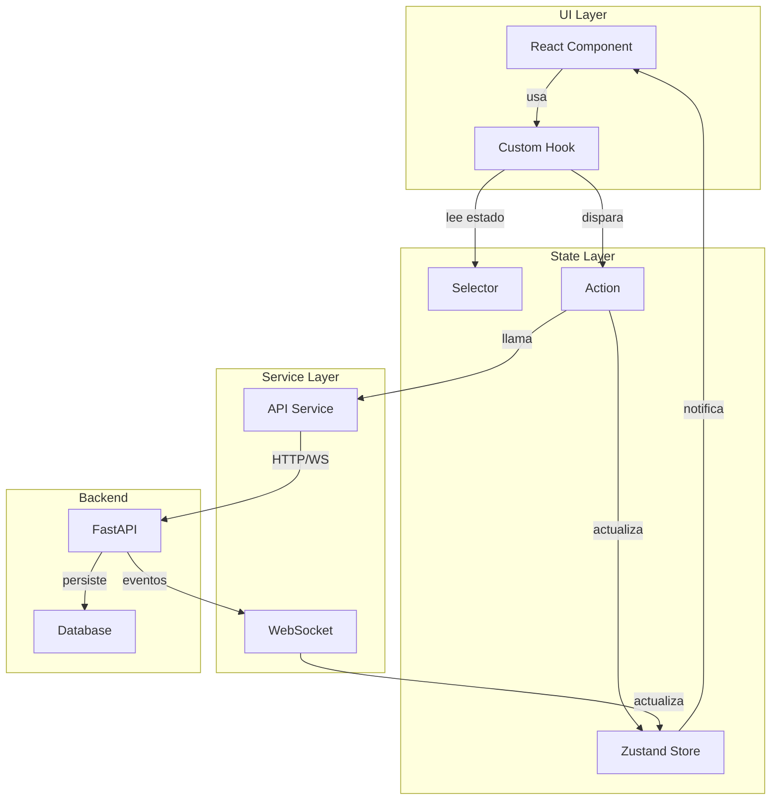
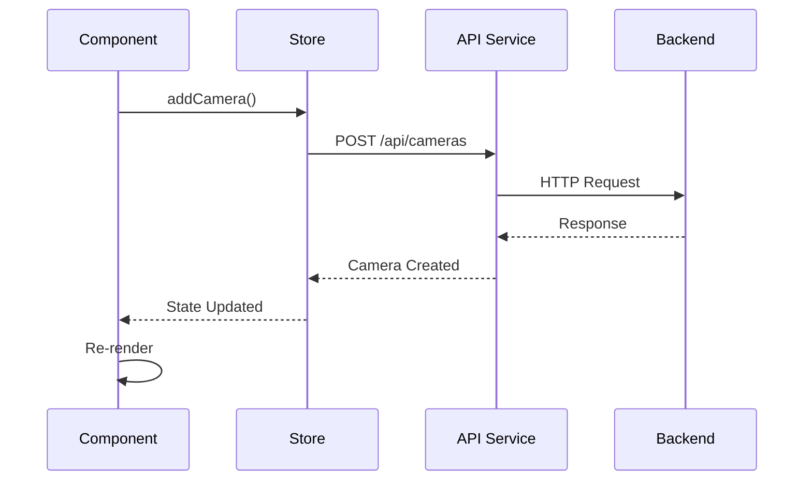
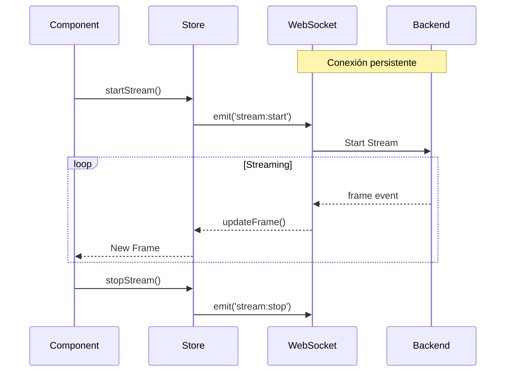
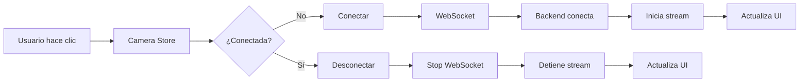
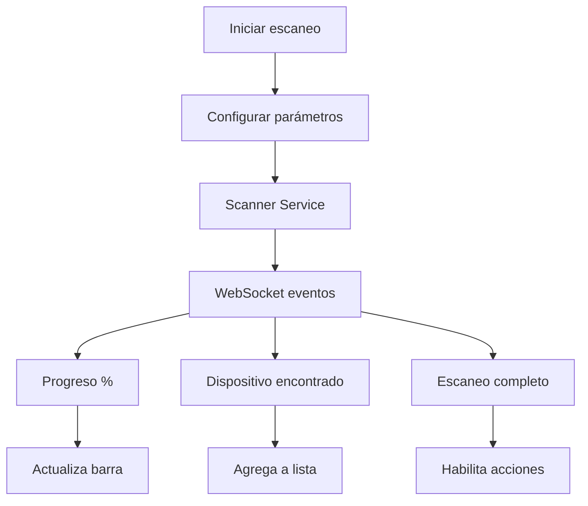

# 🔄 Flujo de Datos - Universal Camera Viewer

[← Estructura del Proyecto](./estructura-proyecto.md) | [Índice](./README.md) | [Componentes Principales →](./componentes-principales.md)

## 🎯 Visión General

El flujo de datos en la aplicación sigue un patrón unidireccional con gestión de estado centralizada usando Zustand y comunicación asíncrona con el backend.

## 🏗️ Arquitectura de Estado



## 📦 Stores Principales

### 1. **App Store** - Estado Global

**Estado gestionado:**

- Loading states globales
- Manejo de errores centralizados
- Tema de la aplicación (claro/oscuro)
- Estado del sidebar (colapsado/expandido)

**Acciones disponibles:**

- setLoading, setError
- toggleTheme, toggleSidebar

### 2. **Camera Store** - Gestión de Cámaras

**Estado:**

- Lista de cámaras registradas
- Cámara seleccionada actual
- Estados de conexión por cámara

**Operaciones CRUD:**

- fetchCameras, addCamera
- updateCamera, deleteCamera

**Control de conexión:**

- connectCamera, disconnectCamera
- Monitoreo de estado en tiempo real

### 3. **Streaming Store** - Video Streaming

**Estado:**

- Streams activos (Map para performance)
- Frame rates por cámara
- Métricas de streaming

**Acciones:**

- Control de streams (start/stop)
- Actualización de frames
- Métricas en tiempo real

### 4. **Scanner Store** - Escaneo de Red

**Estado:**

- Estado de escaneo activo
- Progreso porcentual
- Dispositivos descubiertos
- Historial de sesiones

**Acciones:**

- Control de escaneo
- Gestión de resultados
- Persistencia de sesiones

## 🔄 Patrones de Comunicación

### 1. **REST API - Operaciones CRUD**



### 2. **WebSocket - Tiempo Real**



### 3. **Event-Driven Updates**

**Eventos del sistema:**

- `camera:status` - Actualizaciones de estado de conexión
- `scan:progress` - Progreso del escaneo en tiempo real
- `metrics:update` - Métricas de streaming y performance
- `error:occurred` - Manejo centralizado de errores
- `notification:new` - Sistema de notificaciones

## 🎯 Flujos de Usuario Principales

### 1. **Flujo de Conexión de Cámara**



### 2. **Flujo de Escaneo de Red**



## 🔧 Gestión de Estado Asíncrono

### 1. **Loading States**

**Manejo de estados asíncronos:**

- Hook reutilizable para operaciones asíncronas
- Estados de carga, error y éxito
- Cleanup automático en desmontaje
- Integración con stores globales

### 2. **Optimistic Updates**

**Estrategia de actualización:**

1. Actualizar UI inmediatamente para mejor UX
2. Sincronizar con backend en segundo plano
3. Revertir cambios si la operación falla
4. Mostrar notificación de error al usuario

### 3. **Debouncing y Throttling**

**Optimizaciones de performance:**

- **Debounce**: Búsquedas y filtros (300ms delay)
- **Throttle**: Actualizaciones de frames (100ms máximo)
- **Batch updates**: Agrupar múltiples cambios de estado
- **Memoización**: Evitar cálculos innecesarios

## 🔌 Integración con Hooks

### 1. **useCamera Hook**

```typescript
export const useCamera = (cameraId?: string) => {
  const camera = useCameraStore((state) => 
    cameraId ? state.cameras.find(c => c.id === cameraId) : null
  );
  
  const connectionStatus = useCameraStore((state) => 
    cameraId ? state.connectionStatus[cameraId] : null
  );
  
  const connect = useCallback(() => {
    if (cameraId) {
      useCameraStore.getState().connectCamera(cameraId);
    }
  }, [cameraId]);
  
  const disconnect = useCallback(() => {
    if (cameraId) {
      useCameraStore.getState().disconnectCamera(cameraId);
    }
  }, [cameraId]);
  
  return { camera, connectionStatus, connect, disconnect };
};
```

### 2. **useStream Hook**

```typescript
export const useStream = (cameraId: string) => {
  const stream = useStreamingStore((state) => 
    state.activeStreams.get(cameraId)
  );
  
  const frameRate = useStreamingStore((state) => 
    state.frameRates[cameraId] || 0
  );
  
  useEffect(() => {
    // Auto-start stream
    useStreamingStore.getState().startStream(cameraId);
    
    return () => {
      // Cleanup
      useStreamingStore.getState().stopStream(cameraId);
    };
  }, [cameraId]);
  
  return { stream, frameRate };
};
```

## 📊 Monitoreo y DevTools

### 1. **Zustand DevTools**

**Herramientas de desarrollo:**

- Integración con Redux DevTools
- Time-travel debugging
- Inspección de estado en tiempo real
- Tracking de acciones

### 2. **Performance Monitoring**

**Métricas monitoreadas:**

- Cantidad de re-renders
- Tiempo de renderizado
- Tamaño del estado
- Memory leaks

### 3. **State Persistence**

**Datos persistidos:**

- Preferencias de usuario
- Tema y lenguaje
- Configuración de cámaras
- Layouts guardados

## 🚨 Manejo de Errores

### 1. **Error Boundaries**

**Manejo de errores en componentes:**

- Captura errores de renderizado
- Fallback UI para errores críticos
- Logging automático
- Integración con estado global

### 2. **Error Recovery**

**Estrategias de recuperación:**

- Reintentos automáticos con backoff exponencial
- Fallback a valores por defecto
- Notificaciones al usuario
- Logs para debugging

## ✅ Best Practices

1. **Normalización de datos**: Usar Map/Record para acceso O(1)
2. **Selectores específicos**: Evitar re-renders innecesarios
3. **Acciones atómicas**: Una acción = un cambio de estado
4. **Inmutabilidad**: Siempre crear nuevos objetos
5. **Separación de concerns**: UI ↔ Estado ↔ Servicios

---

[← Estructura del Proyecto](./estructura-proyecto.md) | [Índice](./README.md) | [Componentes Principales →](./componentes-principales.md)
