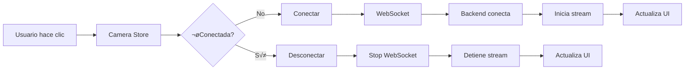

# 🔄 Flujo de Datos - Universal Camera Viewer

[← Estructura del Proyecto](./estructura-proyecto.md) | [Índice](./README.md) | [Componentes Principales →](./componentes-principales.md)

## 🎯 Visión General

El flujo de datos en la aplicación sigue un patrón unidireccional con gestión de estado centralizada usando Zustand y comunicación asíncrona con el backend.

## 🏗️ Arquitectura de Estado


## 📦 Stores Principales

### 1. **App Store** - Estado Global
```typescript
// stores/appStore.ts
interface AppState {
  // Estado
  isLoading: boolean;
  error: string | null;
  theme: 'light' | 'dark';
  sidebarCollapsed: boolean;
  
  // Acciones
  setLoading: (loading: boolean) => void;
  setError: (error: string | null) => void;
  toggleTheme: () => void;
  toggleSidebar: () => void;
}

export const useAppStore = create<AppState>((set) => ({
  isLoading: false,
  error: null,
  theme: 'light',
  sidebarCollapsed: false,
  
  setLoading: (loading) => set({ isLoading: loading }),
  setError: (error) => set({ error }),
  toggleTheme: () => set((state) => ({ 
    theme: state.theme === 'light' ? 'dark' : 'light' 
  })),
  toggleSidebar: () => set((state) => ({ 
    sidebarCollapsed: !state.sidebarCollapsed 
  }))
}));
```

### 2. **Camera Store** - Gestión de Cámaras
```typescript
// stores/cameraStore.ts
interface CameraState {
  // Estado
  cameras: Camera[];
  selectedCamera: Camera | null;
  connectionStatus: Record<string, ConnectionStatus>;
  
  // Acciones CRUD
  fetchCameras: () => Promise<void>;
  addCamera: (camera: CameraInput) => Promise<void>;
  updateCamera: (id: string, data: Partial<Camera>) => Promise<void>;
  deleteCamera: (id: string) => Promise<void>;
  
  // Acciones de conexión
  connectCamera: (id: string) => Promise<void>;
  disconnectCamera: (id: string) => Promise<void>;
  
  // Selección
  selectCamera: (camera: Camera | null) => void;
}
```

### 3. **Streaming Store** - Video Streaming
```typescript
// stores/streamingStore.ts
interface StreamingState {
  // Estado
  activeStreams: Map<string, StreamInfo>;
  frameRates: Record<string, number>;
  
  // Acciones
  startStream: (cameraId: string) => Promise<void>;
  stopStream: (cameraId: string) => void;
  updateFrame: (cameraId: string, frame: string) => void;
  updateMetrics: (cameraId: string, metrics: StreamMetrics) => void;
}
```

### 4. **Scanner Store** - Escaneo de Red
```typescript
// stores/scannerStore.ts
interface ScannerState {
  // Estado
  isScanning: boolean;
  scanProgress: number;
  discoveredDevices: ScanResult[];
  scanHistory: ScanSession[];
  
  // Acciones
  startScan: (config: ScanConfig) => Promise<void>;
  stopScan: () => void;
  clearResults: () => void;
  saveScanSession: () => void;
}
```

## 🔄 Patrones de Comunicación

### 1. **REST API - Operaciones CRUD**


### 2. **WebSocket - Tiempo Real**

```mermaid
sequenceDiagram
    participant C as Component
    participant S as Store
    participant W as WebSocket
    participant B as Backend
    
    Note over W,B: Conexión persistente
    
    C->>S: startStream()
    S->>W: emit('stream:start')
    W->>B: Start Stream
    
    loop Streaming
        B-->>W: frame event
        W-->>S: updateFrame()
        S-->>C: New Frame
    end
    
    C->>S: stopStream()
    S->>W: emit('stream:stop')
```



### 3. **Event-Driven Updates**

```typescript
// Eventos del sistema
ws.on('camera:status', (data) => {
  useCameraStore.getState().updateConnectionStatus(data);
});

ws.on('scan:progress', (data) => {
  useScannerStore.getState().updateProgress(data);
});

ws.on('metrics:update', (data) => {
  useStreamingStore.getState().updateMetrics(data);
});
```

## 🎯 Flujos de Usuario Principales

### 1. **Flujo de Conexión de Cámara**



### 2. **Flujo de Escaneo de Red**


## 🔧 Gestión de Estado Asíncrono

### 1. **Loading States**
```typescript
const useAsyncOperation = () => {
  const [isLoading, setIsLoading] = useState(false);
  const [error, setError] = useState<Error | null>(null);
  
  const execute = useCallback(async (operation: () => Promise<void>) => {
    setIsLoading(true);
    setError(null);
    
    try {
      await operation();
    } catch (err) {
      setError(err as Error);
    } finally {
      setIsLoading(false);
    }
  }, []);
  
  return { isLoading, error, execute };
};
```

### 2. **Optimistic Updates**
```typescript
// Actualización optimista en Camera Store
const updateCamera = async (id: string, data: Partial<Camera>) => {
  // 1. Actualizar UI inmediatamente
  set((state) => ({
    cameras: state.cameras.map(cam => 
      cam.id === id ? { ...cam, ...data } : cam
    )
  }));
  
  try {
    // 2. Sincronizar con backend
    await cameraService.update(id, data);
  } catch (error) {
    // 3. Revertir si falla
    await fetchCameras();
    throw error;
  }
};
```

### 3. **Debouncing y Throttling**
```typescript
// Evitar actualizaciones excesivas
const debouncedSearch = useMemo(
  () => debounce((term: string) => {
    searchStore.search(term);
  }, 300),
  []
);

// Limitar actualizaciones de frames
const throttledFrameUpdate = useMemo(
  () => throttle((frame: string) => {
    streamStore.updateFrame(cameraId, frame);
  }, 100),
  [cameraId]
);
```

## 🔌 Integración con Hooks

### 1. **useCamera Hook**
```typescript
export const useCamera = (cameraId?: string) => {
  const camera = useCameraStore((state) => 
    cameraId ? state.cameras.find(c => c.id === cameraId) : null
  );
  
  const connectionStatus = useCameraStore((state) => 
    cameraId ? state.connectionStatus[cameraId] : null
  );
  
  const connect = useCallback(() => {
    if (cameraId) {
      useCameraStore.getState().connectCamera(cameraId);
    }
  }, [cameraId]);
  
  const disconnect = useCallback(() => {
    if (cameraId) {
      useCameraStore.getState().disconnectCamera(cameraId);
    }
  }, [cameraId]);
  
  return { camera, connectionStatus, connect, disconnect };
};
```

### 2. **useStream Hook**
```typescript
export const useStream = (cameraId: string) => {
  const stream = useStreamingStore((state) => 
    state.activeStreams.get(cameraId)
  );
  
  const frameRate = useStreamingStore((state) => 
    state.frameRates[cameraId] || 0
  );
  
  useEffect(() => {
    // Auto-start stream
    useStreamingStore.getState().startStream(cameraId);
    
    return () => {
      // Cleanup
      useStreamingStore.getState().stopStream(cameraId);
    };
  }, [cameraId]);
  
  return { stream, frameRate };
};
```

## 📊 Monitoreo y DevTools

### 1. **Zustand DevTools**
```typescript
// Integración con Redux DevTools
export const useCameraStore = create<CameraState>()(
  devtools(
    (set, get) => ({
      // ... store implementation
    }),
    { name: 'camera-store' }
  )
);
```

### 2. **Performance Monitoring**
```typescript
// Monitor de re-renders
if (process.env.NODE_ENV === 'development') {
  import('react-render-tracker').then(({ recordRender }) => {
    recordRender();
  });
}
```

### 3. **State Persistence**
```typescript
// Persistir configuración
export const useSettingsStore = create<SettingsState>()(
  persist(
    (set) => ({
      // ... store implementation
    }),
    {
      name: 'settings-storage',
      partialize: (state) => ({ 
        theme: state.theme,
        language: state.language 
      })
    }
  )
);
```

## 🚨 Manejo de Errores

### 1. **Error Boundaries**
```typescript
// Captura errores en componentes
class ErrorBoundary extends Component {
  componentDidCatch(error: Error, info: ErrorInfo) {
    useAppStore.getState().setError(error.message);
    console.error('Component error:', error, info);
  }
}
```

### 2. **Error Recovery**
```typescript
// Reintentos automáticos
const retryWithBackoff = async (
  fn: () => Promise<any>,
  maxRetries = 3
) => {
  for (let i = 0; i < maxRetries; i++) {
    try {
      return await fn();
    } catch (error) {
      if (i === maxRetries - 1) throw error;
      await new Promise(r => setTimeout(r, Math.pow(2, i) * 1000));
    }
  }
};
```

## ✅ Best Practices

1. **Normalización de datos**: Usar Map/Record para acceso O(1)
2. **Selectores específicos**: Evitar re-renders innecesarios
3. **Acciones atómicas**: Una acción = un cambio de estado
4. **Inmutabilidad**: Siempre crear nuevos objetos
5. **Separación de concerns**: UI ↔ Estado ↔ Servicios

---

[← Estructura del Proyecto](./estructura-proyecto.md) | [Índice](./README.md) | [Componentes Principales →](./componentes-principales.md)