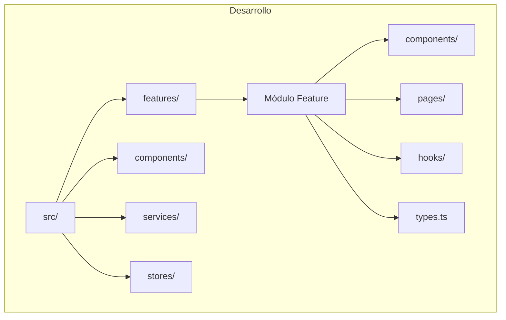

# 💻 Guía de Desarrollo - Universal Camera Viewer

[← Sistema de Diseño](./sistema-diseno.md) | [Índice](./README.md) | [Optimizaciones →](./optimizaciones.md)

## 🎯 Visión General

Esta guía proporciona las mejores prácticas, convenciones y flujos de trabajo para desarrollar en Universal Camera Viewer.

## 🚀 Configuración del Entorno

### Prerrequisitos

```bash
# Node.js 18+ y Yarn
node --version  # >= 18.0.0
yarn --version  # >= 1.22.0

# Rust (para Tauri)
rustc --version  # >= 1.70.0

# Python (para backend)
python --version  # >= 3.9.0
```

### Instalación Inicial

```bash
# 1. Clonar el repositorio
git clone https://github.com/your-org/universal-camera-viewer.git
cd universal-camera-viewer

# 2. Instalar dependencias frontend
yarn install  # IMPORTANTE: Usar yarn, no npm

# 3. Instalar dependencias Python
cd src-python
pip install -r requirements-dev.txt
cd ..

# 4. Configurar variables de entorno
cp .env.example .env
# Editar .env con tus configuraciones
```

### Variables de Entorno

**Variables requeridas:**

- `VITE_API_URL`: URL del backend API
- `VITE_WS_URL`: URL del WebSocket
- `VITE_MEDIAMTX_URL`: URL del servidor MediaMTX
- `VITE_ENABLE_MOCK`: Habilitar datos mock
- `VITE_LOG_LEVEL`: Nivel de logging

## 📁 Estructura del Proyecto



## 🎨 Convenciones de Código

### TypeScript/React

#### Nombrado

**Convenciones establecidas:**

- **Componentes**: PascalCase (ej: `CameraCard`)
- **Funciones/Variables**: camelCase (ej: `handleConnect`)
- **Constantes**: UPPER_SNAKE_CASE (ej: `MAX_RETRIES`)
- **Types/Interfaces**: PascalCase (ej: `CameraConfig`)
- **Enums**: PascalCase con valores UPPER_SNAKE_CASE

#### Estructura de Componente

**Orden recomendado:**

1. Imports (React, librerías, locales)
2. Types/Interfaces
3. Estado local
4. Hooks personalizados
5. Handlers/Callbacks
6. Effects
7. Render helpers
8. Return del componente

**Best practices:**

- Usar `memo` para optimización
- Definir `displayName` para debugging
- Props tipadas con interfaces
- Destructuring en parámetros

### Hooks Personalizados

**Patrón de hooks:**

- Prefijo `use` obligatorio
- Encapsular lógica reutilizable
- Retornar objeto con valores y funciones
- Manejar estados de carga internamente
- Usar `useCallback` para funciones expuestas

## 🧪 Testing

### Estructura de Tests

**Organización de tests:**

- Ubicación: `__tests__` junto al componente
- Archivo: `ComponentName.test.tsx`
- Usar `describe` para agrupar tests
- `beforeEach` para limpiar mocks
- Tests descriptivos con `it` o `test`

**Qué testear:**

- Renderizado correcto
- Interacciones de usuario
- Estados de carga/error
- Props y callbacks
- Casos edge

### Testing de Stores

**Testing Zustand stores:**

- Usar `renderHook` para probar hooks
- `act` para acciones asíncronas
- Resetear estado antes de cada test
- Verificar cambios de estado
- Testear acciones y selectores

## 🔧 Flujo de Desarrollo

### Git Workflow


### Convenciones de Commits

**Formato:** `<tipo>(<alcance>): <mensaje>`

**Tipos permitidos:**

- `feat`: Nueva funcionalidad
- `fix`: Corrección de bug
- `docs`: Cambios en documentación
- `style`: Cambios de formato
- `refactor`: Refactorización
- `test`: Tests
- `chore`: Build/herramientas

**Ejemplos:**

- `feat(cameras): agregar soporte PTZ`
- `fix(streaming): resolver memory leak`
- `docs(readme): actualizar instalación`

### Pull Request Template

**Secciones del PR:**

1. **Descripción**: Resumen de cambios
2. **Tipo de cambio**: Bug fix, feature, etc.
3. **Checklist**: Verificaciones necesarias
4. **Screenshots**: Si hay cambios visuales
5. **Breaking changes**: Si aplica
6. **Issues relacionados**: Links a issues

## 🛠️ Scripts de Desarrollo

### Package.json Scripts

**Scripts principales:**

- **Desarrollo**: `dev`, `tauri-dev`
- **Build**: `build`, `tauri-build`
- **Testing**: `test`, `test:ui`, `test:coverage`
- **Linting**: `lint`, `lint:fix`
- **Type checking**: `type-check`
- **Formateo**: `format`
- **Pre-commit**: Ejecuta linting, types y tests

### Makefile para Python

**Comandos disponibles:**

- `make dev`: Ejecutar servidor de desarrollo
- `make format`: Formatear con black/isort
- `make lint`: Verificar con flake8/pylint
- `make type-check`: Verificar tipos con mypy
- `make test`: Ejecutar tests con pytest
- `make test-cov`: Tests con cobertura
- `make check-all`: Ejecutar todo

## 🔍 Debugging

### VS Code Launch Configuration

**Configuraciones de debug:**

- **Debug Tauri**: Aplicación completa con Rust
- **Debug React**: Frontend en Chrome
- **Debug Python**: Backend FastAPI
- **Compound**: Todos los servicios juntos

**Tips de debugging:**

- Usar breakpoints condicionales
- Inspeccionar estado de Zustand
- Network tab para WebSocket
- React DevTools Profiler

### Chrome DevTools

**Herramientas útiles:**

- **Console**: debugLog helpers condicionales
- **Network**: Monitorear WebSocket frames
- **Performance**: Profiling de renders
- **Memory**: Detectar memory leaks
- **React DevTools**: Inspeccionar componentes
- **Redux DevTools**: Estado de Zustand

## 📦 Gestión de Dependencias

### Agregar Dependencias

```bash
# Producción
yarn add axios zustand @mui/material

# Desarrollo
yarn add -D @types/node vitest @testing-library/react

# Python
pip install fastapi uvicorn
pip install -r requirements-dev.txt
```

### Actualizar Dependencias

```bash
# Ver dependencias desactualizadas
yarn outdated

# Actualizar interactivamente
yarn upgrade-interactive

# Actualizar todo (cuidado)
yarn upgrade --latest
```

## 🔐 Seguridad

### Validación de Entrada

**Validaciones implementadas:**

- **IP Address**: Formato y rangos válidos
- **Puertos**: Rango 1-65535
- **URLs**: Protocolo y formato
- **Input sanitization**: Prevenir XSS
- **Length limits**: Máximos de caracteres

### Manejo de Credenciales

**Mejores prácticas:**

- ❌ NUNCA hardcodear credenciales
- ✅ Usar variables de entorno
- ✅ Encriptar datos sensibles
- ✅ HTTPS para transmisión
- ✅ Tokens con expiración
- ❌ No guardar passwords en localStorage

## 🚀 Performance

### Lazy Loading

**Estrategias de carga:**

- **Route-based splitting**: Páginas completas
- **Component splitting**: Componentes pesados
- **Library splitting**: Librerías grandes
- **Suspense boundaries**: Fallbacks durante carga
- **Prefetching**: Anticipar navegación

### Memoización

**Técnicas de optimización:**

- **React.memo**: Componentes puros
- **useMemo**: Valores calculados costosos
- **useCallback**: Funciones estables
- **Custom comparison**: memo con comparador
- **Selective updates**: Solo re-render necesarios

## 📋 Checklist de Desarrollo

### Antes de Commit

- [ ] El código compila sin errores
- [ ] Los tests pasan
- [ ] El linter no muestra errores
- [ ] Se agregaron tests para nuevas funcionalidades
- [ ] Se actualizó la documentación si es necesario
- [ ] Se revisó el código en busca de credenciales hardcodeadas

### Antes de PR

- [ ] La rama está actualizada con main
- [ ] Los commits siguen las convenciones
- [ ] Se completó el template de PR
- [ ] Se agregaron screenshots si hay cambios visuales
- [ ] Se probó en diferentes navegadores
- [ ] Se verificó la responsividad

## 🆘 Troubleshooting Común

### Error: "Cannot find module"

```bash
# Limpiar caché y reinstalar
rm -rf node_modules yarn.lock
yarn install
```

### Error: "CORS blocked"

```typescript
// Verificar configuración del backend
// FastAPI debe tener CORS habilitado
```

### Error: "WebSocket connection failed"

```typescript
// Verificar que el backend esté corriendo
// Verificar URL en .env
```

---

[← Sistema de Diseño](./sistema-diseno.md) | [Índice](./README.md) | [Optimizaciones →](./optimizaciones.md)
