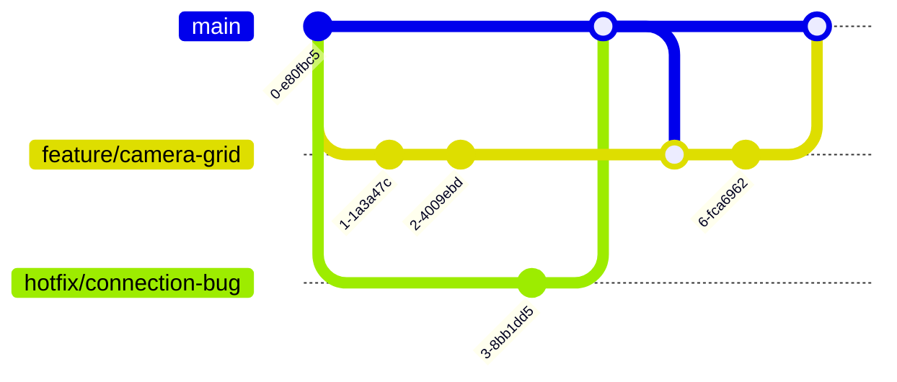

# 💻 Guía de Desarrollo - Universal Camera Viewer

[← Sistema de Diseño](./sistema-diseno.md) | [Índice](./README.md) | [Optimizaciones →](./optimizaciones.md)

## 🎯 Visión General

Esta guía proporciona las mejores prácticas, convenciones y flujos de trabajo para desarrollar en Universal Camera Viewer.

## 🚀 Configuración del Entorno

### Prerrequisitos

```bash
# Node.js 18+ y Yarn
node --version  # >= 18.0.0
yarn --version  # >= 1.22.0

# Rust (para Tauri)
rustc --version  # >= 1.70.0

# Python (para backend)
python --version  # >= 3.9.0
```

### Instalación Inicial

```bash
# 1. Clonar el repositorio
git clone https://github.com/your-org/universal-camera-viewer.git
cd universal-camera-viewer

# 2. Instalar dependencias frontend
yarn install  # IMPORTANTE: Usar yarn, no npm

# 3. Instalar dependencias Python
cd src-python
pip install -r requirements-dev.txt
cd ..

# 4. Configurar variables de entorno
cp .env.example .env
# Editar .env con tus configuraciones
```

### Variables de Entorno

```typescript
// .env
VITE_API_URL=http://localhost:8000
VITE_WS_URL=ws://localhost:8000
VITE_MEDIAMTX_URL=http://localhost:8554
VITE_ENABLE_MOCK=false
VITE_LOG_LEVEL=debug
```

## 📁 Estructura del Proyecto

```mermaid
graph TB
    subgraph "Desarrollo"
        A[src/] --> B[features/]
        A --> C[components/]
        A --> D[services/]
        A --> E[stores/]
        
        B --> B1[Módulo Feature]
        B1 --> B2[components/]
        B1 --> B3[pages/]
        B1 --> B4[hooks/]
        B1 --> B5[types.ts]
    end
```



## 🎨 Convenciones de Código

### TypeScript/React

#### Nombrado

```typescript
// Componentes: PascalCase
export const CameraCard: React.FC<CameraCardProps> = () => { };

// Funciones/Variables: camelCase
const handleCameraConnect = () => { };
const isConnected = true;

// Constantes: UPPER_SNAKE_CASE
const MAX_RETRY_ATTEMPTS = 3;
const DEFAULT_TIMEOUT = 5000;

// Types/Interfaces: PascalCase
interface CameraConfig {
  ip: string;
  port: number;
}

// Enums: PascalCase con valores en UPPER_SNAKE_CASE
enum ConnectionStatus {
  CONNECTED = 'CONNECTED',
  DISCONNECTED = 'DISCONNECTED'
}
```

#### Estructura de Componente

```typescript
// components/CameraCard/CameraCard.tsx
import React, { useState, useCallback, memo } from 'react';
import { Box, Card, Typography } from '@mui/material';
import { useCamera } from '@/hooks/useCamera';
import type { Camera } from '@/types';

interface CameraCardProps {
  camera: Camera;
  onSelect?: (camera: Camera) => void;
  className?: string;
}

export const CameraCard: React.FC<CameraCardProps> = memo(({
  camera,
  onSelect,
  className
}) => {
  // 1. Estado local
  const [isHovered, setIsHovered] = useState(false);
  
  // 2. Hooks personalizados
  const { connect, disconnect, isConnecting } = useCamera(camera.id);
  
  // 3. Handlers
  const handleClick = useCallback(() => {
    onSelect?.(camera);
  }, [camera, onSelect]);
  
  // 4. Effects
  useEffect(() => {
    // Lógica de efectos
  }, []);
  
  // 5. Render helpers
  const renderStatus = () => {
    if (isConnecting) return <LoadingSpinner />;
    return <StatusBadge status={camera.status} />;
  };
  
  // 6. Render principal
  return (
    <Card
      className={className}
      onClick={handleClick}
      onMouseEnter={() => setIsHovered(true)}
      onMouseLeave={() => setIsHovered(false)}
    >
      <Box p={2}>
        <Typography variant="h6">{camera.name}</Typography>
        {renderStatus()}
      </Box>
    </Card>
  );
});

CameraCard.displayName = 'CameraCard';
```

### Hooks Personalizados

```typescript
// hooks/useCamera.ts
export const useCamera = (cameraId: string) => {
  const camera = useCameraStore(state => 
    state.cameras.find(c => c.id === cameraId)
  );
  
  const { connectCamera, disconnectCamera } = useCameraStore();
  const [isConnecting, setIsConnecting] = useState(false);
  
  const connect = useCallback(async () => {
    setIsConnecting(true);
    try {
      await connectCamera(cameraId);
    } finally {
      setIsConnecting(false);
    }
  }, [cameraId, connectCamera]);
  
  const disconnect = useCallback(async () => {
    await disconnectCamera(cameraId);
  }, [cameraId, disconnectCamera]);
  
  return {
    camera,
    connect,
    disconnect,
    isConnecting
  };
};
```

## 🧪 Testing

### Estructura de Tests

```typescript
// components/CameraCard/__tests__/CameraCard.test.tsx
import { render, screen, fireEvent } from '@testing-library/react';
import { CameraCard } from '../CameraCard';
import { mockCamera } from '@/test-utils/mocks';

describe('CameraCard', () => {
  const defaultProps = {
    camera: mockCamera,
    onSelect: jest.fn()
  };
  
  beforeEach(() => {
    jest.clearAllMocks();
  });
  
  it('should render camera name', () => {
    render(<CameraCard {...defaultProps} />);
    expect(screen.getByText(mockCamera.name)).toBeInTheDocument();
  });
  
  it('should call onSelect when clicked', () => {
    render(<CameraCard {...defaultProps} />);
    fireEvent.click(screen.getByRole('button'));
    expect(defaultProps.onSelect).toHaveBeenCalledWith(mockCamera);
  });
  
  it('should show loading state when connecting', () => {
    // Mock del hook
    jest.mock('@/hooks/useCamera', () => ({
      useCamera: () => ({ isConnecting: true })
    }));
    
    render(<CameraCard {...defaultProps} />);
    expect(screen.getByTestId('loading-spinner')).toBeInTheDocument();
  });
});
```

### Testing de Stores

```typescript
// stores/__tests__/cameraStore.test.ts
import { renderHook, act } from '@testing-library/react-hooks';
import { useCameraStore } from '../cameraStore';

describe('cameraStore', () => {
  beforeEach(() => {
    useCameraStore.setState({ cameras: [] });
  });
  
  it('should add camera', async () => {
    const { result } = renderHook(() => useCameraStore());
    
    await act(async () => {
      await result.current.addCamera({
        name: 'Test Camera',
        ip: '192.168.1.100'
      });
    });
    
    expect(result.current.cameras).toHaveLength(1);
    expect(result.current.cameras[0].name).toBe('Test Camera');
  });
});
```

## 🔧 Flujo de Desarrollo

### Git Workflow



### Convenciones de Commits

```bash
# Formato: <tipo>(<alcance>): <mensaje>

# Tipos permitidos:
feat: Nueva funcionalidad
fix: Corrección de bug
docs: Cambios en documentación
style: Cambios de formato (no afectan funcionalidad)
refactor: Refactorización de código
test: Agregar o modificar tests
chore: Cambios en build o herramientas

# Ejemplos:
git commit -m "feat(cameras): agregar soporte para PTZ"
git commit -m "fix(streaming): corregir memory leak en video player"
git commit -m "docs(readme): actualizar instrucciones de instalación"
```

### Pull Request Template

```markdown
## Descripción
Breve descripción de los cambios realizados.

## Tipo de cambio
- [ ] Bug fix
- [ ] Nueva funcionalidad
- [ ] Breaking change
- [ ] Documentación

## Checklist
- [ ] Mi código sigue las guías de estilo
- [ ] He realizado auto-review
- [ ] He agregado tests
- [ ] Los tests existentes pasan
- [ ] He actualizado la documentación

## Screenshots (si aplica)
```

## 🛠️ Scripts de Desarrollo

### Package.json Scripts

```json
{
  "scripts": {
    // Desarrollo
    "dev": "vite",
    "tauri-dev": "tauri dev",
    
    // Build
    "build": "tsc && vite build",
    "tauri-build": "tauri build",
    
    // Testing
    "test": "vitest",
    "test:ui": "vitest --ui",
    "test:coverage": "vitest --coverage",
    
    // Linting
    "lint": "eslint src --ext ts,tsx",
    "lint:fix": "eslint src --ext ts,tsx --fix",
    
    // Type checking
    "type-check": "tsc --noEmit",
    
    // Formateo
    "format": "prettier --write \"src/**/*.{ts,tsx,json,css}\"",
    
    // Pre-commit
    "pre-commit": "yarn lint && yarn type-check && yarn test"
  }
}
```

### Makefile para Python

```makefile
# Desarrollo
dev:
	python run_python.py

# Calidad de código
format:
	black src-python
	isort src-python

lint:
	flake8 src-python
	pylint src-python

type-check:
	mypy src-python

# Testing
test:
	pytest

test-cov:
	pytest --cov=src-python --cov-report=html

# Todo junto
check-all: format lint type-check test
```

## 🔍 Debugging

### VS Code Launch Configuration

```json
// .vscode/launch.json
{
  "version": "0.2.0",
  "configurations": [
    {
      "name": "Debug Tauri",
      "type": "node",
      "request": "launch",
      "runtimeExecutable": "yarn",
      "runtimeArgs": ["tauri-dev"],
      "env": {
        "RUST_BACKTRACE": "1"
      }
    },
    {
      "name": "Debug React",
      "type": "chrome",
      "request": "launch",
      "url": "http://localhost:5173",
      "webRoot": "${workspaceFolder}/src"
    },
    {
      "name": "Debug Python",
      "type": "python",
      "request": "launch",
      "program": "${workspaceFolder}/run_python.py",
      "console": "integratedTerminal"
    }
  ]
}
```

### Chrome DevTools

```typescript
// Helpers para debugging
export const debugLog = (...args: any[]) => {
  if (import.meta.env.DEV) {
    console.log('[DEBUG]', ...args);
  }
};

export const debugTable = (data: any) => {
  if (import.meta.env.DEV) {
    console.table(data);
  }
};

// React DevTools Profiler
export const withProfiler = <P extends object>(
  Component: React.ComponentType<P>,
  id: string
) => {
  if (import.meta.env.DEV) {
    return (props: P) => (
      <Profiler id={id} onRender={onRenderCallback}>
        <Component {...props} />
      </Profiler>
    );
  }
  return Component;
};
```

## 📦 Gestión de Dependencias

### Agregar Dependencias

```bash
# Producción
yarn add axios zustand @mui/material

# Desarrollo
yarn add -D @types/node vitest @testing-library/react

# Python
pip install fastapi uvicorn
pip install -r requirements-dev.txt
```

### Actualizar Dependencias

```bash
# Ver dependencias desactualizadas
yarn outdated

# Actualizar interactivamente
yarn upgrade-interactive

# Actualizar todo (cuidado)
yarn upgrade --latest
```

## 🔐 Seguridad

### Validación de Entrada

```typescript
// utils/validation.ts
export const validateIP = (ip: string): boolean => {
  const ipRegex = /^(?:[0-9]{1,3}\.){3}[0-9]{1,3}$/;
  if (!ipRegex.test(ip)) return false;
  
  const parts = ip.split('.');
  return parts.every(part => {
    const num = parseInt(part, 10);
    return num >= 0 && num <= 255;
  });
};

export const sanitizeInput = (input: string): string => {
  return input
    .trim()
    .replace(/[<>]/g, '') // Prevenir XSS básico
    .slice(0, 255); // Limitar longitud
};
```

### Manejo de Credenciales

```typescript
// NUNCA hacer esto
const password = "admin123"; // ❌

// Usar variables de entorno
const apiKey = import.meta.env.VITE_API_KEY; // ✅

// Encriptar credenciales sensibles
import { encrypt, decrypt } from '@/utils/crypto';

const storeCredentials = async (username: string, password: string) => {
  const encrypted = await encrypt(password);
  localStorage.setItem('creds', JSON.stringify({
    username,
    password: encrypted
  }));
};
```

## 🚀 Performance

### Lazy Loading

```typescript
// Rutas con lazy loading
const CamerasPage = lazy(() => import('@/features/cameras/pages/CamerasPage'));
const ScannerPage = lazy(() => import('@/features/scanner/pages/ScannerPage'));

// Componentes pesados
const HeavyChart = lazy(() => 
  import('@/components/charts/HeavyChart')
    .then(module => ({ default: module.HeavyChart }))
);
```

### Memoización

```typescript
// Memoizar componentes
export const ExpensiveComponent = memo(({ data }) => {
  // Render costoso
}, (prevProps, nextProps) => {
  // Comparación personalizada
  return prevProps.data.id === nextProps.data.id;
});

// Memoizar valores calculados
const expensiveValue = useMemo(() => {
  return calculateExpensiveValue(data);
}, [data]);

// Memoizar callbacks
const handleClick = useCallback((id: string) => {
  doSomething(id);
}, [dependency]);
```

## 📋 Checklist de Desarrollo

### Antes de Commit

- [ ] El código compila sin errores
- [ ] Los tests pasan
- [ ] El linter no muestra errores
- [ ] Se agregaron tests para nuevas funcionalidades
- [ ] Se actualizó la documentación si es necesario
- [ ] Se revisó el código en busca de credenciales hardcodeadas

### Antes de PR

- [ ] La rama está actualizada con main
- [ ] Los commits siguen las convenciones
- [ ] Se completó el template de PR
- [ ] Se agregaron screenshots si hay cambios visuales
- [ ] Se probó en diferentes navegadores
- [ ] Se verificó la responsividad

## 🆘 Troubleshooting Común

### Error: "Cannot find module"

```bash
# Limpiar caché y reinstalar
rm -rf node_modules yarn.lock
yarn install
```

### Error: "CORS blocked"

```typescript
// Verificar configuración del backend
// FastAPI debe tener CORS habilitado
```

### Error: "WebSocket connection failed"

```typescript
// Verificar que el backend esté corriendo
// Verificar URL en .env
```

---

[← Sistema de Diseño](./sistema-diseno.md) | [Índice](./README.md) | [Optimizaciones →](./optimizaciones.md)