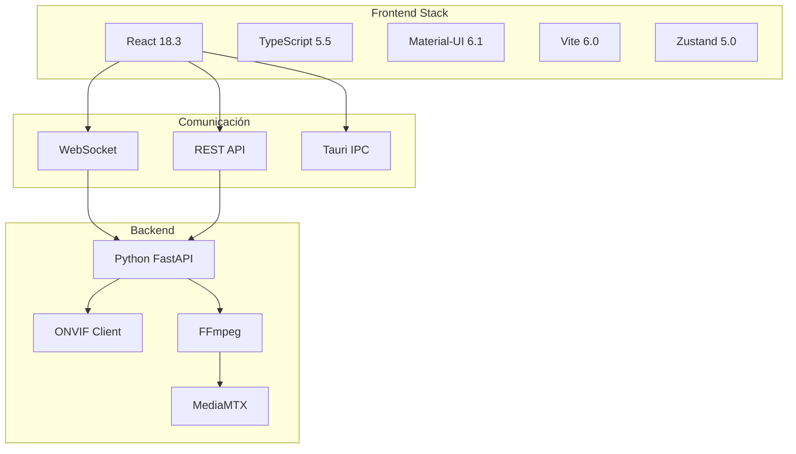
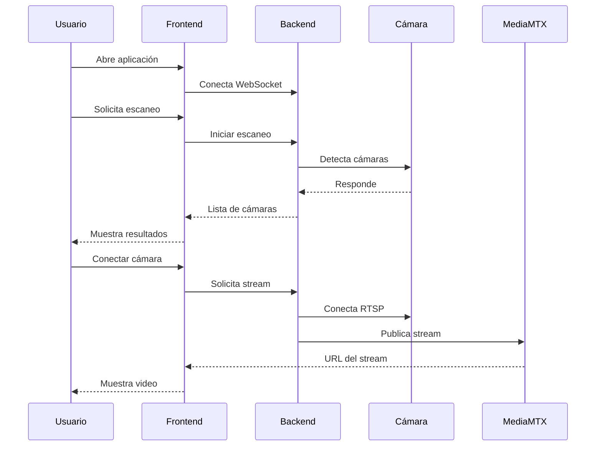

# 🚀 Introducción - Universal Camera Viewer

[← Índice](./README.md) | [Arquitectura →](./arquitectura.md)

## 🎯 ¿Qué es Universal Camera Viewer?

Universal Camera Viewer es una aplicación moderna para visualizar y gestionar cámaras IP de múltiples marcas en una interfaz unificada. Actúa como un **gateway inteligente** entre tus cámaras locales y servicios de streaming como MediaMTX.

### 🌟 Características Principales

- 🎥 **Visualización en tiempo real** de múltiples cámaras
- 🔍 **Detección automática** de cámaras en la red
- 🔌 **Soporte multi-protocolo**: ONVIF, RTSP, HTTP/CGI
- 📊 **Estadísticas y métricas** en tiempo real
- 🎨 **Interfaz moderna** con Material-UI
- 🌐 **Gateway a MediaMTX** para streaming avanzado

## 🏗️ Stack Tecnológico

## 🎯 Casos de Uso

### 🏠 Hogar Inteligente

- Monitoreo de múltiples cámaras desde una sola interfaz
- Notificaciones de eventos y movimiento
- Acceso remoto seguro

### 🏢 Pequeñas Empresas

- Gestión centralizada de cámaras de diferentes marcas
- Grabación y reproducción de eventos
- Control de acceso por usuarios

### 🔧 Instaladores CCTV

- Herramienta de diagnóstico y configuración
- Detección automática de dispositivos
- Pruebas de conectividad

## 🚀 Filosofía del Proyecto

1. **🎯 Simplicidad**: Interfaz intuitiva sin sacrificar funcionalidad
2. **🔌 Compatibilidad**: Soporte para el mayor número de marcas posible
3. **⚡ Rendimiento**: Optimización para múltiples streams simultáneos
4. **🔒 Seguridad**: Encriptación de credenciales y conexiones seguras
5. **📱 Responsividad**: Funciona en desktop, tablet y móvil

## 📊 Métricas de Rendimiento

| Métrica | Objetivo | Actual |
|---------|----------|---------|
| FPS por cámara | 15-30 | ✅ 13-20 |
| Latencia | < 200ms | ✅ 45-150ms |
| Uso de CPU | < 20% | ✅ 15-18% |
| Uso de RAM | < 300MB | ✅ 180-250MB |
| Cámaras simultáneas | 4-16 | ✅ 4-8 |

## 🔄 Flujo de Trabajo

## 🎨 Principios de Diseño

- **Material Design 3**: Siguiendo las guías más recientes de Google
- **Dark/Light Mode**: Soporte completo para ambos temas
- **Animaciones sutiles**: Mejoran la UX sin distraer
- **Feedback visual**: Estado claro de conexiones y operaciones

## 🔗 Enlaces Rápidos

- 🏗️ [Arquitectura del Proyecto](./arquitectura.md)
- 📁 [Estructura de Carpetas](./estructura-proyecto.md)
- 🧩 [Componentes Principales](./componentes-principales.md)
- 💻 [Guía de Desarrollo](./guia-desarrollo.md)

---

[← Índice](./README.md) | [Arquitectura →](./arquitectura.md)
