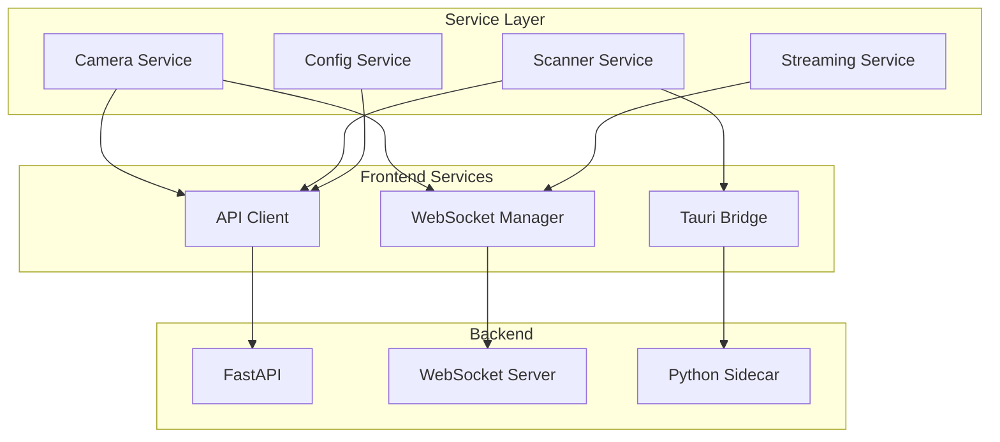

# 🔌 Servicios y API - Universal Camera Viewer

[← Features](./features.md) | [Índice](./README.md) | [Sistema de Diseño →](./sistema-diseno.md)

## 🎯 Visión General

La capa de servicios maneja toda la comunicación con el backend, gestión de WebSocket, y operaciones asíncronas.

## 🏗️ Arquitectura de Servicios



## 📡 Cliente API Base

### Configuración del Cliente HTTP

```typescript
// services/api/client.ts
import axios, { AxiosInstance, AxiosRequestConfig } from 'axios';

class ApiClient {
  private client: AxiosInstance;
  private baseURL: string;
  
  constructor() {
    this.baseURL = import.meta.env.VITE_API_URL || 'http://localhost:8000';
    
    this.client = axios.create({
      baseURL: this.baseURL,
      timeout: 30000,
      headers: {
        'Content-Type': 'application/json',
      }
    });
    
    this.setupInterceptors();
  }
  
  private setupInterceptors() {
    // Request interceptor
    this.client.interceptors.request.use(
      (config) => {
        // Agregar token si existe
        const token = localStorage.getItem('authToken');
        if (token) {
          config.headers.Authorization = `Bearer ${token}`;
        }
        
        // Log en desarrollo
        if (import.meta.env.DEV) {
          console.log(`🚀 ${config.method?.toUpperCase()} ${config.url}`);
        }
        
        return config;
      },
      (error) => {
        return Promise.reject(error);
      }
    );
    
    // Response interceptor
    this.client.interceptors.response.use(
      (response) => {
        return response;
      },
      async (error) => {
        const originalRequest = error.config;
        
        // Retry logic para 401
        if (error.response?.status === 401 && !originalRequest._retry) {
          originalRequest._retry = true;
          
          try {
            await this.refreshToken();
            return this.client(originalRequest);
          } catch (refreshError) {
            // Redirigir a login
            window.location.href = '/login';
            return Promise.reject(refreshError);
          }
        }
        
        // Manejo de errores global
        this.handleError(error);
        return Promise.reject(error);
      }
    );
  }
  
  private handleError(error: any) {
    const message = error.response?.data?.detail || error.message;
    
    // Notificar al usuario
    useNotificationStore.getState().showError(message);
    
    // Log detallado en desarrollo
    if (import.meta.env.DEV) {
      console.error('API Error:', {
        url: error.config?.url,
        method: error.config?.method,
        status: error.response?.status,
        data: error.response?.data
      });
    }
  }
  
  // Métodos públicos
  async get<T>(url: string, config?: AxiosRequestConfig): Promise<T> {
    const response = await this.client.get<T>(url, config);
    return response.data;
  }
  
  async post<T>(url: string, data?: any, config?: AxiosRequestConfig): Promise<T> {
    const response = await this.client.post<T>(url, data, config);
    return response.data;
  }
  
  async put<T>(url: string, data?: any, config?: AxiosRequestConfig): Promise<T> {
    const response = await this.client.put<T>(url, data, config);
    return response.data;
  }
  
  async delete<T>(url: string, config?: AxiosRequestConfig): Promise<T> {
    const response = await this.client.delete<T>(url, config);
    return response.data;
  }
}

export const apiClient = new ApiClient();
```

## 🔄 WebSocket Manager

### Gestión de Conexiones en Tiempo Real

```typescript
// services/websocket/WebSocketManager.ts
import { io, Socket } from 'socket.io-client';

interface WebSocketEvents {
  'camera:status': (data: CameraStatusEvent) => void;
  'stream:frame': (data: StreamFrameEvent) => void;
  'scan:progress': (data: ScanProgressEvent) => void;
  'metrics:update': (data: MetricsEvent) => void;
}

class WebSocketManager {
  private socket: Socket | null = null;
  private reconnectAttempts = 0;
  private maxReconnectAttempts = 5;
  private listeners = new Map<string, Set<Function>>();
  
  connect(): Promise<void> {
    return new Promise((resolve, reject) => {
      if (this.socket?.connected) {
        resolve();
        return;
      }
      
      const wsUrl = import.meta.env.VITE_WS_URL || 'ws://localhost:8000';
      
      this.socket = io(wsUrl, {
        transports: ['websocket'],
        reconnection: true,
        reconnectionAttempts: this.maxReconnectAttempts,
        reconnectionDelay: 1000,
      });
      
      this.socket.on('connect', () => {
        console.log('✅ WebSocket connected');
        this.reconnectAttempts = 0;
        resolve();
      });
      
      this.socket.on('disconnect', (reason) => {
        console.log('❌ WebSocket disconnected:', reason);
        useAppStore.getState().setConnectionStatus('disconnected');
      });
      
      this.socket.on('connect_error', (error) => {
        console.error('WebSocket connection error:', error);
        this.reconnectAttempts++;
        
        if (this.reconnectAttempts >= this.maxReconnectAttempts) {
          reject(new Error('Failed to connect to WebSocket server'));
        }
      });
      
      // Registrar eventos
      this.registerEventHandlers();
    });
  }
  
  private registerEventHandlers() {
    if (!this.socket) return;
    
    // Reenviar eventos a listeners registrados
    const events: (keyof WebSocketEvents)[] = [
      'camera:status',
      'stream:frame',
      'scan:progress',
      'metrics:update'
    ];
    
    events.forEach(event => {
      this.socket!.on(event, (data: any) => {
        this.emit(event, data);
      });
    });
  }
  
  on<K extends keyof WebSocketEvents>(
    event: K,
    callback: WebSocketEvents[K]
  ): () => void {
    if (!this.listeners.has(event)) {
      this.listeners.set(event, new Set());
    }
    
    this.listeners.get(event)!.add(callback);
    
    // Retornar función de cleanup
    return () => {
      this.listeners.get(event)?.delete(callback);
    };
  }
  
  emit<K extends keyof WebSocketEvents>(
    event: K,
    data: Parameters<WebSocketEvents[K]>[0]
  ) {
    const callbacks = this.listeners.get(event);
    if (callbacks) {
      callbacks.forEach(callback => callback(data));
    }
  }
  
  send(event: string, data: any) {
    if (!this.socket?.connected) {
      console.error('WebSocket not connected');
      return;
    }
    
    this.socket.emit(event, data);
  }
  
  disconnect() {
    if (this.socket) {
      this.socket.disconnect();
      this.socket = null;
      this.listeners.clear();
    }
  }
}

export const wsManager = new WebSocketManager();
```

## 📷 Camera Service

### Servicio de Gestión de Cámaras

```typescript
// services/camera/cameraService.ts
import { apiClient } from '../api/client';
import { wsManager } from '../websocket/WebSocketManager';

export interface CameraInput {
  name: string;
  ip: string;
  brand: string;
  username?: string;
  password?: string;
  port?: number;
  protocol?: 'onvif' | 'rtsp' | 'http';
}

class CameraService {
  // CRUD Operations
  async getAllCameras(): Promise<Camera[]> {
    return apiClient.get<Camera[]>('/api/cameras');
  }
  
  async getCameraById(id: string): Promise<Camera> {
    return apiClient.get<Camera>(`/api/cameras/${id}`);
  }
  
  async createCamera(data: CameraInput): Promise<Camera> {
    const camera = await apiClient.post<Camera>('/api/cameras', data);
    
    // Notificar via WebSocket
    wsManager.send('camera:created', { cameraId: camera.id });
    
    return camera;
  }
  
  async updateCamera(id: string, data: Partial<CameraInput>): Promise<Camera> {
    return apiClient.put<Camera>(`/api/cameras/${id}`, data);
  }
  
  async deleteCamera(id: string): Promise<void> {
    await apiClient.delete(`/api/cameras/${id}`);
    
    // Detener stream si está activo
    wsManager.send('stream:stop', { cameraId: id });
  }
  
  // Connection Management
  async connectCamera(id: string): Promise<ConnectionResult> {
    try {
      const result = await apiClient.post<ConnectionResult>(
        `/api/cameras/${id}/connect`
      );
      
      // Suscribirse a eventos de estado
      const unsubscribe = wsManager.on('camera:status', (event) => {
        if (event.cameraId === id) {
          useCameraStore.getState().updateConnectionStatus(id, event.status);
        }
      });
      
      // Guardar unsubscribe para cleanup
      this.connectionCleanups.set(id, unsubscribe);
      
      return result;
    } catch (error) {
      throw new Error(`Failed to connect camera: ${error.message}`);
    }
  }
  
  async disconnectCamera(id: string): Promise<void> {
    await apiClient.post(`/api/cameras/${id}/disconnect`);
    
    // Cleanup listeners
    this.connectionCleanups.get(id)?.();
    this.connectionCleanups.delete(id);
  }
  
  // Camera Discovery
  async discoverCameras(config: ScanConfig): Promise<DiscoveredCamera[]> {
    return apiClient.post<DiscoveredCamera[]>('/api/cameras/discover', config);
  }
  
  // Camera Capabilities
  async getCameraCapabilities(id: string): Promise<CameraCapabilities> {
    return apiClient.get<CameraCapabilities>(`/api/cameras/${id}/capabilities`);
  }
  
  // PTZ Control
  async sendPTZCommand(id: string, command: PTZCommand): Promise<void> {
    return apiClient.post(`/api/cameras/${id}/ptz`, command);
  }
  
  // Presets
  async getPresets(id: string): Promise<CameraPreset[]> {
    return apiClient.get<CameraPreset[]>(`/api/cameras/${id}/presets`);
  }
  
  async gotoPreset(id: string, presetId: string): Promise<void> {
    return apiClient.post(`/api/cameras/${id}/presets/${presetId}/goto`);
  }
  
  // Snapshots
  async takeSnapshot(id: string): Promise<string> {
    const response = await apiClient.post<{ url: string }>(
      `/api/cameras/${id}/snapshot`
    );
    return response.url;
  }
  
  // Batch Operations
  async connectMultipleCameras(ids: string[]): Promise<BatchResult[]> {
    const results = await Promise.allSettled(
      ids.map(id => this.connectCamera(id))
    );
    
    return results.map((result, index) => ({
      cameraId: ids[index],
      success: result.status === 'fulfilled',
      error: result.status === 'rejected' ? result.reason : undefined
    }));
  }
  
  private connectionCleanups = new Map<string, () => void>();
}

export const cameraService = new CameraService();
```

## 🎥 Streaming Service

### Servicio de Video Streaming

```typescript
// services/streaming/streamingService.ts
class StreamingService {
  private activeStreams = new Map<string, StreamSession>();
  private frameBuffers = new Map<string, string[]>();
  
  async startStream(cameraId: string, options?: StreamOptions): Promise<StreamInfo> {
    // Verificar si ya existe un stream activo
    if (this.activeStreams.has(cameraId)) {
      return this.activeStreams.get(cameraId)!.info;
    }
    
    try {
      // Solicitar stream al backend
      const streamInfo = await apiClient.post<StreamInfo>(
        `/api/streams/start`,
        {
          cameraId,
          quality: options?.quality || 'high',
          protocol: options?.protocol || 'webrtc'
        }
      );
      
      // Crear sesión de stream
      const session: StreamSession = {
        info: streamInfo,
        startTime: Date.now(),
        frameCount: 0,
        cleanup: this.setupStreamHandlers(cameraId, streamInfo)
      };
      
      this.activeStreams.set(cameraId, session);
      
      // Actualizar store
      useStreamingStore.getState().addActiveStream(cameraId, streamInfo);
      
      return streamInfo;
    } catch (error) {
      throw new Error(`Failed to start stream: ${error.message}`);
    }
  }
  
  private setupStreamHandlers(cameraId: string, info: StreamInfo): () => void {
    const cleanups: (() => void)[] = [];
    
    // WebRTC Setup
    if (info.protocol === 'webrtc') {
      const pc = new RTCPeerConnection({
        iceServers: [{ urls: 'stun:stun.l.google.com:19302' }]
      });
      
      // Manejar ICE candidates
      pc.onicecandidate = (event) => {
        if (event.candidate) {
          wsManager.send('webrtc:ice-candidate', {
            cameraId,
            candidate: event.candidate
          });
        }
      };
      
      // Cleanup
      cleanups.push(() => pc.close());
    }
    
    // WebSocket frame handler
    const frameHandler = wsManager.on('stream:frame', (event) => {
      if (event.cameraId === cameraId) {
        this.handleFrame(cameraId, event.frame);
      }
    });
    cleanups.push(frameHandler);
    
    // Metrics handler
    const metricsHandler = wsManager.on('stream:metrics', (event) => {
      if (event.cameraId === cameraId) {
        useStreamingStore.getState().updateMetrics(cameraId, event.metrics);
      }
    });
    cleanups.push(metricsHandler);
    
    return () => cleanups.forEach(cleanup => cleanup());
  }
  
  private handleFrame(cameraId: string, frameData: string) {
    const session = this.activeStreams.get(cameraId);
    if (!session) return;
    
    // Actualizar contador
    session.frameCount++;
    
    // Buffer de frames para smooth playback
    if (!this.frameBuffers.has(cameraId)) {
      this.frameBuffers.set(cameraId, []);
    }
    
    const buffer = this.frameBuffers.get(cameraId)!;
    buffer.push(frameData);
    
    // Mantener buffer de tamaño limitado
    if (buffer.length > 3) {
      buffer.shift();
    }
    
    // Actualizar store con el frame más reciente
    useStreamingStore.getState().updateFrame(cameraId, frameData);
  }
  
  async stopStream(cameraId: string): Promise<void> {
    const session = this.activeStreams.get(cameraId);
    if (!session) return;
    
    try {
      // Notificar al backend
      await apiClient.post(`/api/streams/stop`, { cameraId });
      
      // Limpiar recursos
      session.cleanup();
      this.activeStreams.delete(cameraId);
      this.frameBuffers.delete(cameraId);
      
      // Actualizar store
      useStreamingStore.getState().removeActiveStream(cameraId);
    } catch (error) {
      console.error('Error stopping stream:', error);
    }
  }
  
  // Recording
  async startRecording(cameraId: string, options?: RecordingOptions): Promise<RecordingSession> {
    return apiClient.post<RecordingSession>(`/api/streams/${cameraId}/record/start`, options);
  }
  
  async stopRecording(cameraId: string): Promise<RecordingResult> {
    return apiClient.post<RecordingResult>(`/api/streams/${cameraId}/record/stop`);
  }
  
  // Stream Quality
  async changeQuality(cameraId: string, quality: StreamQuality): Promise<void> {
    await apiClient.post(`/api/streams/${cameraId}/quality`, { quality });
  }
  
  // Metrics
  getStreamMetrics(cameraId: string): StreamMetrics | null {
    const session = this.activeStreams.get(cameraId);
    if (!session) return null;
    
    const duration = Date.now() - session.startTime;
    const fps = (session.frameCount / duration) * 1000;
    
    return {
      fps: Math.round(fps * 10) / 10,
      bitrate: 0, // Actualizado por backend
      resolution: session.info.resolution,
      codec: session.info.codec,
      latency: 0 // Actualizado por backend
    };
  }
  
  // Cleanup all streams
  async cleanup(): Promise<void> {
    const promises = Array.from(this.activeStreams.keys()).map(
      cameraId => this.stopStream(cameraId)
    );
    
    await Promise.allSettled(promises);
  }
}

export const streamingService = new StreamingService();
```

## 🔍 Scanner Service

### Servicio de Escaneo de Red

```typescript
// services/scanner/scannerService.ts
class ScannerService {
  private currentScan: AbortController | null = null;
  
  async scanNetwork(config: NetworkScanConfig): Promise<ScanResult[]> {
    // Cancelar escaneo anterior si existe
    this.stopScan();
    
    // Crear nuevo controlador
    this.currentScan = new AbortController();
    
    try {
      // Iniciar escaneo
      const scanId = await apiClient.post<{ scanId: string }>(
        '/api/scanner/network/start',
        config,
        { signal: this.currentScan.signal }
      );
      
      // Escuchar progreso via WebSocket
      const progressHandler = wsManager.on('scan:progress', (event) => {
        if (event.scanId === scanId.scanId) {
          useScannerStore.getState().updateProgress(event.progress);
        }
      });
      
      // Escuchar dispositivos encontrados
      const deviceHandler = wsManager.on('scan:device-found', (event) => {
        if (event.scanId === scanId.scanId) {
          useScannerStore.getState().addDevice(event.device);
        }
      });
      
      // Esperar finalización
      return new Promise((resolve, reject) => {
        const completeHandler = wsManager.on('scan:complete', (event) => {
          if (event.scanId === scanId.scanId) {
            // Cleanup
            progressHandler();
            deviceHandler();
            completeHandler();
            
            resolve(event.results);
          }
        });
        
        // Manejar cancelación
        this.currentScan!.signal.addEventListener('abort', () => {
          progressHandler();
          deviceHandler();
          completeHandler();
          reject(new Error('Scan cancelled'));
        });
      });
    } catch (error) {
      if (error.name === 'AbortError') {
        throw new Error('Scan cancelled');
      }
      throw error;
    }
  }
  
  async scanPorts(ip: string, ports?: number[]): Promise<PortScanResult[]> {
    const defaultPorts = [80, 554, 8000, 8080, 2020, 5543];
    
    return apiClient.post<PortScanResult[]>('/api/scanner/ports', {
      ip,
      ports: ports || defaultPorts,
      timeout: 2000
    });
  }
  
  async testAccess(ip: string, ports: number[]): Promise<AccessTestResult[]> {
    const results: AccessTestResult[] = [];
    
    for (const port of ports) {
      try {
        const result = await apiClient.post<AccessTestResult>(
          '/api/scanner/access-test',
          { ip, port, timeout: 5000 }
        );
        results.push(result);
      } catch (error) {
        results.push({
          ip,
          port,
          accessible: false,
          protocol: null,
          error: error.message
        });
      }
    }
    
    return results;
  }
  
  async identifyDevice(ip: string, port: number): Promise<DeviceInfo | null> {
    try {
      return await apiClient.post<DeviceInfo>('/api/scanner/identify', {
        ip,
        port
      });
    } catch (error) {
      console.error('Failed to identify device:', error);
      return null;
    }
  }
  
  stopScan() {
    if (this.currentScan) {
      this.currentScan.abort();
      this.currentScan = null;
      useScannerStore.getState().resetProgress();
    }
  }
  
  // Utilidades
  async getNetworkInfo(): Promise<NetworkInfo> {
    return apiClient.get<NetworkInfo>('/api/scanner/network-info');
  }
  
  validateSubnet(subnet: string): boolean {
    const subnetRegex = /^(\d{1,3}\.){3}\d{1,3}\/\d{1,2}$/;
    return subnetRegex.test(subnet);
  }
  
  calculateHosts(subnet: string): number {
    const [, bits] = subnet.split('/');
    const hostBits = 32 - parseInt(bits);
    return Math.pow(2, hostBits) - 2; // -2 for network and broadcast
  }
}

export const scannerService = new ScannerService();
```

## ⚙️ Configuration Service

### Servicio de Configuración

```typescript
// services/config/configService.ts
interface AppConfig {
  general: GeneralConfig;
  network: NetworkConfig;
  security: SecurityConfig;
  advanced: AdvancedConfig;
}

class ConfigService {
  private configCache: AppConfig | null = null;
  private saveDebounced: DebouncedFunc<(config: AppConfig) => Promise<void>>;
  
  constructor() {
    // Debounce para evitar guardados excesivos
    this.saveDebounced = debounce(this.saveConfig.bind(this), 1000);
  }
  
  async getConfig(): Promise<AppConfig> {
    if (this.configCache) {
      return this.configCache;
    }
    
    try {
      const config = await apiClient.get<AppConfig>('/api/config');
      this.configCache = config;
      return config;
    } catch (error) {
      // Retornar configuración por defecto
      return this.getDefaultConfig();
    }
  }
  
  async updateConfig(updates: Partial<AppConfig>): Promise<void> {
    const currentConfig = await this.getConfig();
    const newConfig = { ...currentConfig, ...updates };
    
    // Actualizar cache inmediatamente
    this.configCache = newConfig;
    
    // Aplicar cambios localmente
    this.applyConfigChanges(updates);
    
    // Guardar en backend (debounced)
    await this.saveDebounced(newConfig);
  }
  
  private async saveConfig(config: AppConfig): Promise<void> {
    try {
      await apiClient.put('/api/config', config);
      
      // Notificar éxito
      useNotificationStore.getState().showSuccess(
        'Configuración guardada correctamente'
      );
    } catch (error) {
      // Revertir cache en caso de error
      this.configCache = null;
      throw error;
    }
  }
  
  private applyConfigChanges(updates: Partial<AppConfig>) {
    // Aplicar tema
    if (updates.general?.theme) {
      useThemeStore.getState().setTheme(updates.general.theme);
    }
    
    // Aplicar idioma
    if (updates.general?.language) {
      i18n.changeLanguage(updates.general.language);
    }
    
    // Reconectar WebSocket si cambian parámetros de red
    if (updates.network) {
      wsManager.disconnect();
      wsManager.connect();
    }
  }
  
  // Configuraciones específicas
  async exportConfig(): Promise<Blob> {
    const config = await this.getConfig();
    const json = JSON.stringify(config, null, 2);
    return new Blob([json], { type: 'application/json' });
  }
  
  async importConfig(file: File): Promise<void> {
    const text = await file.text();
    const config = JSON.parse(text) as AppConfig;
    
    // Validar configuración
    this.validateConfig(config);
    
    // Aplicar configuración
    await this.updateConfig(config);
  }
  
  private validateConfig(config: any): asserts config is AppConfig {
    const requiredSections = ['general', 'network', 'security', 'advanced'];
    
    for (const section of requiredSections) {
      if (!config[section]) {
        throw new Error(`Missing config section: ${section}`);
      }
    }
  }
  
  private getDefaultConfig(): AppConfig {
    return {
      general: {
        theme: 'light',
        language: 'es',
        autoStart: false,
        notifications: {
          connectionLost: true,
          motionDetection: false,
          systemAlerts: true
        }
      },
      network: {
        connectionTimeout: 10000,
        streamTimeout: 30000,
        maxRetries: 3,
        useProxy: false,
        proxyHost: '',
        proxyPort: 8080
      },
      security: {
        requireAuth: false,
        sessionTimeout: 3600,
        encryptCredentials: true,
        allowedIPs: []
      },
      advanced: {
        debugMode: false,
        logLevel: 'info',
        performanceMode: 'balanced',
        experimentalFeatures: []
      }
    };
  }
}

export const configService = new ConfigService();
```

## 🌐 Tauri Bridge Service

### Comunicación con Funciones Nativas

```typescript
// services/tauri/tauriService.ts
import { invoke } from '@tauri-apps/api/tauri';
import { listen } from '@tauri-apps/api/event';

class TauriService {
  private isAvailable = false;
  
  constructor() {
    this.checkAvailability();
  }
  
  private checkAvailability() {
    this.isAvailable = typeof window !== 'undefined' && 
                      '__TAURI__' in window;
  }
  
  // File System Operations
  async selectFile(filters?: FileFilter[]): Promise<string | null> {
    if (!this.isAvailable) return null;
    
    const { open } = await import('@tauri-apps/api/dialog');
    return open({
      multiple: false,
      filters: filters || []
    });
  }
  
  async saveFile(content: string, defaultPath?: string): Promise<string | null> {
    if (!this.isAvailable) return null;
    
    const { save } = await import('@tauri-apps/api/dialog');
    const path = await save({ defaultPath });
    
    if (path) {
      await invoke('write_file', { path, content });
    }
    
    return path;
  }
  
  // System Information
  async getSystemInfo(): Promise<SystemInfo> {
    if (!this.isAvailable) {
      return this.getFallbackSystemInfo();
    }
    
    return invoke<SystemInfo>('get_system_info');
  }
  
  // Network Operations
  async getLocalIP(): Promise<string> {
    if (!this.isAvailable) {
      return '127.0.0.1';
    }
    
    return invoke<string>('get_local_ip');
  }
  
  // Window Management
  async minimizeWindow(): Promise<void> {
    if (!this.isAvailable) return;
    
    const { appWindow } = await import('@tauri-apps/api/window');
    await appWindow.minimize();
  }
  
  async toggleFullscreen(): Promise<void> {
    if (!this.isAvailable) return;
    
    const { appWindow } = await import('@tauri-apps/api/window');
    const isFullscreen = await appWindow.isFullscreen();
    await appWindow.setFullscreen(!isFullscreen);
  }
  
  // Event Listeners
  onDeepLink(callback: (url: string) => void): () => void {
    if (!this.isAvailable) return () => {};
    
    const unlisten = listen<string>('deep-link', (event) => {
      callback(event.payload);
    });
    
    return () => {
      unlisten.then(fn => fn());
    };
  }
  
  // Python Sidecar Communication
  async invokePython<T>(command: string, args?: any): Promise<T> {
    if (!this.isAvailable) {
      throw new Error('Tauri not available');
    }
    
    return invoke<T>('python_command', { command, args });
  }
  
  private getFallbackSystemInfo(): SystemInfo {
    return {
      os: navigator.platform,
      arch: 'unknown',
      version: 'web',
      memory: navigator.deviceMemory || 4
    };
  }
}

export const tauriService = new TauriService();
```

## 🔐 Error Handling

### Manejo Global de Errores

```typescript
// services/errors/errorHandler.ts
export class ApiError extends Error {
  constructor(
    public status: number,
    public code: string,
    message: string,
    public details?: any
  ) {
    super(message);
    this.name = 'ApiError';
  }
}

export class NetworkError extends Error {
  constructor(message: string) {
    super(message);
    this.name = 'NetworkError';
  }
}

export class ValidationError extends Error {
  constructor(
    message: string,
    public fields?: Record<string, string>
  ) {
    super(message);
    this.name = 'ValidationError';
  }
}

// Global error handler
export function handleServiceError(error: unknown): never {
  if (error instanceof ApiError) {
    // Manejar errores de API específicos
    switch (error.status) {
      case 401:
        // Redirigir a login
        window.location.href = '/login';
        break;
      case 403:
        useNotificationStore.getState().showError(
          'No tienes permisos para realizar esta acción'
        );
        break;
      case 404:
        useNotificationStore.getState().showError(
          'Recurso no encontrado'
        );
        break;
      default:
        useNotificationStore.getState().showError(error.message);
    }
  } else if (error instanceof NetworkError) {
    useNotificationStore.getState().showError(
      'Error de conexión. Verifica tu conexión a internet.'
    );
  } else if (error instanceof ValidationError) {
    useNotificationStore.getState().showError(
      'Error de validación: ' + error.message
    );
  } else {
    // Error genérico
    console.error('Unhandled error:', error);
    useNotificationStore.getState().showError(
      'Ha ocurrido un error inesperado'
    );
  }
  
  throw error;
}
```

## ✅ Best Practices

1. **Error Handling**: Siempre manejar errores y proporcionar feedback
2. **Loading States**: Mostrar estados de carga durante operaciones
3. **Optimistic Updates**: Actualizar UI antes de confirmar con backend
4. **Cleanup**: Limpiar listeners y conexiones al desmontar
5. **Type Safety**: Usar tipos TypeScript para todas las APIs

---

[← Features](./features.md) | [Índice](./README.md) | [Sistema de Diseño →](./sistema-diseno.md)