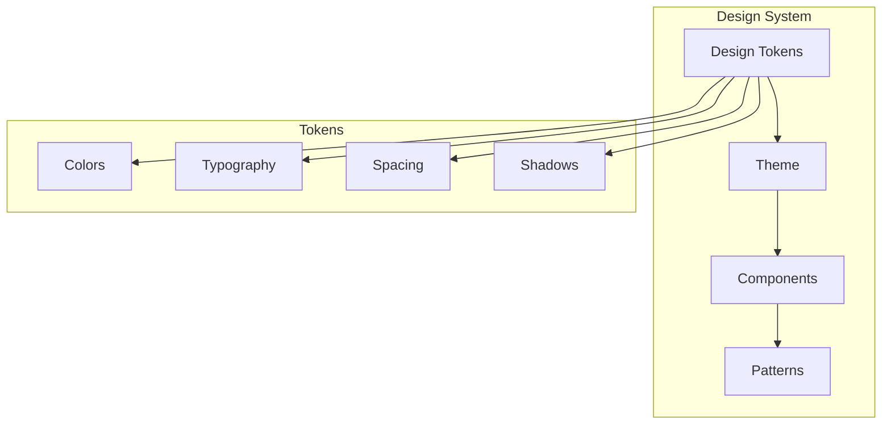

# 🎨 Sistema de Diseño - Universal Camera Viewer

[← Servicios y API](./servicios-api.md) | [Índice](./README.md) | [Guía de Desarrollo →](./guia-desarrollo.md)

## 🎯 Visión General

El sistema de diseño de Universal Camera Viewer está basado en Material Design 3 con personalizaciones específicas para aplicaciones de videovigilancia.

## 🎨 Fundamentos del Diseño



## 🎨 Design Tokens

### Color System

**Paletas de color:**

- **Primary**: Azul profesional (#2196f3) - Identidad de marca
- **Secondary**: Verde éxito (#4caf50) - Acciones positivas
- **Error**: Rojo alerta (#f44336) - Estados de error
- **Warning**: Naranja (#ff9800) - Advertencias
- **Neutral**: Escala de grises para UI

**Colores semánticos:**

- Estados de conexión: connected, connecting, disconnected
- Estados de streaming: streaming, buffering, paused
- Alertas: info, success, warning, danger

**Accesibilidad:**

- Contraste WCAG AA mínimo
- Modo oscuro con ajustes de luminosidad

### Typography System

**Familias tipográficas:**

- **Primary**: Inter, Roboto (sans-serif)
- **Monospace**: Roboto Mono, Consolas

**Escala de tamaños:**

- xs: 12px | sm: 14px | base: 16px | lg: 18px | xl: 20px
- 2xl: 24px | 3xl: 30px | 4xl: 36px | 5xl: 48px

**Pesos:**

- Light: 300 | Regular: 400 | Medium: 500
- Semibold: 600 | Bold: 700

**Variantes:**

- Headings: h1-h6 con escalado responsive
- Body: body1 (16px), body2 (14px)
- Caption: Texto auxiliar (12px)

**Line height**: 1.2 (tight) a 2 (loose)

### Spacing System

**Sistema de espaciado base 8px:**

- Micro: 0.5 (2px), 1 (4px), 1.5 (6px)
- Pequeño: 2 (8px), 3 (12px), 4 (16px)
- Mediano: 5 (20px), 6 (24px), 8 (32px)
- Grande: 10 (40px), 12 (48px), 16 (64px)
- Extra grande: 20 (80px), 24 (96px), 32 (128px)

**Uso recomendado:**

- Padding interno: 2-4 unidades
- Margen entre elementos: 3-6 unidades
- Separación de secciones: 8-12 unidades

## 🎨 Theme Configuration

### Light Theme

**Configuración del tema claro:**

- Background: #f5f5f5 (default), #ffffff (paper)
- Text: Negro con opacidades (87%, 60%, 38%)
- Primary/Secondary: Tonos medios de las paletas
- Border radius: 8px estándar
- Sombras: 5 niveles de elevación

### Dark Theme

**Configuración del tema oscuro:**

- Background: #121212 (default), #1e1e1e (paper)
- Text: Blanco con opacidades (87%, 60%, 38%)
- Primary/Secondary: Tonos más claros para contraste
- Hereda propiedades del tema claro
- Ajustes específicos para legibilidad nocturna

## 🧩 Component Styling

### Styled Components

**Componentes estilizados comunes:**

**ConnectionCard:**

- Indicador visual de estado de conexión
- Barra superior con color semántico
- Elevación en hover
- Transiciones suaves

**AnimatedButton:**

- Efecto ripple personalizado
- Animación en click
- Feedback visual inmediato

**ResponsiveContainer:**

- Padding adaptativo por breakpoint
- Max-width en pantallas grandes
- Centrado automático

### Component Variants

**Variantes de botones:**

- **Primary**: Contained, outlined, text
- **Success**: Para acciones positivas
- **Danger**: Para acciones destructivas
- **Ghost**: Transparente con hover

**Variantes de cards:**

- **Elevated**: Con sombra y elevación
- **Outlined**: Borde sin sombra
- **Filled**: Fondo sólido sin elevación
- **Interactive**: Con efectos hover

## 🎭 Animation System

### Transition Tokens

**Duraciones de animación:**

- Instant: 100ms
- Fast: 200ms
- Normal: 300ms
- Slow: 500ms
- Slower: 800ms

**Curvas de animación (easing):**

- Standard: Material Design estándar
- Accelerate: Inicio lento, final rápido
- Decelerate: Inicio rápido, final lento
- Sharp: Transición directa

**Animaciones predefinidas:**

- fadeIn: Aparición gradual
- slideUp: Deslizar hacia arriba
- pulse: Pulso para estados activos
- ripple: Efecto ondulación

## 📐 Layout System

### Grid System

**Sistema de layout:**

- Grid de 12 columnas
- Contenedores con max-width responsive
- Gutters adaptables por breakpoint

**Max-width por tamaño:**

- xs: 100% | sm: 640px | md: 768px
- lg: 1024px | xl: 1280px | 2xl: 1536px

**Componentes de layout:**

- Container: Centrado con padding
- GridContainer: CSS Grid configurable
- FlexContainer: Flexbox con utilidades

## 🎨 Estados Visuales

### Estados de Componentes

```mermaid
stateDiagram-v2
    [*] --> Default
    Default --> Hover: Mouse over
    Default --> Focus: Tab/Click
    Default --> Active: Click/Touch
    Default --> Disabled: Prop disabled
    
    Hover --> Default: Mouse out
    Focus --> Default: Blur
    Active --> Default: Release
    Disabled --> Default: Enable
```

### Definición de Estados

**Estados interactivos:**

- **Hover**: Elevación y opacidad reducida
- **Focus**: Outline accesible con offset
- **Active**: Escala reducida (feedback táctil)
- **Disabled**: Opacidad 60%, cursor bloqueado
- **Loading**: Spinner superpuesto

**Transiciones entre estados:**

- Duración estándar: 300ms
- Easing: cubic-bezier(0.4, 0, 0.2, 1)
- Propiedades animadas: transform, opacity, box-shadow

## 🌈 Casos de Uso Específicos

### Componentes para Cámaras

**Estilos específicos:**

**ConnectionBadge:**

- Indicador circular de estado
- Colores semánticos por estado
- Animación pulse para "connecting"
- Borde blanco para contraste

**VideoContainer:**

- Aspect ratio 16:9 mantenido
- Fondo oscuro para contraste
- Video con object-fit: contain
- Bordes redondeados

**ControlsOverlay:**

- Gradient oscuro inferior
- Aparece en hover
- Transición suave
- Controles sobre el video

### Componentes para Estadísticas

**Estilos para dashboards:**

**MetricCard:**

- Gradient de fondo llamativo
- Texto blanco de alto contraste
- Decoración circular sutil
- Padding generoso
- Bordes muy redondeados (16px)

**ChartContainer:**

- Fondo blanco limpio
- Sombra sutil para elevación
- Padding uniforme
- Compatible con librerías de gráficos

## 🔧 Utilidades CSS

### Clases Utilitarias

**Utilidades de texto:**

- `.text-truncate`: Texto con ellipsis
- `.text-center/left/right`: Alineación
- `.text-uppercase/lowercase`: Transformación

**Utilidades de display:**

- `.d-none/block/flex/grid`: Display
- `.d-{breakpoint}-{value}`: Responsive

**Utilidades de espaciado:**

- `.m-{0-32}`: Margin completo
- `.p-{0-32}`: Padding completo
- `.mx/my/px/py`: Ejes específicos
- `.mt/mb/ml/mr/pt/pb/pl/pr`: Lados individuales

## 📱 Responsive Design

### Breakpoints

**Puntos de quiebre:**

- xs: 0px (móvil pequeño)
- sm: 600px (móvil grande)
- md: 900px (tablet)
- lg: 1200px (desktop)
- xl: 1536px (desktop grande)

**Uso recomendado:**

- Mobile-first approach
- Media queries con min-width
- Helpers para styled-components
- Grid responsive con breakpoints

## ✅ Best Practices

1. **Consistencia**: Usar siempre tokens en lugar de valores hardcodeados
2. **Accesibilidad**: Mantener contraste WCAG AA mínimo
3. **Performance**: Preferir CSS sobre JS para animaciones
4. **Modularidad**: Componentes pequeños y reutilizables
5. **Documentación**: Documentar variantes y props de componentes

---

[← Servicios y API](./servicios-api.md) | [Índice](./README.md) | [Guía de Desarrollo →](./guia-desarrollo.md)
