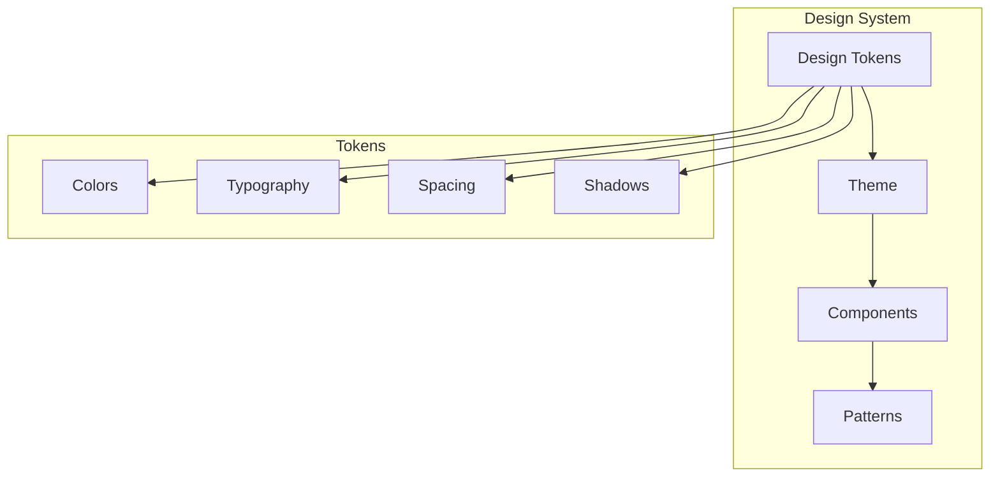

# 🎨 Sistema de Diseño - Universal Camera Viewer

[← Servicios y API](./servicios-api.md) | [Índice](./README.md) | [Guía de Desarrollo →](./guia-desarrollo.md)

## 🎯 Visión General

El sistema de diseño de Universal Camera Viewer está basado en Material Design 3 con personalizaciones específicas para aplicaciones de videovigilancia.

## 🎨 Fundamentos del Diseño



## 🎨 Design Tokens

### Color System

```typescript
// design-system/tokens.ts
export const colorTokens = {
  // Primary Palette - Azul profesional
  primary: {
    50: '#e3f2fd',
    100: '#bbdefb',
    200: '#90caf9',
    300: '#64b5f6',
    400: '#42a5f5',
    500: '#2196f3', // Main
    600: '#1e88e5',
    700: '#1976d2',
    800: '#1565c0',
    900: '#0d47a1'
  },
  
  // Secondary Palette - Verde éxito
  secondary: {
    50: '#e8f5e9',
    100: '#c8e6c9',
    200: '#a5d6a7',
    300: '#81c784',
    400: '#66bb6a',
    500: '#4caf50', // Main
    600: '#43a047',
    700: '#388e3c',
    800: '#2e7d32',
    900: '#1b5e20'
  },
  
  // Error Palette
  error: {
    50: '#ffebee',
    100: '#ffcdd2',
    200: '#ef9a9a',
    300: '#e57373',
    400: '#ef5350',
    500: '#f44336', // Main
    600: '#e53935',
    700: '#d32f2f',
    800: '#c62828',
    900: '#b71c1c'
  },
  
  // Warning Palette
  warning: {
    50: '#fff3e0',
    100: '#ffe0b2',
    200: '#ffcc80',
    300: '#ffb74d',
    400: '#ffa726',
    500: '#ff9800', // Main
    600: '#fb8c00',
    700: '#f57c00',
    800: '#ef6c00',
    900: '#e65100'
  },
  
  // Neutral Palette
  neutral: {
    0: '#ffffff',
    50: '#fafafa',
    100: '#f5f5f5',
    200: '#eeeeee',
    300: '#e0e0e0',
    400: '#bdbdbd',
    500: '#9e9e9e',
    600: '#757575',
    700: '#616161',
    800: '#424242',
    900: '#212121',
    1000: '#000000'
  },
  
  // Semantic Colors
  semantic: {
    // Estados de conexión
    connected: '#4caf50',
    connecting: '#ff9800',
    disconnected: '#9e9e9e',
    error: '#f44336',
    
    // Estados de streaming
    streaming: '#4caf50',
    buffering: '#ff9800',
    paused: '#2196f3',
    stopped: '#9e9e9e',
    
    // Alertas
    info: '#2196f3',
    success: '#4caf50',
    warning: '#ff9800',
    danger: '#f44336'
  }
};
```

### Typography System

```typescript
// design-system/typography.ts
export const typographyTokens = {
  // Font Families
  fontFamily: {
    primary: '"Inter", "Roboto", "Helvetica", "Arial", sans-serif',
    mono: '"Roboto Mono", "Consolas", monospace'
  },
  
  // Font Sizes
  fontSize: {
    xs: '0.75rem',    // 12px
    sm: '0.875rem',   // 14px
    base: '1rem',     // 16px
    lg: '1.125rem',   // 18px
    xl: '1.25rem',    // 20px
    '2xl': '1.5rem',  // 24px
    '3xl': '1.875rem',// 30px
    '4xl': '2.25rem', // 36px
    '5xl': '3rem'     // 48px
  },
  
  // Font Weights
  fontWeight: {
    light: 300,
    regular: 400,
    medium: 500,
    semibold: 600,
    bold: 700
  },
  
  // Line Heights
  lineHeight: {
    tight: 1.2,
    normal: 1.5,
    relaxed: 1.75,
    loose: 2
  },
  
  // Letter Spacing
  letterSpacing: {
    tight: '-0.02em',
    normal: '0',
    wide: '0.02em'
  }
};

// Typography Variants
export const typography = {
  h1: {
    fontSize: typographyTokens.fontSize['5xl'],
    fontWeight: typographyTokens.fontWeight.light,
    lineHeight: typographyTokens.lineHeight.tight,
    letterSpacing: typographyTokens.letterSpacing.tight
  },
  h2: {
    fontSize: typographyTokens.fontSize['4xl'],
    fontWeight: typographyTokens.fontWeight.light,
    lineHeight: typographyTokens.lineHeight.tight
  },
  h3: {
    fontSize: typographyTokens.fontSize['3xl'],
    fontWeight: typographyTokens.fontWeight.regular,
    lineHeight: typographyTokens.lineHeight.normal
  },
  h4: {
    fontSize: typographyTokens.fontSize['2xl'],
    fontWeight: typographyTokens.fontWeight.regular,
    lineHeight: typographyTokens.lineHeight.normal
  },
  h5: {
    fontSize: typographyTokens.fontSize.xl,
    fontWeight: typographyTokens.fontWeight.medium
  },
  h6: {
    fontSize: typographyTokens.fontSize.lg,
    fontWeight: typographyTokens.fontWeight.medium
  },
  body1: {
    fontSize: typographyTokens.fontSize.base,
    lineHeight: typographyTokens.lineHeight.normal
  },
  body2: {
    fontSize: typographyTokens.fontSize.sm,
    lineHeight: typographyTokens.lineHeight.normal
  },
  caption: {
    fontSize: typographyTokens.fontSize.xs,
    lineHeight: typographyTokens.lineHeight.normal
  }
};
```

### Spacing System

```typescript
// design-system/spacing.ts
export const spacingTokens = {
  // Base unit: 8px
  0: '0',
  0.5: '0.125rem',  // 2px
  1: '0.25rem',     // 4px
  1.5: '0.375rem',  // 6px
  2: '0.5rem',      // 8px
  2.5: '0.625rem',  // 10px
  3: '0.75rem',     // 12px
  3.5: '0.875rem',  // 14px
  4: '1rem',        // 16px
  5: '1.25rem',     // 20px
  6: '1.5rem',      // 24px
  7: '1.75rem',     // 28px
  8: '2rem',        // 32px
  9: '2.25rem',     // 36px
  10: '2.5rem',     // 40px
  12: '3rem',       // 48px
  14: '3.5rem',     // 56px
  16: '4rem',       // 64px
  20: '5rem',       // 80px
  24: '6rem',       // 96px
  28: '7rem',       // 112px
  32: '8rem'        // 128px
};
```

## 🎨 Theme Configuration

### Light Theme

```typescript
// design-system/theme.ts
import { createTheme } from '@mui/material/styles';

export const lightTheme = createTheme({
  palette: {
    mode: 'light',
    primary: {
      main: colorTokens.primary[500],
      light: colorTokens.primary[300],
      dark: colorTokens.primary[700],
      contrastText: '#ffffff'
    },
    secondary: {
      main: colorTokens.secondary[500],
      light: colorTokens.secondary[300],
      dark: colorTokens.secondary[700],
      contrastText: '#ffffff'
    },
    error: {
      main: colorTokens.error[500],
      light: colorTokens.error[300],
      dark: colorTokens.error[700]
    },
    warning: {
      main: colorTokens.warning[500],
      light: colorTokens.warning[300],
      dark: colorTokens.warning[700]
    },
    background: {
      default: '#f5f5f5',
      paper: '#ffffff'
    },
    text: {
      primary: 'rgba(0, 0, 0, 0.87)',
      secondary: 'rgba(0, 0, 0, 0.6)',
      disabled: 'rgba(0, 0, 0, 0.38)'
    }
  },
  typography: {
    fontFamily: typographyTokens.fontFamily.primary,
    ...typography
  },
  spacing: 8,
  shape: {
    borderRadius: 8
  },
  shadows: [
    'none',
    '0px 2px 4px rgba(0,0,0,0.05)',
    '0px 4px 8px rgba(0,0,0,0.08)',
    '0px 8px 16px rgba(0,0,0,0.1)',
    '0px 16px 24px rgba(0,0,0,0.12)',
    // ... más sombras
  ]
});
```

### Dark Theme

```typescript
export const darkTheme = createTheme({
  palette: {
    mode: 'dark',
    primary: {
      main: colorTokens.primary[400],
      light: colorTokens.primary[300],
      dark: colorTokens.primary[600],
      contrastText: '#ffffff'
    },
    secondary: {
      main: colorTokens.secondary[400],
      light: colorTokens.secondary[300],
      dark: colorTokens.secondary[600],
      contrastText: '#ffffff'
    },
    background: {
      default: '#121212',
      paper: '#1e1e1e'
    },
    text: {
      primary: 'rgba(255, 255, 255, 0.87)',
      secondary: 'rgba(255, 255, 255, 0.6)',
      disabled: 'rgba(255, 255, 255, 0.38)'
    }
  },
  // Heredar otras propiedades del tema claro
  ...lightTheme,
  palette: {
    ...lightTheme.palette,
    mode: 'dark',
    // Sobrescribir colores específicos
  }
});
```

## 🧩 Component Styling

### Styled Components

```typescript
// components/ui/StyledComponents.ts
import { styled } from '@mui/material/styles';
import { Card, Button } from '@mui/material';

// Card con estado de conexión
export const ConnectionCard = styled(Card)<{ status: ConnectionStatus }>(
  ({ theme, status }) => ({
    position: 'relative',
    overflow: 'hidden',
    transition: theme.transitions.create(['transform', 'box-shadow']),
    
    '&::before': {
      content: '""',
      position: 'absolute',
      top: 0,
      left: 0,
      right: 0,
      height: 4,
      backgroundColor: colorTokens.semantic[status],
      transition: theme.transitions.create('background-color')
    },
    
    '&:hover': {
      transform: 'translateY(-2px)',
      boxShadow: theme.shadows[4]
    }
  })
);

// Botón con animación
export const AnimatedButton = styled(Button)(({ theme }) => ({
  position: 'relative',
  overflow: 'hidden',
  
  '&::after': {
    content: '""',
    position: 'absolute',
    top: '50%',
    left: '50%',
    width: 0,
    height: 0,
    borderRadius: '50%',
    background: 'rgba(255, 255, 255, 0.3)',
    transform: 'translate(-50%, -50%)',
    transition: 'width 0.3s, height 0.3s'
  },
  
  '&:active::after': {
    width: 300,
    height: 300
  }
}));

// Container responsive
export const ResponsiveContainer = styled('div')(({ theme }) => ({
  width: '100%',
  padding: theme.spacing(2),
  
  [theme.breakpoints.up('sm')]: {
    padding: theme.spacing(3)
  },
  
  [theme.breakpoints.up('md')]: {
    padding: theme.spacing(4)
  },
  
  [theme.breakpoints.up('lg')]: {
    maxWidth: 1200,
    margin: '0 auto'
  }
}));
```

### Component Variants

```typescript
// components/ui/variants.ts
export const buttonVariants = {
  primary: {
    contained: {
      background: colorTokens.primary[500],
      color: '#fff',
      '&:hover': {
        background: colorTokens.primary[600]
      }
    },
    outlined: {
      borderColor: colorTokens.primary[500],
      color: colorTokens.primary[500],
      '&:hover': {
        borderColor: colorTokens.primary[600],
        background: `${colorTokens.primary[500]}10`
      }
    }
  },
  success: {
    contained: {
      background: colorTokens.semantic.success,
      color: '#fff'
    }
  },
  danger: {
    contained: {
      background: colorTokens.semantic.danger,
      color: '#fff'
    }
  }
};

export const cardVariants = {
  elevated: {
    boxShadow: '0 4px 12px rgba(0,0,0,0.08)',
    '&:hover': {
      boxShadow: '0 8px 24px rgba(0,0,0,0.12)'
    }
  },
  outlined: {
    border: '1px solid',
    borderColor: colorTokens.neutral[200],
    boxShadow: 'none'
  },
  filled: {
    background: colorTokens.neutral[50],
    boxShadow: 'none'
  }
};
```

## 🎭 Animation System

### Transition Tokens

```typescript
// design-system/animations.ts
export const animationTokens = {
  duration: {
    instant: 100,
    fast: 200,
    normal: 300,
    slow: 500,
    slower: 800
  },
  
  easing: {
    standard: 'cubic-bezier(0.4, 0, 0.2, 1)',
    accelerate: 'cubic-bezier(0.4, 0, 1, 1)',
    decelerate: 'cubic-bezier(0, 0, 0.2, 1)',
    sharp: 'cubic-bezier(0.4, 0, 0.6, 1)'
  }
};

// Animaciones predefinidas
export const animations = {
  fadeIn: keyframes`
    from { opacity: 0; }
    to { opacity: 1; }
  `,
  
  slideUp: keyframes`
    from { 
      opacity: 0;
      transform: translateY(20px);
    }
    to {
      opacity: 1;
      transform: translateY(0);
    }
  `,
  
  pulse: keyframes`
    0% { transform: scale(1); }
    50% { transform: scale(1.05); }
    100% { transform: scale(1); }
  `,
  
  ripple: keyframes`
    to {
      transform: scale(4);
      opacity: 0;
    }
  `
};
```

### Componentes Animados

```typescript
// components/ui/AnimatedComponents.tsx
export const FadeInBox = styled(Box)`
  animation: ${animations.fadeIn} ${animationTokens.duration.normal}ms 
             ${animationTokens.easing.standard};
`;

export const SlideUpContainer = styled('div')<{ delay?: number }>`
  animation: ${animations.slideUp} ${animationTokens.duration.normal}ms 
             ${animationTokens.easing.decelerate}
             ${props => props.delay || 0}ms both;
`;

export const PulseIcon = styled('div')`
  animation: ${animations.pulse} 2s ${animationTokens.easing.standard} infinite;
`;
```

## 📐 Layout System

### Grid System

```typescript
// design-system/layout.ts
export const layoutTokens = {
  maxWidth: {
    xs: '100%',
    sm: '640px',
    md: '768px',
    lg: '1024px',
    xl: '1280px',
    '2xl': '1536px'
  },
  
  columns: 12,
  
  gutter: {
    xs: spacingTokens[2],
    sm: spacingTokens[3],
    md: spacingTokens[4],
    lg: spacingTokens[6]
  }
};

// Layout Components
export const Container = styled('div')<{ maxWidth?: keyof typeof layoutTokens.maxWidth }>`
  width: 100%;
  max-width: ${props => layoutTokens.maxWidth[props.maxWidth || 'xl']};
  margin: 0 auto;
  padding: 0 ${layoutTokens.gutter.md};
`;

export const GridContainer = styled('div')<{ cols?: number; gap?: number }>`
  display: grid;
  grid-template-columns: repeat(${props => props.cols || 12}, 1fr);
  gap: ${props => spacingTokens[props.gap || 4]};
`;
```

## 🎨 Estados Visuales

### Estados de Componentes

```mermaid
stateDiagram-v2
    [*] --> Default
    Default --> Hover: Mouse over
    Default --> Focus: Tab/Click
    Default --> Active: Click/Touch
    Default --> Disabled: Prop disabled
    
    Hover --> Default: Mouse out
    Focus --> Default: Blur
    Active --> Default: Release
    Disabled --> Default: Enable
```

### Definición de Estados

```typescript
// design-system/states.ts
export const stateStyles = {
  hover: {
    opacity: 0.8,
    transform: 'translateY(-2px)',
    boxShadow: '0 4px 12px rgba(0,0,0,0.15)'
  },
  
  focus: {
    outline: `2px solid ${colorTokens.primary[500]}`,
    outlineOffset: 2
  },
  
  active: {
    transform: 'scale(0.98)'
  },
  
  disabled: {
    opacity: 0.6,
    cursor: 'not-allowed',
    pointerEvents: 'none'
  },
  
  loading: {
    position: 'relative',
    color: 'transparent',
    pointerEvents: 'none',
    
    '&::after': {
      content: '""',
      position: 'absolute',
      top: '50%',
      left: '50%',
      width: 20,
      height: 20,
      margin: '-10px 0 0 -10px',
      border: '2px solid',
      borderColor: `${colorTokens.primary[500]} transparent`,
      borderRadius: '50%',
      animation: 'spin 1s linear infinite'
    }
  }
};
```

## 🌈 Casos de Uso Específicos

### Componentes para Cámaras

```typescript
// design-system/camera-components.ts
export const cameraStyles = {
  // Estado de conexión
  connectionBadge: (status: ConnectionStatus) => ({
    position: 'absolute',
    top: 8,
    right: 8,
    width: 12,
    height: 12,
    borderRadius: '50%',
    backgroundColor: colorTokens.semantic[status],
    boxShadow: `0 0 0 2px rgba(255,255,255,0.8)`,
    
    // Animación para connecting
    ...(status === 'connecting' && {
      animation: `${animations.pulse} 1.5s ease-in-out infinite`
    })
  }),
  
  // Video container
  videoContainer: {
    position: 'relative',
    paddingBottom: '56.25%', // 16:9 aspect ratio
    backgroundColor: colorTokens.neutral[900],
    borderRadius: 8,
    overflow: 'hidden',
    
    '& video': {
      position: 'absolute',
      top: 0,
      left: 0,
      width: '100%',
      height: '100%',
      objectFit: 'contain'
    }
  },
  
  // Overlay de controles
  controlsOverlay: {
    position: 'absolute',
    bottom: 0,
    left: 0,
    right: 0,
    padding: spacingTokens[2],
    background: 'linear-gradient(to top, rgba(0,0,0,0.7), transparent)',
    transform: 'translateY(100%)',
    transition: 'transform 0.3s ease',
    
    '&:hover': {
      transform: 'translateY(0)'
    }
  }
};
```

### Componentes para Estadísticas

```typescript
// design-system/stats-components.ts
export const statsStyles = {
  // Tarjeta de métrica
  metricCard: {
    background: 'linear-gradient(135deg, #667eea 0%, #764ba2 100%)',
    color: '#fff',
    padding: spacingTokens[6],
    borderRadius: 16,
    position: 'relative',
    overflow: 'hidden',
    
    '&::before': {
      content: '""',
      position: 'absolute',
      top: -50,
      right: -50,
      width: 100,
      height: 100,
      borderRadius: '50%',
      background: 'rgba(255,255,255,0.1)'
    }
  },
  
  // Gráfico container
  chartContainer: {
    backgroundColor: colorTokens.neutral[0],
    borderRadius: 8,
    padding: spacingTokens[4],
    boxShadow: '0 2px 8px rgba(0,0,0,0.05)',
    
    '& .recharts-wrapper': {
      width: '100% !important',
      height: '100% !important'
    }
  }
};
```

## 🔧 Utilidades CSS

### Clases Utilitarias

```typescript
// design-system/utilities.ts
export const utilities = {
  // Text utilities
  '.text-truncate': {
    overflow: 'hidden',
    textOverflow: 'ellipsis',
    whiteSpace: 'nowrap'
  },
  
  '.text-center': {
    textAlign: 'center'
  },
  
  // Display utilities
  '.d-none': {
    display: 'none'
  },
  
  '.d-flex': {
    display: 'flex'
  },
  
  // Spacing utilities
  ...Object.entries(spacingTokens).reduce((acc, [key, value]) => ({
    ...acc,
    [`.m-${key}`]: { margin: value },
    [`.p-${key}`]: { padding: value },
    [`.mt-${key}`]: { marginTop: value },
    [`.mb-${key}`]: { marginBottom: value },
    [`.ml-${key}`]: { marginLeft: value },
    [`.mr-${key}`]: { marginRight: value }
  }), {})
};
```

## 📱 Responsive Design

### Breakpoints

```typescript
// design-system/breakpoints.ts
export const breakpoints = {
  xs: 0,
  sm: 600,
  md: 900,
  lg: 1200,
  xl: 1536
};

// Media queries helpers
export const media = {
  xs: `@media (min-width: ${breakpoints.xs}px)`,
  sm: `@media (min-width: ${breakpoints.sm}px)`,
  md: `@media (min-width: ${breakpoints.md}px)`,
  lg: `@media (min-width: ${breakpoints.lg}px)`,
  xl: `@media (min-width: ${breakpoints.xl}px)`
};

// Uso en styled components
export const ResponsiveText = styled('p')`
  font-size: ${typographyTokens.fontSize.sm};
  
  ${media.sm} {
    font-size: ${typographyTokens.fontSize.base};
  }
  
  ${media.md} {
    font-size: ${typographyTokens.fontSize.lg};
  }
`;
```

## ✅ Best Practices

1. **Consistencia**: Usar siempre tokens en lugar de valores hardcodeados
2. **Accesibilidad**: Mantener contraste WCAG AA mínimo
3. **Performance**: Preferir CSS sobre JS para animaciones
4. **Modularidad**: Componentes pequeños y reutilizables
5. **Documentación**: Documentar variantes y props de componentes

---

[← Servicios y API](./servicios-api.md) | [Índice](./README.md) | [Guía de Desarrollo →](./guia-desarrollo.md)