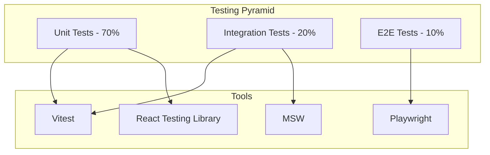

# 🧪 Testing - Universal Camera Viewer

[← Optimizaciones](./optimizaciones.md) | [Índice](./README.md) | [Deployment →](./deployment.md)

## 🎯 Visión General

Esta guía detalla las estrategias de testing implementadas en Universal Camera Viewer, cubriendo tests unitarios, de integración, e2e y de rendimiento.

## 🏗️ Arquitectura de Testing



## 🧪 Configuración del Entorno

### Vitest Configuration

```typescript
// vite.config.ts
import { defineConfig } from 'vite';
import react from '@vitejs/plugin-react';

export default defineConfig({
  plugins: [react()],
  test: {
    globals: true,
    environment: 'jsdom',
    setupFiles: ['./src/test-utils/setup.ts'],
    coverage: {
      provider: 'v8',
      reporter: ['text', 'json', 'html'],
      exclude: [
        'node_modules/',
        'src/test-utils/',
        '**/*.d.ts',
        '**/*.config.ts',
        '**/mockData.ts'
      ],
      thresholds: {
        lines: 80,
        functions: 80,
        branches: 75,
        statements: 80
      }
    },
    pool: 'threads',
    css: true,
    alias: {
      '@': '/src'
    }
  }
});
```

### Test Setup

```typescript
// test-utils/setup.ts
import '@testing-library/jest-dom';
import { cleanup } from '@testing-library/react';
import { afterEach, beforeAll, afterAll, vi } from 'vitest';
import { server } from './mocks/server';

// Limpiar después de cada test
afterEach(() => {
  cleanup();
  vi.clearAllMocks();
});

// Setup MSW
beforeAll(() => {
  server.listen({ onUnhandledRequest: 'error' });
});

afterEach(() => {
  server.resetHandlers();
});

afterAll(() => {
  server.close();
});

// Mock de IntersectionObserver
global.IntersectionObserver = vi.fn().mockImplementation(() => ({
  observe: vi.fn(),
  unobserve: vi.fn(),
  disconnect: vi.fn()
}));

// Mock de ResizeObserver
global.ResizeObserver = vi.fn().mockImplementation(() => ({
  observe: vi.fn(),
  unobserve: vi.fn(),
  disconnect: vi.fn()
}));
```

## 🔬 Unit Testing

### Testing de Componentes

```typescript
// components/CameraCard/__tests__/CameraCard.test.tsx
import { render, screen, fireEvent, waitFor } from '@testing-library/react';
import userEvent from '@testing-library/user-event';
import { CameraCard } from '../CameraCard';
import { mockCamera } from '@/test-utils/mocks';

describe('CameraCard', () => {
  const defaultProps = {
    camera: mockCamera,
    onSelect: vi.fn(),
    onConnect: vi.fn()
  };
  
  beforeEach(() => {
    vi.clearAllMocks();
  });
  
  describe('Rendering', () => {
    it('should render camera information correctly', () => {
      render(<CameraCard {...defaultProps} />);
      
      expect(screen.getByText(mockCamera.name)).toBeInTheDocument();
      expect(screen.getByText(mockCamera.ip)).toBeInTheDocument();
      expect(screen.getByText(mockCamera.brand)).toBeInTheDocument();
    });
    
    it('should show connection status', () => {
      render(<CameraCard {...defaultProps} />);
      
      const statusBadge = screen.getByTestId('connection-status');
      expect(statusBadge).toHaveClass('status-disconnected');
    });
    
    it('should render loading state when connecting', () => {
      const connectingCamera = { ...mockCamera, isConnecting: true };
      render(<CameraCard {...defaultProps} camera={connectingCamera} />);
      
      expect(screen.getByTestId('loading-spinner')).toBeInTheDocument();
    });
  });
  
  describe('Interactions', () => {
    it('should call onSelect when card is clicked', async () => {
      const user = userEvent.setup();
      render(<CameraCard {...defaultProps} />);
      
      await user.click(screen.getByRole('article'));
      
      expect(defaultProps.onSelect).toHaveBeenCalledWith(mockCamera);
      expect(defaultProps.onSelect).toHaveBeenCalledTimes(1);
    });
    
    it('should call onConnect when connect button is clicked', async () => {
      const user = userEvent.setup();
      render(<CameraCard {...defaultProps} />);
      
      const connectButton = screen.getByRole('button', { name: /conectar/i });
      await user.click(connectButton);
      
      expect(defaultProps.onConnect).toHaveBeenCalledWith(mockCamera.id);
    });
    
    it('should prevent card selection when clicking action buttons', async () => {
      const user = userEvent.setup();
      render(<CameraCard {...defaultProps} />);
      
      const button = screen.getByRole('button', { name: /conectar/i });
      await user.click(button);
      
      expect(defaultProps.onSelect).not.toHaveBeenCalled();
    });
  });
  
  describe('Accessibility', () => {
    it('should have proper ARIA labels', () => {
      render(<CameraCard {...defaultProps} />);
      
      const card = screen.getByRole('article');
      expect(card).toHaveAttribute('aria-label', `Cámara ${mockCamera.name}`);
      
      const connectButton = screen.getByRole('button', { name: /conectar/i });
      expect(connectButton).toHaveAttribute('aria-label', `Conectar cámara ${mockCamera.name}`);
    });
    
    it('should be keyboard navigable', async () => {
      const user = userEvent.setup();
      render(<CameraCard {...defaultProps} />);
      
      await user.tab();
      expect(screen.getByRole('article')).toHaveFocus();
      
      await user.keyboard('{Enter}');
      expect(defaultProps.onSelect).toHaveBeenCalled();
    });
  });
});
```

### Testing de Hooks

```typescript
// hooks/__tests__/useCamera.test.ts
import { renderHook, act, waitFor } from '@testing-library/react';
import { useCamera } from '../useCamera';
import { cameraService } from '@/services/camera/cameraService';
import { wrapper } from '@/test-utils/wrapper';

vi.mock('@/services/camera/cameraService');

describe('useCamera', () => {
  const mockCameraId = 'camera-123';
  
  beforeEach(() => {
    vi.clearAllMocks();
  });
  
  it('should connect to camera', async () => {
    const mockConnect = vi.fn().mockResolvedValue({ success: true });
    (cameraService.connectCamera as any).mockImplementation(mockConnect);
    
    const { result } = renderHook(() => useCamera(mockCameraId), { wrapper });
    
    act(() => {
      result.current.connect();
    });
    
    expect(result.current.isConnecting).toBe(true);
    
    await waitFor(() => {
      expect(result.current.isConnecting).toBe(false);
      expect(result.current.isConnected).toBe(true);
    });
    
    expect(mockConnect).toHaveBeenCalledWith(mockCameraId);
  });
  
  it('should handle connection errors', async () => {
    const mockError = new Error('Connection failed');
    (cameraService.connectCamera as any).mockRejectedValue(mockError);
    
    const { result } = renderHook(() => useCamera(mockCameraId), { wrapper });
    
    await act(async () => {
      await result.current.connect();
    });
    
    expect(result.current.error).toBe('Connection failed');
    expect(result.current.isConnected).toBe(false);
  });
  
  it('should disconnect from camera', async () => {
    const mockDisconnect = vi.fn().mockResolvedValue(undefined);
    (cameraService.disconnectCamera as any).mockImplementation(mockDisconnect);
    
    const { result } = renderHook(() => useCamera(mockCameraId), { wrapper });
    
    // Simular estado conectado
    act(() => {
      result.current.setIsConnected(true);
    });
    
    await act(async () => {
      await result.current.disconnect();
    });
    
    expect(mockDisconnect).toHaveBeenCalledWith(mockCameraId);
    expect(result.current.isConnected).toBe(false);
  });
});
```

### Testing de Stores

```typescript
// stores/__tests__/cameraStore.test.ts
import { act, renderHook } from '@testing-library/react';
import { useCameraStore } from '../cameraStore';
import { mockCamera } from '@/test-utils/mocks';

describe('cameraStore', () => {
  beforeEach(() => {
    // Reset store a estado inicial
    useCameraStore.setState({
      cameras: [],
      selectedCamera: null,
      connectionStatus: {}
    });
  });
  
  describe('Camera Management', () => {
    it('should add a camera', () => {
      const { result } = renderHook(() => useCameraStore());
      
      act(() => {
        result.current.addCamera(mockCamera);
      });
      
      expect(result.current.cameras).toHaveLength(1);
      expect(result.current.cameras[0]).toEqual(mockCamera);
    });
    
    it('should update camera', () => {
      const { result } = renderHook(() => useCameraStore());
      
      // Agregar cámara inicial
      act(() => {
        result.current.addCamera(mockCamera);
      });
      
      // Actualizar
      const updates = { name: 'Updated Camera' };
      act(() => {
        result.current.updateCamera(mockCamera.id, updates);
      });
      
      expect(result.current.cameras[0].name).toBe('Updated Camera');
    });
    
    it('should delete camera', () => {
      const { result } = renderHook(() => useCameraStore());
      
      act(() => {
        result.current.addCamera(mockCamera);
        result.current.deleteCamera(mockCamera.id);
      });
      
      expect(result.current.cameras).toHaveLength(0);
    });
  });
  
  describe('Selection', () => {
    it('should select camera', () => {
      const { result } = renderHook(() => useCameraStore());
      
      act(() => {
        result.current.addCamera(mockCamera);
        result.current.selectCamera(mockCamera);
      });
      
      expect(result.current.selectedCamera).toEqual(mockCamera);
    });
    
    it('should clear selection', () => {
      const { result } = renderHook(() => useCameraStore());
      
      act(() => {
        result.current.selectCamera(mockCamera);
        result.current.selectCamera(null);
      });
      
      expect(result.current.selectedCamera).toBeNull();
    });
  });
  
  describe('Connection Status', () => {
    it('should update connection status', () => {
      const { result } = renderHook(() => useCameraStore());
      
      act(() => {
        result.current.updateConnectionStatus(mockCamera.id, 'connected');
      });
      
      expect(result.current.connectionStatus[mockCamera.id]).toBe('connected');
    });
  });
});
```

## 🔄 Integration Testing

### API Integration Tests

```typescript
// services/__tests__/cameraService.integration.test.ts
import { cameraService } from '../camera/cameraService';
import { server, rest } from '@/test-utils/mocks/server';
import { API_URL } from '@/config';

describe('CameraService Integration', () => {
  describe('getAllCameras', () => {
    it('should fetch all cameras from API', async () => {
      const mockCameras = [
        { id: '1', name: 'Camera 1', ip: '192.168.1.100' },
        { id: '2', name: 'Camera 2', ip: '192.168.1.101' }
      ];
      
      server.use(
        rest.get(`${API_URL}/api/cameras`, (req, res, ctx) => {
          return res(ctx.json(mockCameras));
        })
      );
      
      const cameras = await cameraService.getAllCameras();
      
      expect(cameras).toEqual(mockCameras);
    });
    
    it('should handle API errors', async () => {
      server.use(
        rest.get(`${API_URL}/api/cameras`, (req, res, ctx) => {
          return res(ctx.status(500), ctx.json({ detail: 'Server error' }));
        })
      );
      
      await expect(cameraService.getAllCameras()).rejects.toThrow('Server error');
    });
  });
  
  describe('connectCamera', () => {
    it('should connect to camera and return stream info', async () => {
      const mockStreamInfo = {
        url: 'ws://localhost:8554/stream/camera-123',
        protocol: 'webrtc'
      };
      
      server.use(
        rest.post(`${API_URL}/api/cameras/:id/connect`, (req, res, ctx) => {
          return res(ctx.json(mockStreamInfo));
        })
      );
      
      const result = await cameraService.connectCamera('camera-123');
      
      expect(result).toEqual(mockStreamInfo);
    });
    
    it('should handle connection timeout', async () => {
      server.use(
        rest.post(`${API_URL}/api/cameras/:id/connect`, (req, res, ctx) => {
          return res(ctx.delay(5000), ctx.status(408));
        })
      );
      
      await expect(
        cameraService.connectCamera('camera-123')
      ).rejects.toThrow('timeout');
    });
  });
});
```

### WebSocket Integration Tests

```typescript
// services/__tests__/websocket.integration.test.ts
import { wsManager } from '../websocket/WebSocketManager';
import { waitFor } from '@testing-library/react';
import WS from 'jest-websocket-mock';

describe('WebSocket Integration', () => {
  let mockServer: WS;
  
  beforeEach(async () => {
    mockServer = new WS('ws://localhost:8000');
    await wsManager.connect();
  });
  
  afterEach(() => {
    WS.clean();
    wsManager.disconnect();
  });
  
  it('should receive camera status updates', async () => {
    const statusHandler = vi.fn();
    wsManager.on('camera:status', statusHandler);
    
    // Simular mensaje del servidor
    mockServer.send(JSON.stringify({
      type: 'camera:status',
      data: {
        cameraId: 'camera-123',
        status: 'connected'
      }
    }));
    
    await waitFor(() => {
      expect(statusHandler).toHaveBeenCalledWith({
        cameraId: 'camera-123',
        status: 'connected'
      });
    });
  });
  
  it('should handle reconnection', async () => {
    // Simular desconexión
    mockServer.close();
    
    await waitFor(() => {
      expect(wsManager.isConnected()).toBe(false);
    });
    
    // Simular reconexión
    mockServer = new WS('ws://localhost:8000');
    
    await waitFor(() => {
      expect(wsManager.isConnected()).toBe(true);
    });
  });
});
```

## 🌐 E2E Testing

### Playwright Configuration

```typescript
// playwright.config.ts
import { defineConfig, devices } from '@playwright/test';

export default defineConfig({
  testDir: './e2e',
  timeout: 30000,
  fullyParallel: true,
  forbidOnly: !!process.env.CI,
  retries: process.env.CI ? 2 : 0,
  workers: process.env.CI ? 1 : undefined,
  reporter: [
    ['html'],
    ['junit', { outputFile: 'test-results/junit.xml' }]
  ],
  use: {
    baseURL: 'http://localhost:5173',
    trace: 'on-first-retry',
    screenshot: 'only-on-failure',
    video: 'retain-on-failure'
  },
  projects: [
    {
      name: 'chromium',
      use: { ...devices['Desktop Chrome'] }
    },
    {
      name: 'firefox',
      use: { ...devices['Desktop Firefox'] }
    },
    {
      name: 'webkit',
      use: { ...devices['Desktop Safari'] }
    },
    {
      name: 'Mobile Chrome',
      use: { ...devices['Pixel 5'] }
    }
  ],
  webServer: {
    command: 'yarn dev',
    port: 5173,
    reuseExistingServer: !process.env.CI
  }
});
```

### E2E Test Examples

```typescript
// e2e/cameras.spec.ts
import { test, expect } from '@playwright/test';
import { mockCameras } from './fixtures/cameras';

test.describe('Camera Management', () => {
  test.beforeEach(async ({ page }) => {
    // Interceptar API calls
    await page.route('**/api/cameras', async (route) => {
      await route.fulfill({
        status: 200,
        contentType: 'application/json',
        body: JSON.stringify(mockCameras)
      });
    });
    
    await page.goto('/cameras');
  });
  
  test('should display camera grid', async ({ page }) => {
    // Esperar a que carguen las cámaras
    await page.waitForSelector('[data-testid="camera-grid"]');
    
    // Verificar que se muestran todas las cámaras
    const cameraCards = await page.locator('[data-testid="camera-card"]').count();
    expect(cameraCards).toBe(mockCameras.length);
    
    // Verificar información de la primera cámara
    const firstCamera = mockCameras[0];
    await expect(page.getByText(firstCamera.name)).toBeVisible();
    await expect(page.getByText(firstCamera.ip)).toBeVisible();
  });
  
  test('should connect to camera', async ({ page }) => {
    // Mock de conexión exitosa
    await page.route('**/api/cameras/*/connect', async (route) => {
      await route.fulfill({
        status: 200,
        body: JSON.stringify({
          url: 'ws://localhost:8554/stream',
          protocol: 'webrtc'
        })
      });
    });
    
    // Click en botón conectar
    await page.click('[data-testid="connect-button-0"]');
    
    // Verificar estado de conexión
    await expect(page.locator('[data-testid="status-badge-0"]')).toHaveText('Conectado');
    
    // Verificar que se muestra el video player
    await expect(page.locator('[data-testid="video-player-0"]')).toBeVisible();
  });
  
  test('should handle connection errors', async ({ page }) => {
    // Mock de error de conexión
    await page.route('**/api/cameras/*/connect', async (route) => {
      await route.fulfill({
        status: 500,
        body: JSON.stringify({
          detail: 'No se pudo conectar a la cámara'
        })
      });
    });
    
    await page.click('[data-testid="connect-button-0"]');
    
    // Verificar mensaje de error
    await expect(page.getByText('No se pudo conectar a la cámara')).toBeVisible();
  });
});

test.describe('Camera Scanner', () => {
  test('should scan network for cameras', async ({ page }) => {
    await page.goto('/scanner');
    
    // Configurar parámetros de escaneo
    await page.fill('[data-testid="subnet-input"]', '192.168.1.0/24');
    
    // Mock de resultados de escaneo
    await page.route('**/api/scanner/network/start', async (route) => {
      await route.fulfill({
        status: 200,
        body: JSON.stringify({ scanId: 'scan-123' })
      });
    });
    
    // Iniciar escaneo
    await page.click('[data-testid="start-scan-button"]');
    
    // Verificar que se muestra el progreso
    await expect(page.locator('[data-testid="scan-progress"]')).toBeVisible();
    
    // Simular dispositivos encontrados via WebSocket
    await page.evaluate(() => {
      window.dispatchEvent(new CustomEvent('ws-message', {
        detail: {
          type: 'scan:device-found',
          data: {
            ip: '192.168.1.100',
            manufacturer: 'Dahua'
          }
        }
      }));
    });
    
    // Verificar que se muestra el dispositivo
    await expect(page.getByText('192.168.1.100')).toBeVisible();
  });
});
```

## 🎭 Mocking Strategies

### MSW (Mock Service Worker)

```typescript
// test-utils/mocks/handlers.ts
import { rest } from 'msw';
import { API_URL } from '@/config';

export const handlers = [
  // Cameras
  rest.get(`${API_URL}/api/cameras`, (req, res, ctx) => {
    return res(
      ctx.json([
        {
          id: '1',
          name: 'Entrada Principal',
          ip: '192.168.1.100',
          brand: 'Dahua',
          status: 'disconnected'
        },
        {
          id: '2',
          name: 'Patio Trasero',
          ip: '192.168.1.101',
          brand: 'Hikvision',
          status: 'connected'
        }
      ])
    );
  }),
  
  // Camera connection
  rest.post(`${API_URL}/api/cameras/:id/connect`, (req, res, ctx) => {
    const { id } = req.params;
    
    // Simular diferentes respuestas según el ID
    if (id === 'fail-camera') {
      return res(
        ctx.status(500),
        ctx.json({ detail: 'Connection failed' })
      );
    }
    
    return res(
      ctx.json({
        url: `ws://localhost:8554/stream/${id}`,
        protocol: 'webrtc',
        resolution: '1920x1080',
        codec: 'h264'
      })
    );
  }),
  
  // Scanner
  rest.post(`${API_URL}/api/scanner/network/start`, (req, res, ctx) => {
    return res(
      ctx.json({
        scanId: 'scan-' + Date.now(),
        estimatedTime: 120
      })
    );
  })
];

// test-utils/mocks/server.ts
import { setupServer } from 'msw/node';
import { handlers } from './handlers';

export const server = setupServer(...handlers);
```

### Mock Data Factories

```typescript
// test-utils/factories/camera.factory.ts
import { faker } from '@faker-js/faker';
import { Camera, ConnectionStatus } from '@/types';

export const createMockCamera = (overrides?: Partial<Camera>): Camera => {
  return {
    id: faker.string.uuid(),
    name: faker.lorem.words(2),
    ip: faker.internet.ipv4(),
    brand: faker.helpers.arrayElement(['Dahua', 'Hikvision', 'Axis', 'TP-Link']),
    model: faker.string.alphanumeric(10),
    username: 'admin',
    password: faker.internet.password(),
    port: faker.helpers.arrayElement([80, 554, 8000, 8080]),
    protocol: faker.helpers.arrayElement(['onvif', 'rtsp', 'http']),
    status: faker.helpers.arrayElement<ConnectionStatus>([
      'connected',
      'disconnected',
      'connecting',
      'error'
    ]),
    lastSeen: faker.date.recent().toISOString(),
    capabilities: {
      ptz: faker.datatype.boolean(),
      audio: faker.datatype.boolean(),
      events: faker.datatype.boolean()
    },
    ...overrides
  };
};

export const createMockCameras = (count: number = 5): Camera[] => {
  return Array.from({ length: count }, () => createMockCamera());
};
```

## 📈 Coverage Reports

### Configuración de Coverage

```json
// package.json
{
  "scripts": {
    "test": "vitest",
    "test:ui": "vitest --ui",
    "test:coverage": "vitest --coverage",
    "test:coverage:ui": "vitest --coverage --ui"
  }
}
```

### Coverage Thresholds

```typescript
// vitest.config.ts
export default defineConfig({
  test: {
    coverage: {
      thresholds: {
        lines: 80,
        functions: 80,
        branches: 75,
        statements: 80,
        perFile: true
      },
      watermarks: {
        lines: [80, 95],
        functions: [80, 95],
        branches: [75, 90],
        statements: [80, 95]
      }
    }
  }
});
```

## 🔍 Debugging Tests

### Debug Utilities

```typescript
// test-utils/debug.ts
import { screen, prettyDOM } from '@testing-library/react';

export const debugScreen = (element?: HTMLElement) => {
  const target = element || screen.getByTestId('root');
  console.log(prettyDOM(target, 99999));
};

export const debugStore = (store: any) => {
  console.log('Store state:', JSON.stringify(store.getState(), null, 2));
};

export const takeScreenshot = async (page: Page, name: string) => {
  if (process.env.DEBUG) {
    await page.screenshot({ 
      path: `test-results/screenshots/${name}.png`,
      fullPage: true 
    });
  }
};
```

### VS Code Launch Config for Tests

```json
// .vscode/launch.json
{
  "configurations": [
    {
      "type": "node",
      "request": "launch",
      "name": "Debug Test File",
      "autoAttachChildProcesses": true,
      "skipFiles": ["<node_internals>/**", "**/node_modules/**"],
      "program": "${workspaceRoot}/node_modules/vitest/vitest.mjs",
      "args": ["run", "${relativeFile}"],
      "smartStep": true,
      "console": "integratedTerminal"
    }
  ]
}
```

## ✅ Testing Best Practices

### 1. Estructura de Tests

```typescript
describe('ComponentName', () => {
  // Agrupar por funcionalidad
  describe('Rendering', () => {
    it('should render with default props', () => {});
    it('should render loading state', () => {});
  });
  
  describe('User Interactions', () => {
    it('should handle click events', () => {});
    it('should validate input', () => {});
  });
  
  describe('API Integration', () => {
    it('should fetch data on mount', () => {});
    it('should handle errors gracefully', () => {});
  });
  
  describe('Accessibility', () => {
    it('should have proper ARIA labels', () => {});
    it('should be keyboard navigable', () => {});
  });
});
```

### 2. Nombrado de Tests

```typescript
// ✅ Bueno: Descriptivo y específico
it('should display error message when API returns 404', () => {});

// ❌ Malo: Vago y poco descriptivo
it('should work', () => {});
```

### 3. AAA Pattern

```typescript
it('should update camera name', () => {
  // Arrange
  const newName = 'Updated Camera';
  const camera = createMockCamera();
  
  // Act
  const result = updateCameraName(camera, newName);
  
  // Assert
  expect(result.name).toBe(newName);
});
```

### 4. Test Isolation

```typescript
// Cada test debe ser independiente
beforeEach(() => {
  // Reset estado
  localStorage.clear();
  vi.clearAllMocks();
  cleanup();
});
```

## 📋 Testing Checklist

### Antes de Commit

- [ ] Todos los tests pasan localmente
- [ ] Coverage cumple con los thresholds
- [ ] No hay tests saltados (`.skip`)
- [ ] No hay `console.log` en tests
- [ ] Los mocks están correctamente limpiados

### Para PRs

- [ ] Tests para nuevas funcionalidades
- [ ] Tests de regresión para bugs fixes
- [ ] Tests de integración si hay cambios en APIs
- [ ] Screenshots actualizados para tests visuales
- [ ] CI/CD pipeline verde

---

[← Optimizaciones](./optimizaciones.md) | [Índice](./README.md) | [Deployment →](./deployment.md)