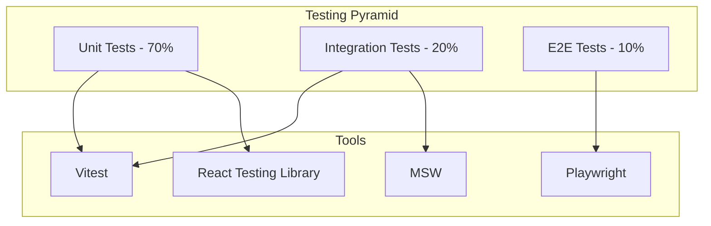

# 🧪 Testing - Universal Camera Viewer

[← Optimizaciones](./optimizaciones.md) | [Índice](./README.md) | [Deployment →](./deployment.md)

## 🎯 Visión General

Esta guía detalla las estrategias de testing implementadas en Universal Camera Viewer, cubriendo tests unitarios, de integración, e2e y de rendimiento.

## 🏗️ Arquitectura de Testing

## 🧪 Configuración del Entorno

### Vitest Configuration

**Configuración principal:**

- Entorno: jsdom para testing de componentes React
- Provider de coverage: v8 con reportes en múltiples formatos
- Umbrales de cobertura: 80% líneas/funciones, 75% branches
- Pool de threads para ejecución paralela
- Alias @ para imports absolutos desde src

### Test Setup

**Configuración global de tests:**

- Import de jest-dom para matchers adicionales
- Limpieza automática después de cada test
- Configuración de MSW (Mock Service Worker) para mocking de APIs
- Mocks globales para IntersectionObserver y ResizeObserver
- Reset de handlers y mocks entre tests

## 🔬 Unit Testing

### Testing de Componentes

**Estructura de tests para componentes React:**

**Categorías de tests:**

1. **Rendering**
   - Verificar que la información se muestra correctamente
   - Estados de carga y error
   - Renderizado condicional

2. **Interactions**
   - Eventos de click y teclado
   - Validación de callbacks
   - Prevención de propagación de eventos

3. **Accessibility**
   - Labels ARIA correctos
   - Navegación por teclado
   - Roles semánticos

**Best practices:**

- Usar `userEvent` para interacciones realistas
- Limpiar mocks en beforeEach
- Agrupar tests por funcionalidad
- Verificar tanto comportamiento como presentación

### Testing de Hooks

**Estrategias para testing de custom hooks:**

**Puntos clave:**

- Usar `renderHook` con wrapper para proveer contexto
- Mockear servicios y dependencias externas
- Usar `act` para updates de estado asíncronos
- `waitFor` para esperar cambios de estado

**Casos de test comunes:**

1. Estado inicial del hook
2. Operaciones exitosas (happy path)
3. Manejo de errores
4. Limpieza en unmount
5. Efectos secundarios y callbacks

### Testing de Stores

**Testing de Zustand stores:**

**Estrategias principales:**

- Reset del store en beforeEach para aislamiento
- Usar setState para establecer estado inicial
- Agrupar tests por funcionalidad del store
- Verificar inmutabilidad del estado

**Áreas de testing:**

1. **CRUD Operations**: Add, update, delete
2. **Selection Management**: Select/deselect items
3. **Status Updates**: Connection, loading states
4. **Computed Values**: Getters y selectores
5. **Side Effects**: Subscriptions y listeners

## 🔄 Integration Testing

### API Integration Tests

**Testing de servicios con MSW:**

**Configuración:**

- Mock Service Worker para interceptar requests HTTP
- Handlers personalizados por test
- Simulación de errores y timeouts

**Casos de test esenciales:**

1. **Happy Path**: Respuestas exitosas
2. **Error Handling**: 4xx, 5xx errors
3. **Timeouts**: Conexiones lentas
4. **Retry Logic**: Reintentos automáticos
5. **Data Validation**: Respuestas malformadas

### WebSocket Integration Tests

**Testing de comunicación en tiempo real:**

**Herramientas:**

- jest-websocket-mock para simular servidor WS
- Verificación de eventos y mensajes
- Testing de reconexión automática

**Escenarios críticos:**

1. **Message Handling**: Recepción y parsing
2. **Connection Lifecycle**: Connect/disconnect
3. **Reconnection**: Auto-reconexión
4. **Event Emitters**: Suscripción a eventos
5. **Error Recovery**: Manejo de desconexiones

## 🌐 E2E Testing

### Playwright Configuration

**Configuración E2E con Playwright:**

**Características principales:**

- Testing en múltiples navegadores (Chrome, Firefox, Safari)
- Soporte para dispositivos móviles
- Traces, screenshots y videos en fallos
- Ejecución paralela de tests
- Servidor de desarrollo automático
- Reintentos en CI/CD
- Reportes HTML y JUnit

### E2E Test Examples

**Estructura de tests E2E:**

**Flujos principales a testear:**

1. **Camera Management**
   - Visualización de grilla de cámaras
   - Conexión/desconexión
   - Manejo de errores de conexión
   - Streaming de video

2. **Network Scanner**
   - Configuración de parámetros
   - Progreso de escaneo
   - Detección de dispositivos
   - Navegación a resultados

3. **User Workflows**
   - Login y autenticación
   - Configuración de preferencias
   - Navegación entre módulos
   - Persistencia de datos

**Best practices E2E:**

- Mock de APIs externas
- data-testid para selectores estables
- Esperar elementos visibles
- Verificar flujos completos

## 🎭 Mocking Strategies

### MSW (Mock Service Worker)

**Configuración de mocking de APIs:**

**Handlers principales:**

- **GET /api/cameras**: Lista de cámaras
- **POST /api/cameras/:id/connect**: Conexión a cámara
- **POST /api/scanner/network/start**: Inicio de escaneo

**Características:**

- Respuestas condicionales por parámetros
- Simulación de errores controlados
- Delays para testing de loading states
- Compartido entre unit e integration tests

### Mock Data Factories

**Generación de datos de prueba:**

**Factories disponibles:**

- **createMockCamera**: Genera una cámara con datos aleatorios
- **createMockCameras**: Array de cámaras
- **createMockScanResult**: Resultados de escaneo
- **createMockStream**: Información de streaming

**Ventajas:**

- Datos consistentes pero variados
- Overrides para casos específicos
- Integración con faker.js
- Reutilizable entre tests

## 📈 Coverage Reports

### Coverage Reports

**Configuración de cobertura:**

**Scripts disponibles:**

- `yarn test`: Ejecutar tests
- `yarn test:ui`: UI interactiva de Vitest
- `yarn test:coverage`: Generar reporte de cobertura
- `yarn test:coverage:ui`: Coverage con UI

**Umbrales de cobertura:**

- Lines: 80% (objetivo 95%)
- Functions: 80% (objetivo 95%)
- Branches: 75% (objetivo 90%)
- Statements: 80% (objetivo 95%)
- perFile: true para verificar cada archivo

## 🔍 Debugging Tests

### Debugging Tests

**Herramientas de debugging:**

**Utilidades disponibles:**

- **debugScreen**: Imprime DOM formateado
- **debugStore**: Muestra estado del store
- **takeScreenshot**: Screenshots en E2E

**VS Code debugging:**

- Configuración para debug de tests individuales
- Breakpoints en código de test
- Step through con F10/F11
- Inspección de variables

## ✅ Testing Best Practices

### 1. Estructura de Tests

**Organización recomendada:**

- Agrupar por funcionalidad con `describe`
- Categorías comunes: Rendering, Interactions, API, Accessibility
- Tests específicos y descriptivos
- Un assert por test cuando sea posible

### 2. Nombrado de Tests

**Convenciones:**

- Comenzar con "should" para describir comportamiento esperado
- Ser específico sobre condiciones y resultados
- Evitar nombres genéricos como "works" o "test"
- Incluir contexto cuando sea necesario

### 3. AAA Pattern

**Arrange-Act-Assert:**

- **Arrange**: Preparar datos y estado inicial
- **Act**: Ejecutar la acción a testear
- **Assert**: Verificar el resultado esperado
- Separar visualmente cada sección

### 4. Test Isolation

**Aislamiento de tests:**

- Limpiar estado global en beforeEach
- Reset de mocks entre tests
- No depender del orden de ejecución
- Cada test debe poder ejecutarse independientemente

## 📋 Testing Checklist

### Antes de Commit

- [ ] Todos los tests pasan localmente
- [ ] Coverage cumple con los thresholds
- [ ] No hay tests saltados (`.skip`)
- [ ] No hay `console.log` en tests
- [ ] Los mocks están correctamente limpiados

### Para PRs

- [ ] Tests para nuevas funcionalidades
- [ ] Tests de regresión para bugs fixes
- [ ] Tests de integración si hay cambios en APIs
- [ ] Screenshots actualizados para tests visuales
- [ ] CI/CD pipeline verde

---

[← Optimizaciones](./optimizaciones.md) | [Índice](./README.md) | [Deployment →](./deployment.md)
